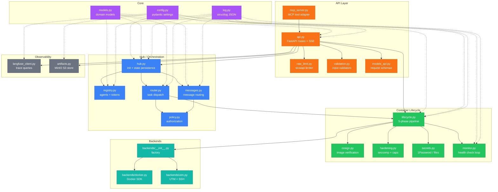
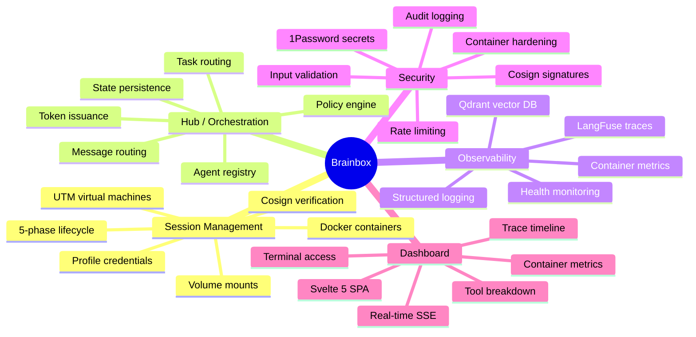

# Brainbox Documentation

Brainbox is a FastAPI backend with a Svelte 5 dashboard for managing sandboxed Claude Code sessions. It provisions containers (Docker) or VMs (UTM), injects secrets, monitors health, and exposes a REST API and MCP server for programmatic control.

## Quick Start

```bash
just bb-api              # Start API on :9999
just bb-dashboard        # Start API + built dashboard
just bb-docker-build     # Build the brainbox container image
just bb-docker-start     # Launch a default session
```

## Module Map



## Capability Overview



## Module Reference

| Module | Responsibility | Doc |
|--------|---------------|-----|
| `api.py` | FastAPI routes, SSE, lifespan | [api-reference.md](api-reference.md) |
| `mcp_server.py` | MCP tool adapter (16 tools) | [api-reference.md](api-reference.md) |
| `rate_limit.py` | slowapi rate limiter | [api-reference.md](api-reference.md) |
| `validation.py` | Session name, artifact key, volume, port, role validators | [api-reference.md](api-reference.md) |
| `models_api.py` | Pydantic request schemas | [api-reference.md](api-reference.md) |
| `lifecycle.py` | 5-phase pipeline: provision, configure, start, monitor, recycle | [lifecycle.md](lifecycle.md) |
| `cosign.py` | Container image signature verification (keyless + key-based) | [lifecycle.md](lifecycle.md) |
| `hardening.py` | Seccomp, cap_drop, read-only rootfs, tmpfs, resource limits | [lifecycle.md](lifecycle.md) |
| `secrets.py` | 1Password service account or plaintext file resolution | [observability.md](observability.md) |
| `monitor.py` | Async health check loop with TTL enforcement | [observability.md](observability.md) |
| `backends/__init__.py` | Backend factory (`create_backend`) | [lifecycle.md](lifecycle.md) |
| `backends/docker.py` | Docker SDK: provision, configure, start, stop, health, exec | [lifecycle.md](lifecycle.md) |
| `backends/utm.py` | UTM/SSH: provision, configure, start, stop, health, exec | [lifecycle.md](lifecycle.md) |
| `hub.py` | Hub init/shutdown, state persistence, periodic flush | [hub.md](hub.md) |
| `registry.py` | Agent loading, token issuance/validation/revocation | [hub.md](hub.md) |
| `router.py` | Task submit, complete, fail, cancel, check running | [hub.md](hub.md) |
| `messages.py` | Message routing with pending queue and audit log | [hub.md](hub.md) |
| `policy.py` | Task assignment, message, and capability authorization | [hub.md](hub.md) |
| `langfuse_client.py` | LangFuse trace/observation queries via HTTP | [observability.md](observability.md) |
| `artifacts.py` | MinIO S3 artifact upload/download/list/delete | [observability.md](observability.md) |
| `config.py` | Pydantic settings from `CL_*` env vars | [lifecycle.md](lifecycle.md) |
| `models.py` | Domain models (Agent, Session, Task, Token, Message) | [hub.md](hub.md) |
| `log.py` | structlog JSON logging with session context | [observability.md](observability.md) |
| `dashboard/` | Svelte 5 SPA with 3 panels | [dashboard.md](dashboard.md) |

## Documents

1. **[lifecycle.md](lifecycle.md)** — Container lifecycle pipeline, backends, cosign, hardening, volume mounts
2. **[hub.md](hub.md)** — Hub orchestration: agents, tokens, tasks, messages, policy
3. **[api-reference.md](api-reference.md)** — REST API endpoints, MCP server, rate limits
4. **[observability.md](observability.md)** — Monitoring, metrics, LangFuse, artifacts, secrets, SSE
5. **[dashboard.md](dashboard.md)** — Svelte 5 dashboard components, state, data flow
