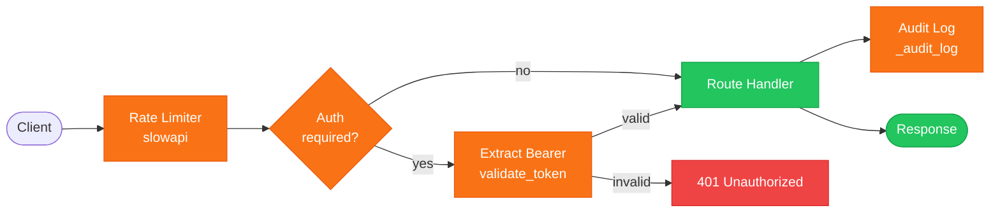
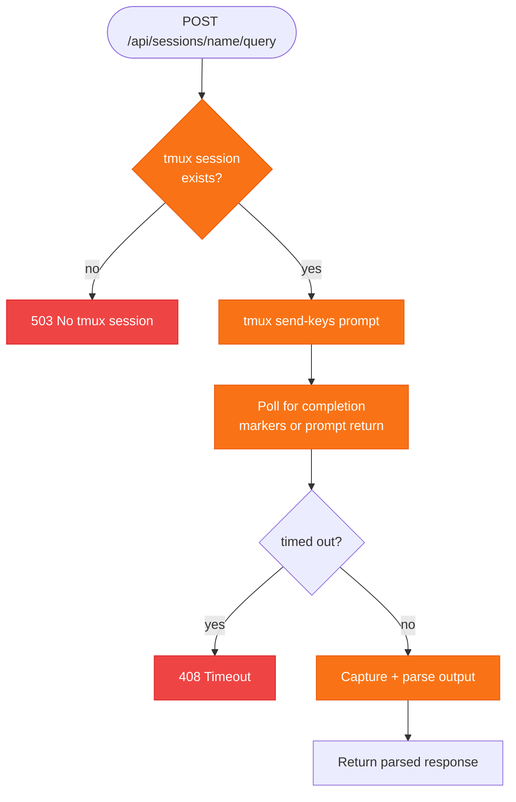

# REST API & MCP Server

Brainbox exposes a FastAPI application on port 9999 (configurable via `CL_API_PORT`) and an MCP server on stdio. Both provide programmatic access to session management, hub orchestration, and observability.

## Request Processing Pipeline

Every API request passes through rate limiting, optional auth, and audit logging before reaching the handler.



## Endpoints

### Session Management

| Method | Path | Rate Limit | Auth | Description |
|--------|------|-----------|------|-------------|
| `GET` | `/api/sessions` | — | No | List all sessions (Docker + UTM) with ports, volumes, status |
| `POST` | `/api/create` | 10/min | No | Create and start a new session via `run_pipeline()` |
| `POST` | `/api/start` | 10/min | No | Start a stopped session |
| `POST` | `/api/stop` | 10/min | No | Stop a running session (recycle fallback to direct Docker stop) |
| `POST` | `/api/delete` | 10/min | No | Delete a session (recycle fallback to direct Docker remove) |
| `POST` | `/api/sessions/{name}/exec` | 10/min | No | Execute a command inside a running container |
| `POST` | `/api/sessions/{name}/query` | 5/min | No | Send a prompt to Claude Code in the container |

#### `POST /api/create`

```json
{
  "name": "my-session",
  "role": "developer",
  "volumes": ["/host/path:/container/path:rw"],
  "llm_provider": "claude",
  "llm_model": null,
  "ollama_host": null,
  "workspace_profile": "personal",
  "workspace_home": "/Users/me/workspace",
  "backend": "docker",
  "vm_template": null,
  "ports": {"8080": 8080}
}
```

Response (Docker): `{"success": true, "backend": "docker", "url": "http://localhost:7681"}`

Response (UTM): `{"success": true, "backend": "utm", "ssh_port": 2200, "url": null}`

#### `POST /api/sessions/{name}/query`

Sends a prompt to Claude Code running inside the container via tmux.

```json
{
  "prompt": "Implement the login page",
  "working_dir": "/home/developer/workspace/project",
  "timeout": 300,
  "fork_session": false
}
```

### Query Execution Flow



### Tasks

| Method | Path | Rate Limit | Description |
|--------|------|-----------|-------------|
| `GET` | `/api/tasks` | 30/min | List async tasks with optional status filter |
| `GET` | `/api/tasks/{task_id}` | 30/min | Get task status, progress, result |
| `DELETE` | `/api/tasks/{task_id}` | 30/min | Cancel a queued or in-progress task |

### Hub API

| Method | Path | Rate Limit | Auth | Description |
|--------|------|-----------|------|-------------|
| `GET` | `/api/hub/agents` | — | No | List registered agents |
| `GET` | `/api/hub/agents/{name}` | — | No | Get agent definition |
| `POST` | `/api/hub/tasks` | — | No | Submit a task to an agent |
| `GET` | `/api/hub/tasks` | — | No | List hub tasks (optional `?status=` filter) |
| `GET` | `/api/hub/tasks/{task_id}` | — | No | Get hub task details |
| `DELETE` | `/api/hub/tasks/{task_id}` | — | No | Cancel a hub task |
| `POST` | `/api/hub/messages` | — | **Yes** | Route a message (Bearer token required) |
| `GET` | `/api/hub/messages` | — | **Yes** | Get pending messages for token |
| `GET` | `/api/hub/tokens` | — | No | List active tokens |
| `GET` | `/api/hub/state` | — | No | Full hub state (agents, tasks, tokens, messages) |

### Artifacts (MinIO)

| Method | Path | Rate Limit | Description |
|--------|------|-----------|-------------|
| `GET` | `/api/artifacts/health` | — | Check MinIO connectivity |
| `GET` | `/api/artifacts` | — | List artifacts (optional `?prefix=` filter) |
| `POST` | `/api/artifacts/{key}` | 30/min | Upload artifact (raw bytes in body) |
| `GET` | `/api/artifacts/{key}` | 30/min | Download artifact |
| `DELETE` | `/api/artifacts/{key}` | 30/min | Delete artifact |

Artifact mode (`CL_ARTIFACT__MODE`): `off` (disabled, 503), `warn` (soft fail, return null), `enforce` (hard fail, 502).

### Observability

| Method | Path | Description |
|--------|------|-------------|
| `GET` | `/api/langfuse/health` | LangFuse connectivity |
| `GET` | `/api/qdrant/health` | Qdrant connectivity |
| `GET` | `/api/langfuse/sessions/{name}/traces` | List traces for a session |
| `GET` | `/api/langfuse/sessions/{name}/summary` | Trace count, error count, tool breakdown |
| `GET` | `/api/langfuse/traces/{trace_id}` | Trace detail with observations |

LangFuse mode (`CL_LANGFUSE__MODE`): `off` (disabled, 503), `warn` (soft fail), `enforce` (hard fail, 502).

### Metrics & Events

| Method | Path | Description |
|--------|------|-------------|
| `GET` | `/api/metrics/containers` | Per-container CPU %, memory, uptime, trace/error counts |
| `GET` | `/api/events` | SSE stream (Docker + hub events) |

### Dashboard (SPA)

| Path | Description |
|------|-------------|
| `/assets/*` | Static JS/CSS from built dashboard |
| `/*` | SPA fallback → `index.html` |

## Rate Limits

Rate limiting uses [slowapi](https://github.com/laurentS/slowapi) keyed by client IP.

| Endpoint Group | Limit |
|---------------|-------|
| Session create/start/stop/delete | 10/minute |
| Session exec | 10/minute |
| Session query | 5/minute |
| Task status/list/cancel | 30/minute |
| Artifact upload/download/delete | 30/minute |

Exceeded requests receive a `429` response with a `Retry-After` header:

```json
{
  "error": "Rate limit exceeded",
  "detail": "Too many requests. Please try again later.",
  "retry_after": null
}
```

## Input Validation

Request bodies are validated via Pydantic models in `models_api.py`.

| Validator | Rules |
|-----------|-------|
| `validate_session_name` | Alphanumeric start, `[a-zA-Z0-9_.-]*`, 1–64 chars, no `..` |
| `validate_role` | Must be `developer`, `researcher`, or `performer` |
| `validate_volume_mount` | `host:container[:mode]`, both absolute, mode `rw` (default) or `ro` |
| `validate_port` | 1024–65535 |
| `validate_artifact_key` | No `..`, no leading `/`, no null bytes, normalized |

## MCP Server

The MCP server (`mcp_server.py`) is a stdio-based adapter that proxies HTTP calls to the brainbox API. It uses `FastMCP("brainbox")` and connects to `BRAINBOX_URL` (default `http://127.0.0.1:9999`).

### MCP Tool-to-API Mapping

```mermaid
graph TB
    subgraph MCP["MCP Server (stdio)"]
        direction TB
        ls[list_sessions]
        cs[create_session]
        ss[start_session]
        stop[stop_session]
        del[delete_session]
        met[get_metrics]
        st[submit_task]
        gt[get_task]
        lt[list_tasks]
        ct[cancel_task]
        hs[get_hub_state]
        qs[query_session]
        la[list_agents]
        lh[get_langfuse_health]
        qh[get_qdrant_health]
    end

    subgraph API["REST API"]
        direction TB
        e1[GET /api/sessions]
        e2[POST /api/create]
        e3[POST /api/start]
        e4[POST /api/stop]
        e5[POST /api/delete]
        e6[GET /api/metrics/containers]
        e7[POST /api/hub/tasks]
        e8[GET /api/hub/tasks/id]
        e9[GET /api/hub/tasks]
        e10[DELETE /api/hub/tasks/id]
        e11[GET /api/hub/state]
        e12[POST /api/sessions/name/query]
        e13[GET /api/hub/agents]
        e14[GET /api/langfuse/health]
        e15[GET /api/qdrant/health]
    end

    ls --> e1
    cs --> e2
    ss --> e3
    stop --> e4
    del --> e5
    met --> e6
    st --> e7
    gt --> e8
    lt --> e9
    ct --> e10
    hs --> e11
    qs --> e12
    la --> e13
    lh --> e14
    qh --> e15

    classDef mcpStyle fill:#f97316,stroke:#ea580c,color:#fff
    classDef apiStyle fill:#3b82f6,stroke:#2563eb,color:#fff

    class ls,cs,ss,stop,del,met,st,gt,lt,ct,hs,qs,la,lh,qh mcpStyle
    class e1,e2,e3,e4,e5,e6,e7,e8,e9,e10,e11,e12,e13,e14,e15 apiStyle
```



All MCP tools use a shared `_request(method, path, body)` helper that handles JSON encoding, error extraction, and connection errors.

## Audit Logging

Destructive operations are audit-logged via `_audit_log()`:

```python
_audit_log(request, "session.stop", session_name="my-session", success=True)
```

Recorded fields: `operation`, `session_name`, `client_ip`, `user_agent`, `success`, `error`.

Operations logged: `session.create`, `session.start`, `session.stop`, `session.delete`, `session.exec`, `session.query`.

## SSE Events

The `/api/events` endpoint streams Server-Sent Events from two sources:

- **Docker events:** Filtered to `brainbox.managed=true` containers, emits `create`, `start`, `stop`, `die`, `destroy` as plain strings.
- **Hub events:** Serialized as JSON with `{hub: true, event: "task.started", data: {...}}`.

Clients (dashboard, external tools) use SSE to trigger real-time UI updates without polling.
