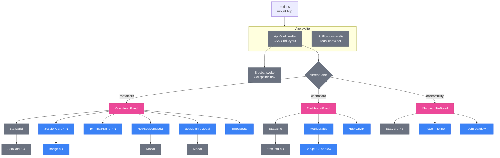
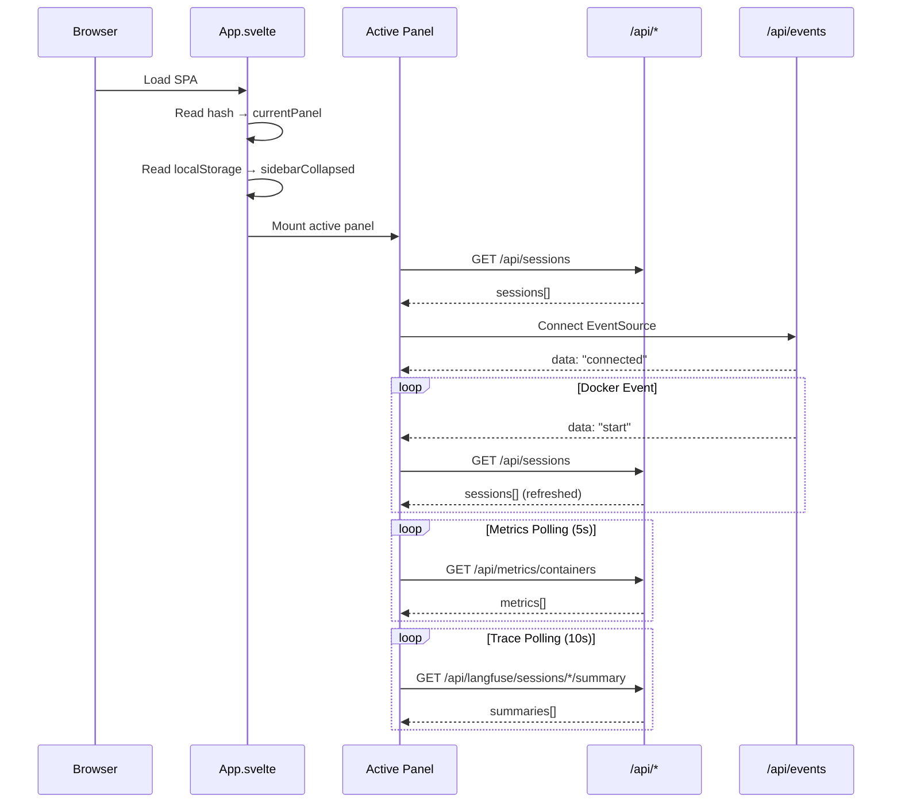
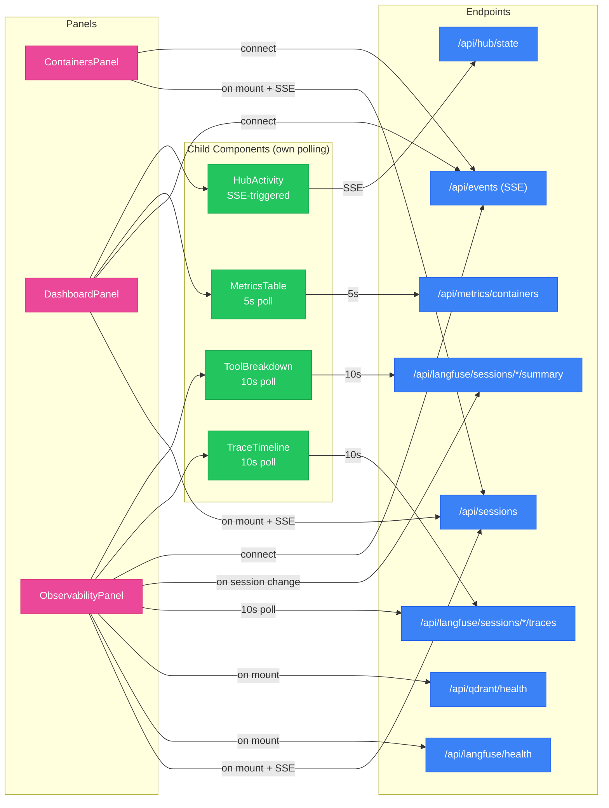
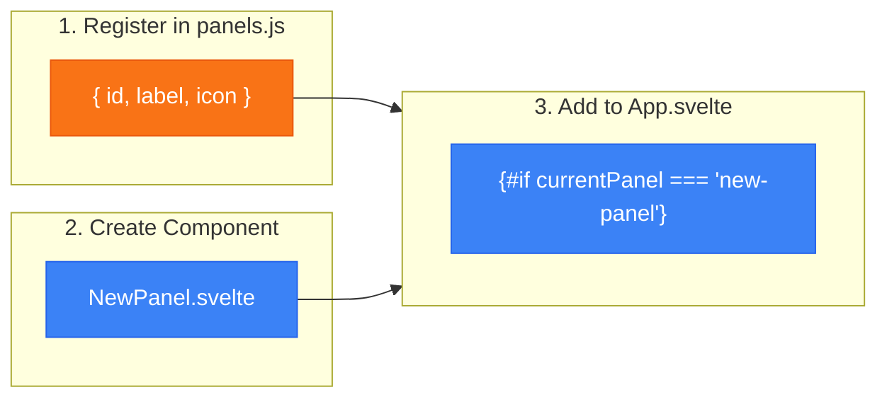

# Svelte 5 Dashboard

The brainbox dashboard is a Svelte 5 SPA (Single Page Application) using runes-based reactive state. It provides real-time monitoring and control of sessions across three panels: **Containers**, **Dashboard**, and **Observability**.

**Key characteristics:**
- Hash-based routing (`#containers`, `#dashboard`, `#observability`)
- Svelte 5 runes (`$state`, `$derived`, `$effect`) — no external store library
- SSE for real-time updates + polling for metrics
- Dark theme with CSS custom properties

## Component Tree



## Startup & Real-Time Update Flow



## Data Flow Map

Each panel fetches specific API endpoints at different cadences.



| Component | Endpoint | Cadence | Trigger |
|-----------|----------|---------|---------|
| All panels | `/api/sessions` | Event-driven | SSE Docker events |
| MetricsTable | `/api/metrics/containers` | 5s | Interval |
| HubActivity | `/api/hub/state` | Event-driven | SSE hub events |
| TraceTimeline | `/api/langfuse/sessions/*/traces` | 10s | Interval |
| ToolBreakdown | `/api/langfuse/sessions/*/summary` | 10s | Interval |
| ObservabilityPanel | `/api/langfuse/health`, `/api/qdrant/health` | Once | On mount |

## Panel Extension Pattern

New panels are added by creating a component and registering it in `panels.js`.



**Steps:**

1. Add entry to `panels.js`:
   ```js
   { id: 'my-panel', label: 'My Panel', icon: '<svg>...</svg>' }
   ```
2. Create `MyPanel.svelte` in `dashboard/src/lib/`
3. Add conditional render in `App.svelte`:
   ```svelte
   {:else if currentPanel.value === 'my-panel'}
     <MyPanel />
   ```

## Reactive State

### Global stores (`stores.svelte.js`)

| Store | Type | Persistence | Description |
|-------|------|------------|-------------|
| `currentPanel` | `$state` | URL hash | Active panel ID, synced with `location.hash` |
| `sidebarCollapsed` | `$state` | localStorage | Sidebar collapsed state (220px ↔ 60px) |

### Notification system (`notifications.svelte.js`)

| Method | Duration | Description |
|--------|----------|-------------|
| `notifications.error(msg)` | 5s | Red toast |
| `notifications.success(msg)` | 3s | Green toast |
| `notifications.warning(msg)` | 4s | Amber toast |
| `notifications.info(msg)` | 3s | Blue toast |

### Panel-level state (representative)

**ContainersPanel:**

| State | Type | Description |
|-------|------|-------------|
| `sessions` | `$state` | All sessions from API |
| `showNewModal` | `$state` | New session dialog visibility |
| `expandedSessions` | `$state(Set)` | Sessions with open terminals |
| `activeProfile` | `$state` | Workspace profile filter |
| `filteredSessions` | `$derived` | Sessions filtered by profile |

**DashboardPanel:**

| State | Type | Description |
|-------|------|-------------|
| `sessions` | `$state` | All sessions |
| `activeSessions` | `$derived` | Filtered to active |
| `abortController` | `$state` | Fetch cancellation |

**ObservabilityPanel:**

| State | Type | Description |
|-------|------|-------------|
| `langfuseHealth` | `$state` | `{healthy, mode}` |
| `qdrantHealth` | `$state` | `{healthy, url}` |
| `summaries` | `$state` | Per-session LangFuse summaries |
| `selectedSession` | `$state` | Filter to single session |
| `totalTraces` | `$derived` | Sum of all trace counts |
| `totalErrors` | `$derived` | Sum of all error counts |

## SSE Connection

The `api.js` module provides `connectSSE(onEvent, onError, onReconnect)` with auto-reconnect using exponential backoff:

| Attempt | Delay |
|---------|-------|
| 1 | 1s |
| 2 | 2s |
| 3 | 4s |
| 4 | 8s |
| 5 | 16s |
| 6+ | 30s (max) |

Backoff resets on successful message receipt.

## UX Patterns

**Dual-tap confirmation:** Stop and delete buttons require two clicks within 3 seconds. First click shows a warning state, second click executes. Timer expiration resets the button.

**Fetch cancellation:** Components use `AbortController` to cancel in-flight requests when new data is needed, preventing race conditions.

**Virtual scrolling:** TraceTimeline uses fixed item height (36px) with a buffer of 5 items. Only renders visible items for traces > 50.

**Modal focus management:** Modals save `document.activeElement` on mount, focus the first interactive element, and restore focus on unmount.

## Theme

Dark theme defined via CSS custom properties in `AppShell.svelte`:

| Variable | Value | Usage |
|----------|-------|-------|
| `--color-bg-primary` | `#0a0e1a` | Page background |
| `--color-bg-secondary` | `#111827` | Cards, tables |
| `--color-bg-tertiary` | `#1e293b` | Hover states |
| `--color-border-primary` | `#1e293b` | Borders |
| `--color-text-primary` | `#e2e8f0` | Body text |
| `--color-text-secondary` | `#94a3b8` | Muted text |
| `--color-accent` | `#f59e0b` | Brand amber |
| `--color-success` | `#10b981` | Active/healthy |
| `--color-error` | `#ef4444` | Errors |
| `--color-role-developer` | `#3b82f6` | Blue badge |
| `--color-role-researcher` | `#a855f7` | Purple badge |
| `--color-role-performer` | `#f97316` | Orange badge |
| `--color-llm-public` | `#ec4899` | Claude (pink) |
| `--color-llm-private` | `#22c55e` | Ollama (green) |
