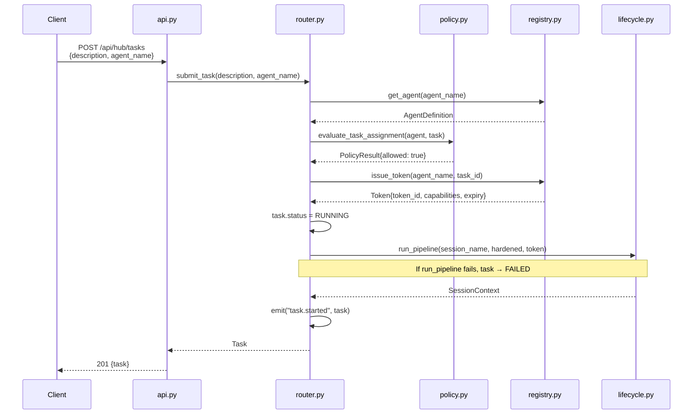
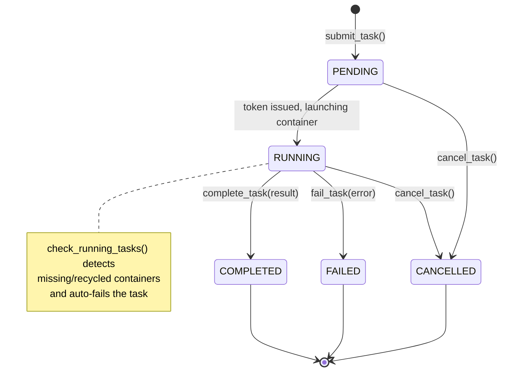
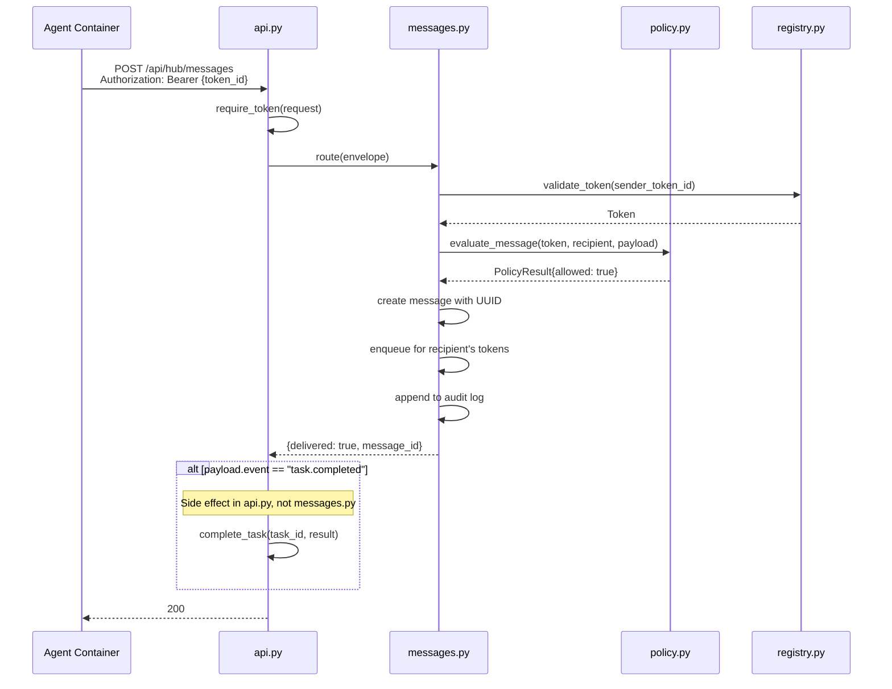
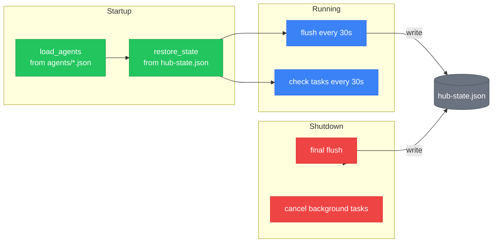

# Hub, Agents, Tasks & Messages

The hub is brainbox's orchestration layer. It manages an **agent registry** (JSON definitions loaded from disk), a **token system** (scoped capabilities with TTL), a **task router** (dispatch work to agents via container lifecycle), and a **message router** (inter-agent communication with policy enforcement).

## Hub Components

```mermaid
graph TB
    subgraph Hub["hub.py — Facade"]
        Init[init / shutdown]
        Flush[periodic flush<br/>every 30s]
        Check[periodic check<br/>every 30s]
    end

    subgraph Registry["registry.py"]
        Agents[Agent Definitions<br/>loaded from JSON]
        Tokens[Token Store<br/>issue / validate / revoke]
    end

    subgraph Router["router.py"]
        Tasks[Task Store]
        Submit[submit_task]
        Complete[complete_task]
        Fail[fail_task]
        Cancel[cancel_task]
        RunCheck[check_running_tasks]
    end

    subgraph Messages["messages.py"]
        Pending[Pending Queue<br/>per token_id]
        AuditLog[Audit Log<br/>capped ring buffer]
        Route[route]
    end

    subgraph Policy["policy.py"]
        TaskPolicy[evaluate_task_assignment]
        MsgPolicy[evaluate_message]
        CapPolicy[evaluate_capability]
    end

    Init --> Agents
    Init --> Flush
    Init --> Check

    Submit --> TaskPolicy
    Submit --> Tokens
    Submit --> Tasks
    Route --> MsgPolicy
    Route --> Pending
    Route --> AuditLog

    Check --> RunCheck
    Flush --> StateFile[(hub-state.json)]

    classDef hubStyle fill:#3b82f6,stroke:#2563eb,color:#fff
    classDef regStyle fill:#8b5cf6,stroke:#7c3aed,color:#fff
    classDef routerStyle fill:#22c55e,stroke:#16a34a,color:#fff
    classDef msgStyle fill:#f97316,stroke:#ea580c,color:#fff
    classDef polStyle fill:#ef4444,stroke:#dc2626,color:#fff

    class Init,Flush,Check hubStyle
    class Agents,Tokens regStyle
    class Tasks,Submit,Complete,Fail,Cancel,RunCheck routerStyle
    class Pending,AuditLog,Route msgStyle
    class TaskPolicy,MsgPolicy,CapPolicy polStyle
```



## Task Submission Flow

When a task is submitted, the router validates the agent, checks policy, issues a token, and launches a container.



**Note:** The task is set to `RUNNING` *before* `run_pipeline()` is called. If the container launch fails, `submit_task()` catches the exception, sets the task to `FAILED`, revokes the token, and re-raises.

## Task State Machine

Tasks progress through a strict lifecycle. Terminal states (`COMPLETED`, `FAILED`, `CANCELLED`) trigger container recycling and token revocation.



| Transition | Trigger | Side Effects |
|-----------|---------|-------------|
| PENDING → RUNNING | Container created successfully | Token issued, session launched |
| RUNNING → COMPLETED | Agent sends `task.completed` message | Container recycled, token revoked |
| RUNNING → FAILED | Launch error or container missing | Container recycled, token revoked |
| RUNNING → CANCELLED | `cancel_task()` called | Container recycled, token revoked |
| PENDING → CANCELLED | `cancel_task()` called | Token revoked |

## Message Routing

Agents communicate via token-authenticated messages. The message router enforces policy before delivery.



### Message flow details

- **Sending:** Agent POSTs with Bearer token. Token is validated, policy is checked, message is queued.
- **Receiving:** Agent GETs `/api/hub/messages` with Bearer token. Pending messages are drained (removed from queue after retrieval).
- **Audit log:** Capped ring buffer (`settings.hub.message_retention`, default 100 entries). Records both delivered and rejected messages.
- **Task completion side effect:** After `messages.route()` returns, `api.py` checks if `payload.event == "task.completed"` and calls `complete_task()` which recycles the container and revokes the token. This logic lives in the API layer, not in `messages.py`.

## State Persistence

Hub state is periodically flushed to `hub-state.json` and restored on startup. Terminal tasks and stale messages are dropped during restore.



### State file structure

```json
{
  "flushed_at": 1740000000000,
  "registry": {
    "tokens": [["token-uuid", {"token_id": "...", "agent_name": "...", "expiry": ...}]]
  },
  "router": {
    "tasks": [["task-uuid", {"id": "...", "status": "running", ...}]]
  },
  "messages": {
    "pending": [["token-id", [{"id": "msg-uuid", ...}]]],
    "log": [{"id": "...", "status": "delivered", ...}]
  }
}
```

**Restore behavior:**

| Component | Restore Logic |
|-----------|--------------|
| Registry (tokens) | Only restore non-expired tokens |
| Router (tasks) | Drop terminal tasks (completed, failed, cancelled) |
| Messages (pending) | Only restore for still-valid tokens |
| Messages (log) | Dropped entirely — rebuilds naturally |

## Agent Registry

Agents are defined as JSON files in the `agents/` directory adjacent to the brainbox package.

### Agent definition schema

```json
{
  "name": "code-reviewer",
  "image": "brainbox-researcher",
  "description": "Reviews pull requests and suggests improvements",
  "capabilities": ["read_code", "write_reviews", "use_tools"],
  "hardened": true
}
```

| Field | Type | Description |
|-------|------|-------------|
| `name` | string | Unique agent identifier |
| `image` | string | Docker image to use |
| `description` | string | Human-readable purpose |
| `capabilities` | string[] | Allowed operations (used by policy) |
| `hardened` | bool | Whether to use hardened container config |

### Token lifecycle

Tokens are scoped to a single agent + task with TTL expiry.

| Field | Type | Description |
|-------|------|-------------|
| `token_id` | UUID | Bearer token value |
| `agent_name` | string | Which agent this token is for |
| `task_id` | string | Which task this token is scoped to |
| `capabilities` | string[] | Copied from agent definition |
| `issued` | int | Epoch milliseconds |
| `expiry` | int | Epoch milliseconds (`issued + ttl * 1000`) |

**Default TTL:** 3600 seconds (1 hour)

**Expiry:** Tokens are lazily pruned — `validate_token()` removes expired tokens on access, and `list_tokens()` cleans all expired entries.

## Policy Engine

Three policy checks enforce authorization:

| Check | Called By | Validates |
|-------|----------|-----------|
| `evaluate_task_assignment` | `router.submit_task()` | Agent exists, is registered, task has description |
| `evaluate_message` | `messages.route()` | Token valid, not expired, recipient is agent or "hub", payload has type |
| `evaluate_capability` | Not currently called (available for extensions) | Token has required capability in its list |

All checks return `PolicyResult(allowed: bool, reason: str | None)`.

## Domain Models

All models are Pydantic `BaseModel` subclasses in `models.py`.

| Model | Key Fields | Usage |
|-------|-----------|-------|
| `AgentDefinition` | name, image, description, capabilities[], hardened | Loaded from `agents/*.json` |
| `Token` | token_id, agent_name, task_id, capabilities[], issued, expiry | Issued per task |
| `Task` | id, description, agent_name, status, token_id, session_name, result, error | Router state |
| `SessionContext` | session_name, container_name, port, role, state, secrets, backend, ... | Lifecycle state |
| `MessageEnvelope` | recipient, type, payload | Inbound from agent |
| `Message` | id, timestamp, sender, recipient, type, payload | Stored + queued |
| `PolicyResult` | allowed, reason | Authorization decision |

### Session states (enum)

`PROVISIONING` → `CONFIGURING` → `STARTING` → `RUNNING` → `MONITORING` → `RECYCLING` → `RECYCLED`

### Task statuses (enum)

`PENDING` → `RUNNING` → `COMPLETED` / `FAILED` / `CANCELLED`
