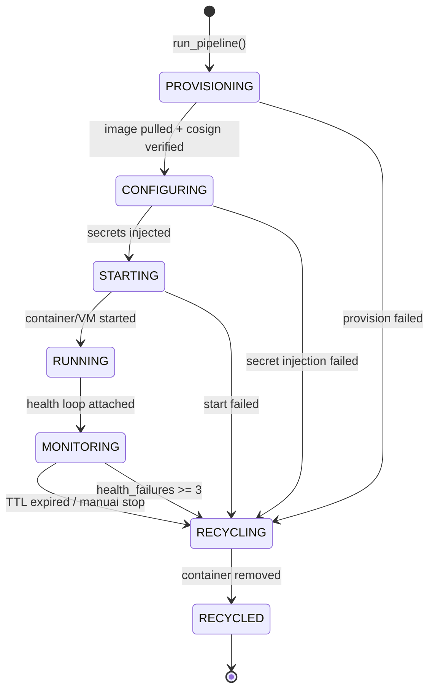
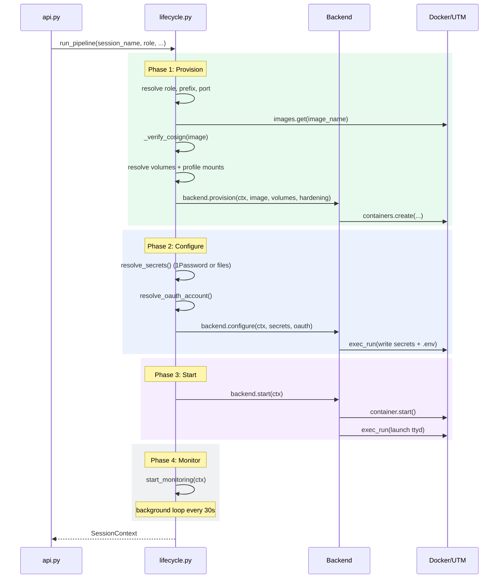
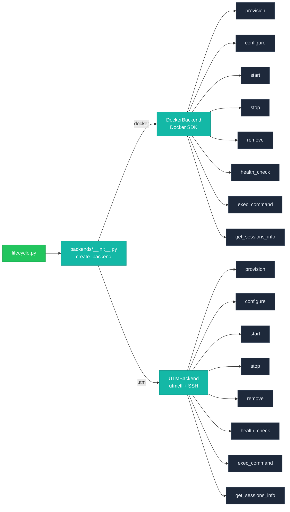
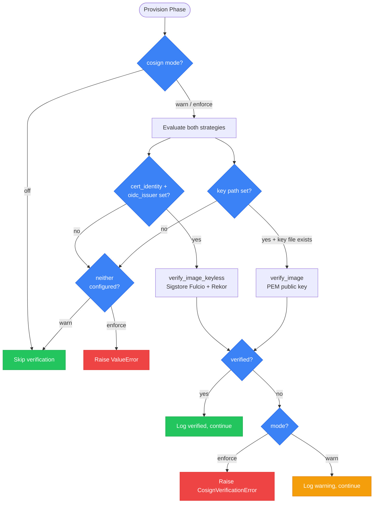
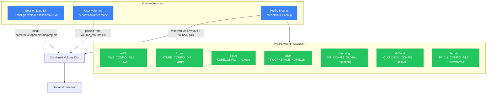

# Container Lifecycle & Backends

Brainbox manages sandboxed environments through a 5-phase pipeline: **provision → configure → start → monitor → recycle**. Two backends are supported — Docker containers and macOS UTM virtual machines — accessed through a common protocol.

## Session State Machine

Every session transitions through these states. Error recovery returns to the previous state or jumps to `RECYCLING`.

## Pipeline Sequence

`run_pipeline()` in `lifecycle.py` orchestrates the full lifecycle. Each phase delegates to the active backend.

## Backend Abstraction

Both backends implement the same interface. `create_backend(name)` returns the appropriate implementation.

### Docker Backend

| Phase | Docker SDK Call | Details |
|-------|----------------|---------|
| provision | `containers.create()` | Image, name, `sleep infinity`, ports, labels, volumes, hardening |
| configure | `exec_run()` × N | Write `.env`, `.agent-token`, `.claude.json`, `settings.json`, profile env |
| start | `container.start()` + `exec_run(ttyd)` | Launch web terminal (skip in hardened mode) |
| stop | `container.stop(timeout=5)` | Graceful shutdown |
| remove | `container.remove()` | Cleanup |
| health_check | `container.reload()` + `stats()` | CPU %, memory usage/limit |
| exec_command | `container.exec_run(cmd)` | Arbitrary command execution |

**Labels applied:** `brainbox.managed=true`, `brainbox.role`, `brainbox.llm_provider`, `brainbox.llm_model`, `brainbox.workspace_profile`

**Port bindings:** Always expose `7681` (ttyd terminal) plus any custom ports from `ctx.ports`.

### UTM Backend

| Phase | Operation | Details |
|-------|-----------|---------|
| provision | Clone template `.utm`, edit `config.plist` | Set VM name, networking (bridged or port-forward), VirtioFS shares |
| configure | Boot VM, SSH inject secrets | Write `.env`, `.agent-token`, `.claude.json`; mount VirtioFS shares |
| start | `utmctl start` + wait for SSH | Bridged: discover IP via ARP; QEMU: use localhost + ssh_port |
| stop | `utmctl stop` | Stop VM |
| remove | `utmctl stop` + `shutil.rmtree()` | Remove VM package |
| health_check | `utmctl status` + SSH probe | VM state + SSH reachability |
| exec_command | SSH execute | Remote command via SSH |

**Networking modes:**
- **Apple VMs:** Bridged networking, IP discovered via ARP table scan
- **QEMU VMs:** Port forwarding (guest 22 → host ssh_port)

## Cosign Verification

Image signature verification runs during provision (Phase 1). The verification mode is controlled by `CL_COSIGN__MODE`.

**Verification strategies:**

| Strategy | Config | Mechanism |
|----------|--------|-----------|
| Keyless (preferred) | `CL_COSIGN__CERTIFICATE_IDENTITY` + `CL_COSIGN__OIDC_ISSUER` | Sigstore Fulcio/Rekor transparency log |
| Key-based (fallback) | `CL_COSIGN__KEY` (path to PEM) | Local public key verification |

## Volume Mount Resolution

Volumes are assembled from three sources during provision.

### Profile mount specs

| Mount | Env Vars | Fallback | Container Path | Default |
|-------|----------|----------|---------------|---------|
| AWS | `AWS_CONFIG_FILE`, `AWS_SHARED_CREDENTIALS_FILE` | `~/.aws` | `/home/developer/.aws` | on |
| Azure | `AZURE_CONFIG_DIR` | `~/.azure` | `/home/developer/.azure` | on |
| Kube | `KUBECONFIG` | `~/.kube` | `/home/developer/.kube` | on |
| SSH | — | `$WORKSPACE_HOME/.ssh` | `/home/developer/.ssh` | on |
| Gitconfig (file) | `GIT_CONFIG_GLOBAL` | `$WORKSPACE_HOME/.gitconfig` | `/home/developer/.gitconfig` | on |
| GCloud | `CLOUDSDK_CONFIG` | `~/.gcloud` | `/home/developer/.gcloud` | off |
| Terraform | `TF_CLI_CONFIG_FILE` | `~/.terraform.d` | `/home/developer/.terraform.d` | off |

When `workspace_home` is provided with a `workspace_profile`, the volatile cache at `$TMPDIR/sp-profiles/{profile}/.env` is read to resolve env vars from the target profile.

**AWS SSO special case:** When `workspace_home` differs from the real home, an extra nested bind mount for `~/.aws/sso/cache/` is added so the container sees live SSO tokens.

## Hardening

Two modes controlled by `SessionContext.hardened`:

| Setting | Hardened | Legacy |
|---------|----------|--------|
| Root filesystem | Read-only | Read-write |
| IPC mode | Default | `host` |
| Capabilities dropped | `NET_RAW`, `SYS_ADMIN`, `MKNOD`, `SYS_CHROOT`, `NET_ADMIN` | None |
| `no-new-privileges` | Yes | No |
| Memory limit | `settings.resources.memory` (default 2g) | None |
| CPU limit | `settings.resources.cpus` (default 2) | None |
| tmpfs | `/workspace` (500M), `/tmp` (100M) | None |
| Secret mount | `/run/secrets` (tmpfs, 0o400, ro) | `.env` file |
| Profile env | `/run/profile` (tmpfs, 0o644, rw) | Inline in `.env` |
| Web terminal (ttyd) | Not launched — no web access | Launched on port 7681 |

**Note:** `LANGFUSE_SESSION_ID` is written to `~/.env` in both modes (for LangFuse trace correlation), even when other secrets go to `/run/secrets` in hardened mode.

## Configuration

All settings use the `CL_` env prefix with `__` as nested delimiter.

| Setting | Env Var | Default | Description |
|---------|---------|---------|-------------|
| `role` | `CL_ROLE` | `developer` | Default container role |
| `image` | `CL_IMAGE` | `""` (resolves to `brainbox-{role}`) | Docker image name |
| `container_prefix` | `CL_CONTAINER_PREFIX` | `""` (resolves to `{role}-`) | Container name prefix |
| `ttl` | `CL_TTL` | `3600` | Session TTL in seconds |
| `api_port` | `CL_API_PORT` | `9999` | API listen port |
| `health_check_interval` | `CL_HEALTH_CHECK_INTERVAL` | `30` | Health loop interval (seconds) |
| `health_check_retries` | `CL_HEALTH_CHECK_RETRIES` | `3` | Failures before recycling |
| `cosign.mode` | `CL_COSIGN__MODE` | `warn` | `off` / `warn` / `enforce` |
| `resources.memory` | `CL_RESOURCES__MEMORY` | `2g` | Container memory limit |
| `resources.cpus` | `CL_RESOURCES__CPUS` | `2` | Container CPU limit |
| `profile.mount_aws` | `CL_PROFILE__MOUNT_AWS` | `true` | Mount AWS credentials |
| `profile.mount_ssh` | `CL_PROFILE__MOUNT_SSH` | `true` | Mount SSH directory |

See `config.py` for the full list of nested settings groups: `ResourceSettings`, `HardeningSettings`, `CosignSettings`, `ArtifactSettings`, `LangfuseSettings`, `QdrantSettings`, `ProfileSettings`, `OllamaSettings`, `UTMSettings`, `HubSettings`.
