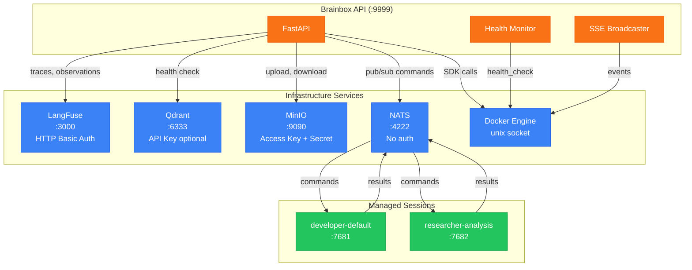
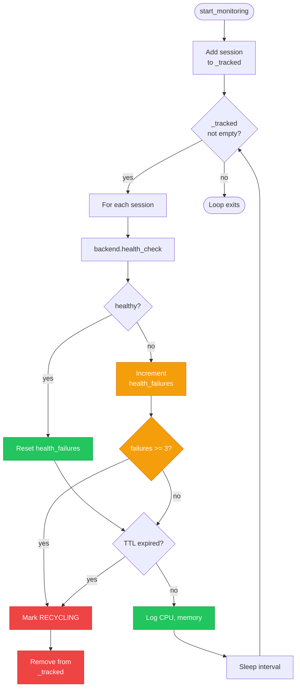
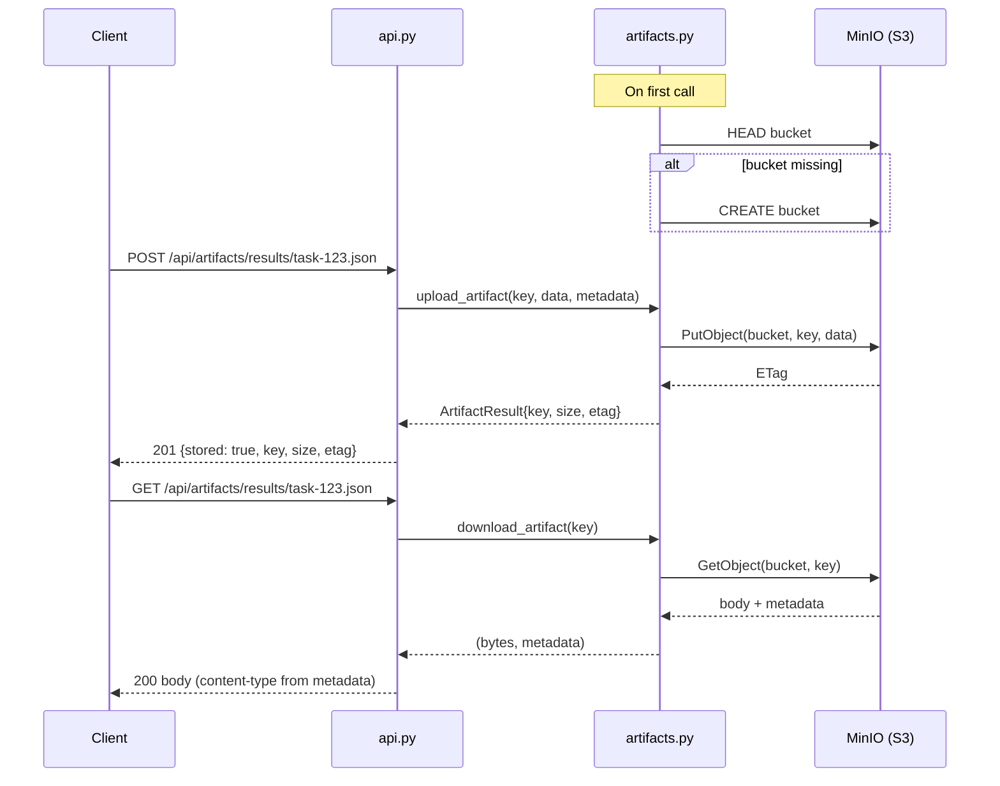
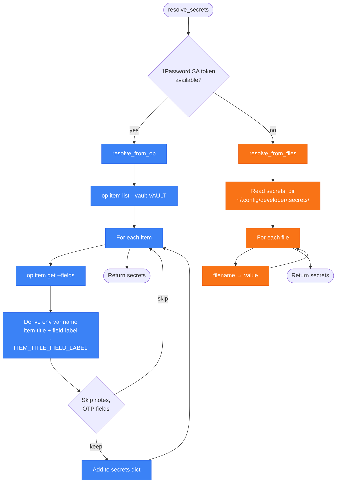
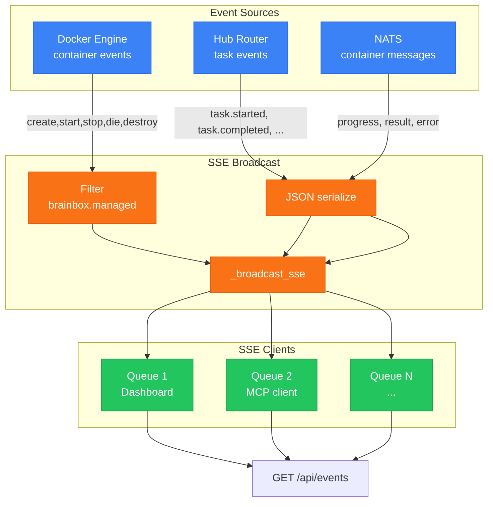

# Monitoring, Metrics & Infrastructure

Brainbox integrates several infrastructure services for observability, artifact storage, and inter-container messaging. This document covers the health monitoring loop, container metrics collection, LangFuse trace integration, MinIO artifact storage, secret resolution, NATS messaging, and SSE event broadcasting.

## Infrastructure Service Map



| Service | Default Port | Protocol | Auth | Config Prefix |
|---------|-------------|----------|------|--------------|
| Brainbox API | 9999 | HTTP | None | `CL_API_PORT` |
| LangFuse | 3000 | HTTP | Basic (public_key:secret_key) | `CL_LANGFUSE__*` |
| Qdrant | 6333 | HTTP | API key (optional) | `CL_QDRANT__*` |
| MinIO | 9090 | HTTP (S3) | Access key + secret | `CL_ARTIFACT__*` |
| NATS | 4222 | NATS protocol | None | `CL_NATS__*` |
| Docker | unix socket | Docker API | — | — |

## Health Monitor Loop

The monitor (`monitor.py`) runs a background async loop that checks each tracked session at a configurable interval.



| Setting | Default | Description |
|---------|---------|-------------|
| `health_check_interval` | 30s | Polling interval |
| `health_check_timeout` | 5s | Per-check timeout |
| `health_check_retries` | 3 | Failures before recycling |
| `ttl` | 3600s | Session time-to-live |

**Backend-specific metrics logged:**

| Backend | Metrics |
|---------|---------|
| Docker | CPU %, memory usage/limit (human-readable) |
| UTM | VM state, SSH reachability, SSH port |

## Artifact Lifecycle

Artifacts are stored in MinIO (S3-compatible) and accessed via the `/api/artifacts` endpoints.



**Artifact modes** (`CL_ARTIFACT__MODE`):

| Mode | Behavior on Error |
|------|-------------------|
| `off` | All artifact endpoints return 503 |
| `warn` | Log warning, return null/empty (soft fail) |
| `enforce` | Return 502 (hard fail) |

**Configuration:**

| Setting | Default | Description |
|---------|---------|-------------|
| `artifact.endpoint` | `http://localhost:9090` | MinIO endpoint |
| `artifact.bucket` | `artifacts` | S3 bucket name |
| `artifact.access_key` | — | MinIO access key |
| `artifact.secret_key` | — | MinIO secret key |
| `artifact.region` | `us-east-1` | S3 region |

## Secret Resolution

Secrets are resolved during the configure phase and injected into containers. Two strategies are tried in order.



**1Password strategy (preferred):**
- Uses `OP_SERVICE_ACCOUNT_TOKEN` env var or `op_sa_token_file`
- Scoped to vault (`CL_OP_VAULT` if set)
- Env var naming: `item-title` + `field-label` → `ITEM_TITLE_FIELD_LABEL` (hyphens → underscores, uppercase)
- Skips: `notesPlain` field IDs, `OTP` field types

**Plaintext files (fallback):**
- Reads all files in `~/.config/developer/.secrets/`
- Filename becomes the key, file content becomes the value

**Injection targets:**

| Mode | Location | Permissions |
|------|----------|------------|
| Hardened | `/run/secrets/{name}` (tmpfs) | 0400 (read-only) |
| Legacy | `~/.env` (file) | 0077 umask |

## SSE Event Pipeline

SSE events flow from Docker and Hub sources through a broadcast mechanism to connected clients.



**Implementation details:**
- `_sse_queues: set[asyncio.Queue]` — each connected client gets a bounded queue (maxsize=50)
- `_broadcast_sse(data)` — puts data into all queues (drops on `QueueFull`)
- Docker events run in a background thread via `run_in_executor`, reconnecting after a 1s delay on stream death
- Hub events are forwarded via `on_event()` callback registered during lifespan
- NATS events (questions, progress, results, errors, cancellations) are forwarded from subscription handlers

## LangFuse Integration

The LangFuse client (`langfuse_client.py`) queries traces and observations via the LangFuse public API using HTTP Basic Auth.

| Function | API Call | Returns |
|----------|---------|---------|
| `health_check()` | `GET /api/public/health` | `bool` |
| `list_traces(session_id, limit)` | `GET /api/public/traces?sessionId=...` | `list[TraceResult]` |
| `get_trace(trace_id)` | `GET /api/public/traces/{id}` + `GET /api/public/observations` | `(TraceResult, list[ObservationResult])` |
| `get_session_traces_summary(session_id)` | `GET traces` + `GET observations` (batch) | `SessionSummary` |

**SessionSummary** aggregates: `total_traces`, `total_observations`, `error_count`, `tool_counts` (tool name → count).

**Caching:** Container metrics endpoint caches trace counts per session with a 60s TTL to reduce LangFuse API load.

## NATS Integration

**Status:** `nats_client.py` is imported by `api.py` but the implementation file is not yet present in the repository. The NATS integration code in `api.py` (handlers, subscriptions) is complete, but the `BrainboxNATSClient` class itself needs to be implemented.

When NATS is enabled (`CL_NATS__ENABLED=true`), brainbox subscribes to container event channels and can publish commands.

**Subscriptions (set up during lifespan):**

| Subject Pattern | Handler | Purpose |
|----------------|---------|---------|
| `brainbox.*.questions` | `_handle_agent_question` | Agent asks a question |
| `brainbox.*.progress` | `_handle_progress_update` | Task progress updates |
| `brainbox.*.results` | `_handle_result` | Task completion results |
| `brainbox.*.errors` | `_handle_error` | Task errors |
| `brainbox.*.cancelled` | `_handle_cancelled` | Task cancellations |

All NATS events update the async task store (`_tasks`) and broadcast to SSE clients.

**Publishing:** `_nats_client.publish_command(session_name, command)` sends commands to containers, used by the query endpoint for async task dispatch.

## Structured Logging

All modules use `structlog` configured for JSON output to stdout.

**Log format:**
```json
{
  "timestamp": "2026-02-21T10:30:45Z",
  "level": "info",
  "event": "container.started",
  "session_name": "my-project",
  "container_name": "developer-my-project",
  "metadata": {"port": 7681, "backend": "docker"}
}
```

**Key events:**

| Event | Level | Module |
|-------|-------|--------|
| `api.started` | info | api.py |
| `audit.operation` | info | api.py |
| `container.cosign_verified` | info | lifecycle.py |
| `container.configured` | info | lifecycle.py |
| `container.started` | info | lifecycle.py |
| `container.monitoring` | info | lifecycle.py |
| `container.recycled` | info | lifecycle.py |
| `hub.initialized` | info | hub.py |
| `hub.state_restored` | info | hub.py |
| `registry.agent_loaded` | info | registry.py |
| `registry.token_issued` | info | registry.py |
| `router.task_started` | info | router.py |
| `router.task_completed` | info | router.py |
| `messages.routed` | info | messages.py |
| `messages.rejected` | warning | messages.py |
| `nats.connected` | info | api.py |
| `monitor.health_check` | info/warning | monitor.py |
