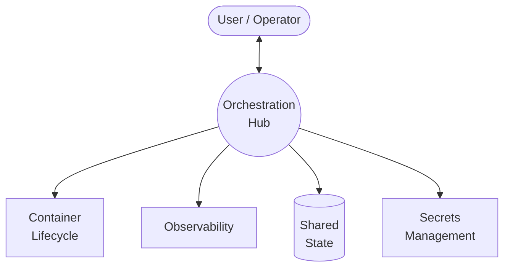

# Agentic Workflow Architecture

High-level architecture for autonomous agent workflows with container isolation and structured observability.

**Design maturity: Foundation** — see [[phase-roadmap]] for progression to later phases.

## Design Principles

- **Security**: Agents operate within sandboxed containers — filesystem access is scoped, not host-level
- **Autonomy**: Within their container boundary, agents have full filesystem and process control
- **Observability**: All agent activity is captured and logged

## Overview

## Layer Details

| Layer | Description | Detail |
|---|---|---|
| **Orchestration** | Task routing, agent registry, brainbox tokens, message routing, star topology | [[arch-orchestration]] |
| **Brainbox Lifecycle** | Provision (cosign), configure, start, monitor, recycle — brainbox hardening | [[arch-brainbox]] |
| **Observability** | Structured logs, basic metrics | [[arch-observability]] |
| **Secrets Management** | 1Password + direnv, file-based delivery | [[arch-secrets-management]] |
| **Shared State** | Vector DB, artifact store | [[arch-shared-state]] |
