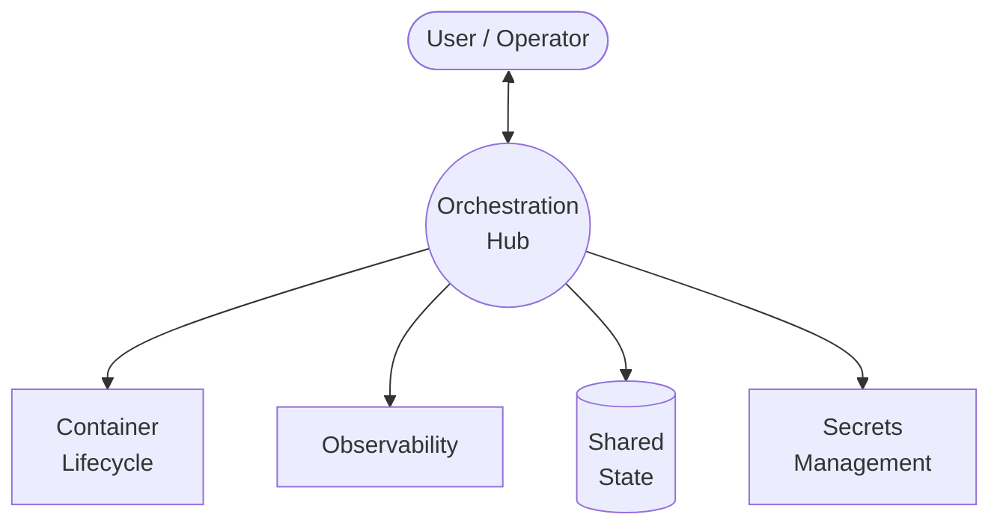

# Agentic Workflow Architecture

High-level architecture for autonomous agent workflows with container isolation and structured observability.

**Design maturity: Foundation** — see [[phase-roadmap]] for progression to later phases.

## Design Principles

- **Security**: Agents operate within sandboxed containers — filesystem access is scoped, not host-level
- **Autonomy**: Within their container boundary, agents have full filesystem and process control
- **Observability**: All agent activity is captured and logged

## Overview

```mermaid
graph TD
    User([User / Operator])

    User <--> Orch

    Orch((Orchestration<br/>Hub))

    Orch --> Lifecycle[Container<br/>Lifecycle]
    Orch --> Observe[Observability]
    Orch --> State[(Shared<br/>State)]
    Orch --> Secrets[Secrets<br/>Management]
```

## Layer Details

| Layer | Description | Detail |
|---|---|---|
| **Orchestration** | Task routing, agent registry (now with role-based agents), brainbox tokens, message routing, star topology | [[arch-orchestration]] |
| **Brainbox Lifecycle** | Provision (cosign), configure, start, monitor, recycle — brainbox hardening | [[arch-brainbox]] |
| **Observability** | Structured logs, basic metrics | [[arch-observability]] |
| **Secrets Management** | 1Password + direnv, file-based delivery | [[arch-secrets-management]] |
| **Shared State** | Vector DB, artifact store | [[arch-shared-state]] |

## Implementation Notes

The following capabilities have been implemented in brainbox, advancing beyond the original Phase 1 scope:

- **Agent role system**: 6 roles (developer, supervisor, worker, merge-queue, pr-shepherd, reviewer) with JSON definitions and markdown role prompts, absorbed from multiclaude (Dan Lorenc). Role-aware crash recovery — persistent agents auto-restart, transient agents clean up.
- **Multi-repo hub**: Repository management via CRUD endpoints (`/api/hub/repos`) with per-repo agent containers and a dashboard Repos panel.
- **Claude Code Teams integration**: `CLAUDE_CODE_EXPERIMENTAL_AGENT_TEAMS=1` injected into all containers, enabling native multi-agent coordination.
