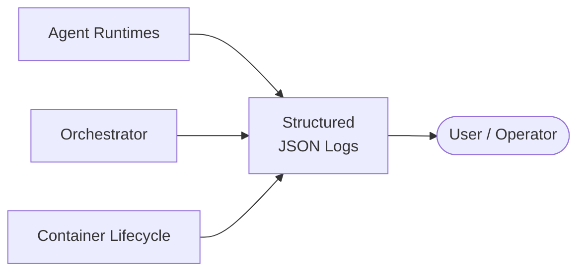

# Observability

All agent activity and container lifecycle events produce structured JSON logs.

## Log Format

All components emit structured JSON to stdout with consistent fields.

| Field | Description |
|---|---|
| **timestamp** | ISO 8601 UTC |
| **agent_name** | Which agent produced this log |
| **task_id** | Which task this log belongs to |
| **container_token** | The container's identity token ID |
| **level** | debug, info, warn, error |
| **message** | Human-readable log message |
| **metadata** | Structured key-value pairs |

## What's Tracked

| Signal | Source |
|---|---|
| **Task events** | Task dispatched, completed, failed, timed out |
| **Container events** | Provisioned, started, health check failed, recycled |
| **Message events** | Routed, rejected (invalid token, policy violation) |
| **Resource usage** | CPU, memory, disk per container (from Docker stats) |

## What's Deferred

| Feature | Phase |
|---|---|
| Formal metrics + alerting | PHASE_2 |
| Distributed traces | PHASE_2 |
| Data classification + redaction pipeline | PHASE_2 |
| Hash-chained audit trail + WORM storage | PHASE_3 |
