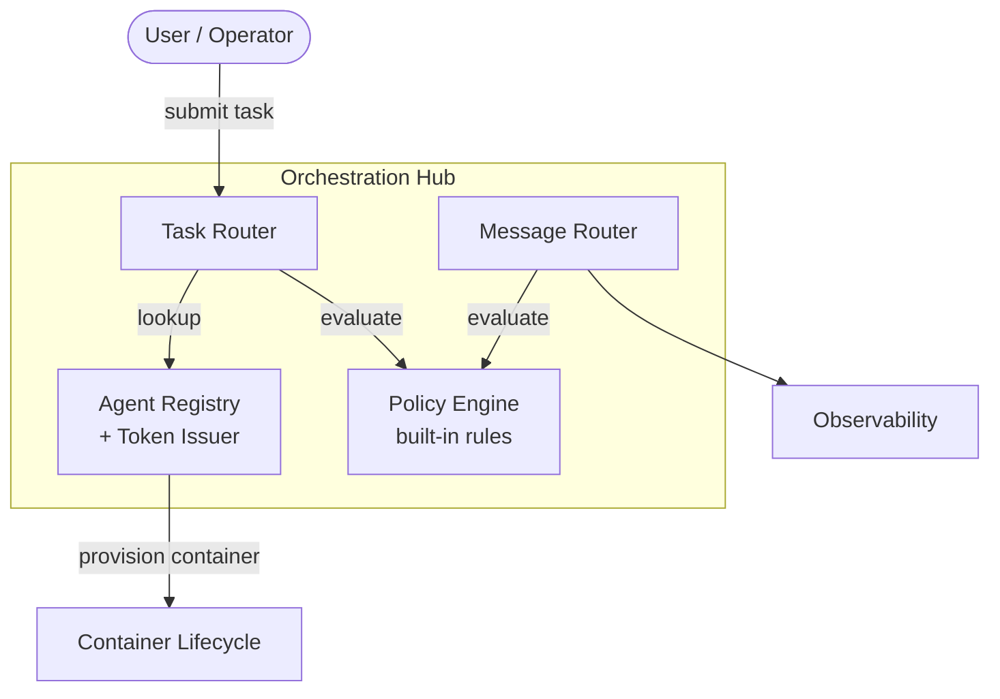
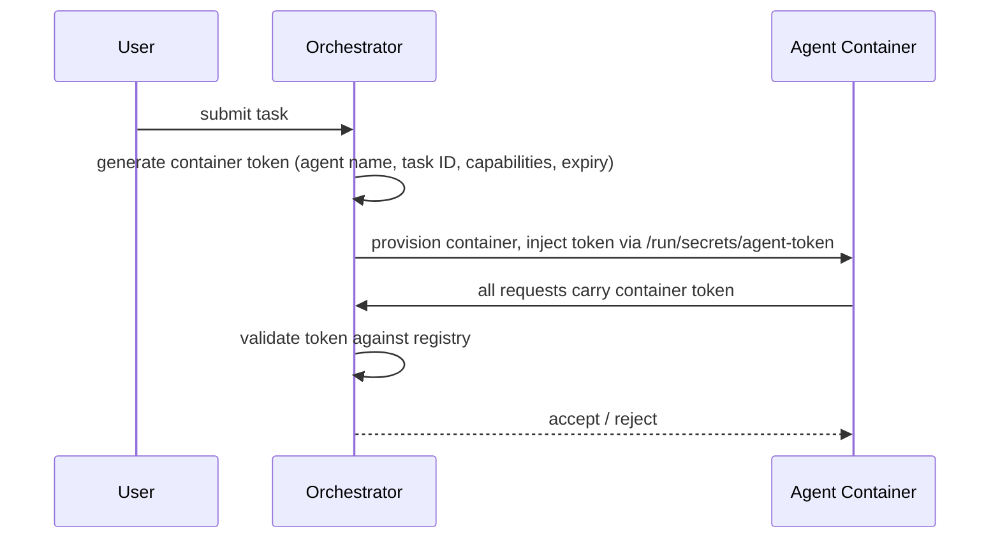
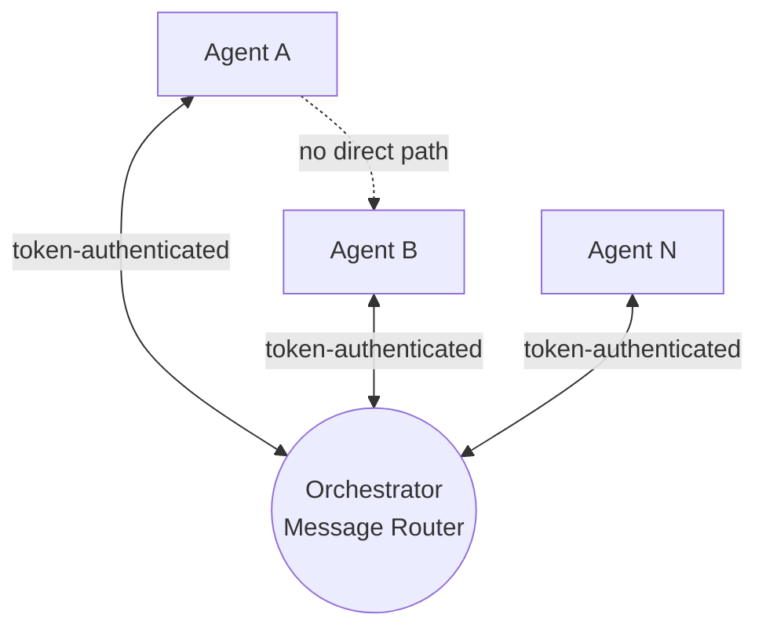
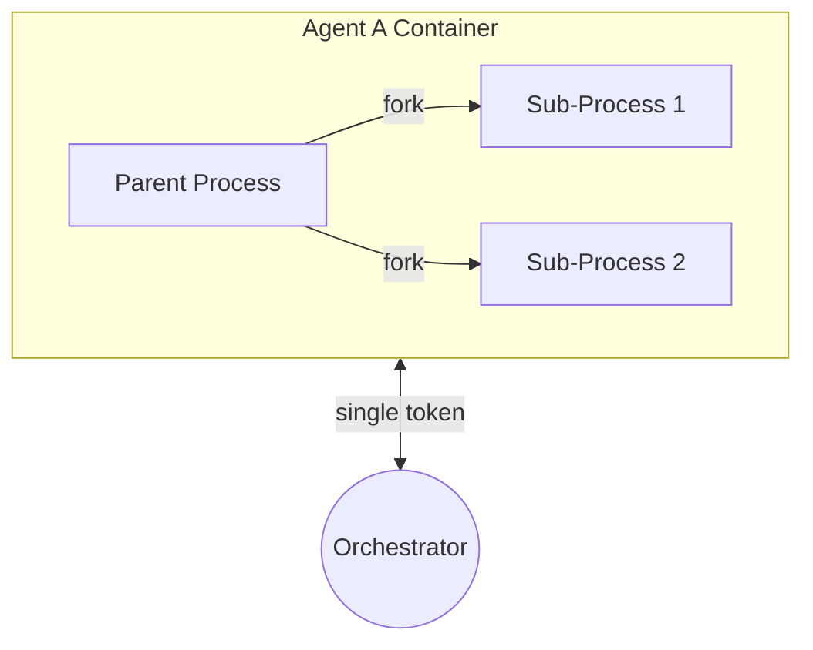

# Orchestration Layer

The orchestration hub handles **task dispatch**, **agent identity**, and **message routing**. There is no separate message broker or identity provider. Runs as a single process.

## Hub Overview

## Components

| Component | Responsibility |
|---|---|
| **Task Router** | Receives work requests from users, resolves which agent handles them |
| **Agent Registry** | Catalog of available agents, their capabilities, and container images. Issues container tokens on provisioning. |
| **Policy Engine** | Built-in rules for task authorization and message routing |
| **Message Router** | Routes all inter-agent communication — request/reply and events |

## Container Tokens

The orchestrator is the identity provider. When it spawns a container, it issues a unique token that the agent uses for all communication.

| Field | Purpose |
|---|---|
| **Token ID** | Unique identifier for this container instance |
| **Agent name** | Which agent image this container is running |
| **Task ID** | Which specific task this container was spawned for |
| **Capabilities** | What this agent is allowed to do |
| **Expiry** | Matches container TTL — token dies with the container |

The orchestrator validates every request by checking the token against its own registry. No external identity infrastructure needed.

> SPIFFE/SPIRE replaces this in PHASE_2 for workload attestation and mTLS.

## Star Topology

All inter-agent communication flows through the orchestrator. No direct agent-to-agent connections.

Every message passes through the orchestrator, which validates the token, checks policy, logs the exchange, and routes to the recipient.

## Message Patterns

| Pattern | Description | Example |
|---|---|---|
| **Request / Reply** | Agent sends request, orchestrator routes it, recipient replies | Agent A requests data from Agent B |
| **Event** | Agent emits an event, orchestrator routes to subscribers | Agent A completed a task, notify interested agents |

## Internal Delegation

Delegation is **internal only** — an agent can fork sub-processes within its own container. The orchestrator has no visibility.

| Property | Detail |
|---|---|
| **Scope** | Same container, same token, same resource limits |
| **Orchestrator visibility** | None — internal sub-processes are opaque |
| **Secret access** | Shared — sub-processes inherit the parent's `/run/secrets/` mount |

> External delegation (orchestrator provisions a new container for a sub-task) is introduced in PHASE_2.

## Communication Guardrails

Enforced at the orchestrator on every message.

| Guardrail | How |
|---|---|
| **Token required** | Every message must carry a valid container token — unauthenticated messages rejected |
| **Policy check** | Built-in rules evaluate whether this agent can send to that target |
| **Schema validation** | Message payload must conform to the expected schema |
| **Logging** | Every routed message is logged to [[arch-observability|Observability]] |
