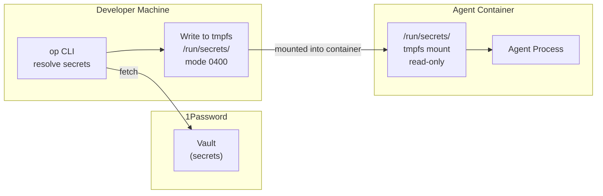

# Secrets Management

Secrets are never stored in files, images, or git. 1Password is the single source of truth. Secrets are delivered to containers as files on tmpfs, never as environment variables.

## Secret Flow



## How It Works

### 1. Secrets live in 1Password only

```
op://AgentVault/openai/api-key
op://AgentVault/database/connection-string
```

### 2. `.envrc` references secrets by URI — never by value

```bash
# .envrc — safe to commit
export OPENAI_API_KEY="op://AgentVault/openai/api-key"
export DATABASE_URL="op://AgentVault/database/connection-string"
```

### 3. direnv + `op` CLI resolves at shell entry

```bash
export OPENAI_API_KEY="$(op read op://AgentVault/openai/api-key)"
```

### 4. Secrets are delivered as files on tmpfs

During the [[arch-brainbox|Configure phase]], secrets are written to `/run/secrets/` with restrictive permissions. The agent reads them as files — they never appear in `/proc/*/environ`.

```bash
# Secrets written to tmpfs before container start:
# /run/secrets/openai-api-key (mode 0400, owned by 65534)
# /run/secrets/database-url    (mode 0400, owned by 65534)
```

## Security Properties

| Property | How It's Achieved |
|---|---|
| **No secrets in git** | `.envrc` contains only `op://` URIs, never values |
| **No secrets in images** | Secrets delivered at runtime via tmpfs, not baked at build |
| **No secrets in /proc** | File-based delivery on tmpfs — not environment variables |
| **Rotation without redeploy** | Update in 1Password — next container start picks up new value |

## What's Deferred

| Feature | Phase |
|---|---|
| Envelope encryption (KEK/DEK) | PHASE_2 |
| OIDC federation for CI | PHASE_2 |
| Break-glass procedure | PHASE_3 |
