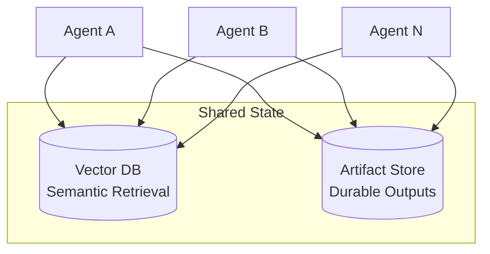

# Shared State

Durable persistence layer for cross-agent data. The only sanctioned path for data that outlives a single container.

## Architecture

Agents access stores through the brainbox API proxy (`/api/artifacts/*`). Agents don't need S3 credentials — brainbox proxies all requests to MinIO.

## Stores

| Store | Purpose | Examples | Backend |
|---|---|---|---|
| **Vector DB** | Semantic search and retrieval | Embeddings, conversation history, knowledge base | Local instance (Qdrant, ChromaDB) |
| **Artifact Store** | Durable, addressable outputs | Generated files, reports, build artifacts | MinIO (S3-compatible), configurable endpoint via `CL_ARTIFACT__ENDPOINT` |

## Access Rules

| Rule | Detail |
|---|---|
| **Attribution** | Every stored object carries: task ID, timestamp |
| **All agents can access all data** | No namespace isolation — any agent can read/write any store |

## Artifact Store Modes

The artifact store supports `off/warn/enforce` modes (matching the cosign pattern):

| Mode | MinIO Up | MinIO Down |
|---|---|---|
| **off** | All operations return 503 | All operations return 503 |
| **warn** | Normal operation | Logs warning, returns graceful fallback |
| **enforce** | Normal operation | Returns 502 error |

Key structure is a flat namespace. Phase 2 adds agent/task-scoped key prefixes.

## Rules

- Container filesystems are **ephemeral** — anything that must survive a recycle goes here
- All writes carry task ID for basic attribution
- No namespace isolation — all agents share the same data space

## What's Deferred

| Feature | Phase |
|---|---|
| Authenticated proxy (all access through proxy) | PHASE_2 |
| Namespace isolation per agent/task | PHASE_2 |
| Signed writes + verified reads | PHASE_2 |
| Quarantine capability | PHASE_3 |
| Per-namespace encryption at rest | PHASE_3 |
