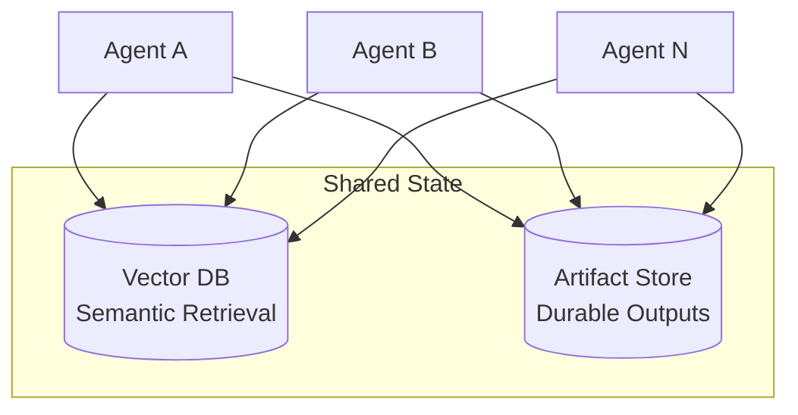

# Shared State

Durable persistence layer for cross-agent data. The only sanctioned path for data that outlives a single container.

## Architecture

Agents access stores directly. Access is not scoped or authenticated — any container can read/write any store.

## Stores

| Store | Purpose | Examples | Backend |
|---|---|---|---|
| **Vector DB** | Semantic search and retrieval | Embeddings, conversation history, knowledge base | Local instance (Qdrant, ChromaDB) |
| **Artifact Store** | Durable, addressable outputs | Generated files, reports, build artifacts | Local directory or S3-compatible store |

## Access Rules

| Rule | Detail |
|---|---|
| **Attribution** | Every stored object carries: task ID, timestamp |
| **All agents can access all data** | No namespace isolation — any agent can read/write any store |

## Rules

- Container filesystems are **ephemeral** — anything that must survive a recycle goes here
- All writes carry task ID for basic attribution
- No namespace isolation — all agents share the same data space

## What's Deferred

| Feature | Phase |
|---|---|
| Authenticated proxy (all access through proxy) | PHASE_2 |
| Namespace isolation per agent/task | PHASE_2 |
| Signed writes + verified reads | PHASE_2 |
| Quarantine capability | PHASE_3 |
| Per-namespace encryption at rest | PHASE_3 |
