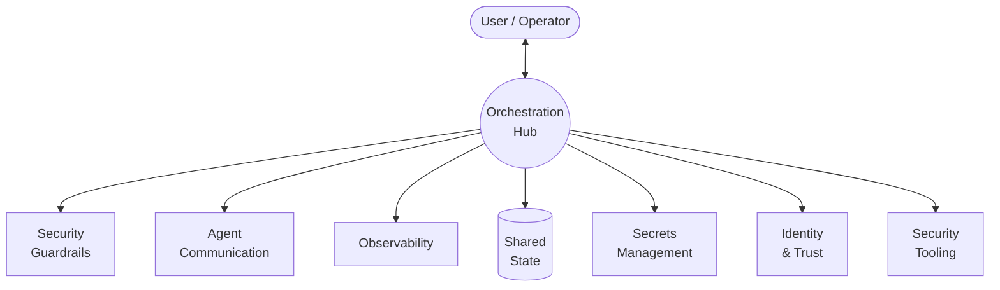

# Agentic Workflow Architecture

High-level architecture for autonomous agent workflows with security hardening, container token identity, and operational maturity.

**Design maturity: Hardened** — see [[phase-roadmap]] for progression to later phases.

## Design Principles

- **Security**: Agents operate within hardened containers with network segmentation and policy enforcement
- **Autonomy**: Within their container boundary, agents have full filesystem and process control
- **Observability**: All agent activity is captured, traced, classified, and redacted before storage

## Overview

## Layer Details

| Layer | Description | Detail |
|---|---|---|
| **Orchestration** | Task routing, agent registry, policy evaluation, message routing, state persistence | [[arch-orchestration]] |
| **Identity & Trust** | Container tokens, capability scoping, image integrity | [[arch-identity-and-trust]] |
| **Security Guardrails** | Full brainbox hardening, network zones, default-deny | [[arch-security-guardrails]] |
| **Brainbox Lifecycle** | Provision, configure, start, monitor, recycle — mandatory hardening | [[arch-brainbox]] |
| **Agent Communication** | Star topology, internal + external delegation, broadcast | [[arch-agent-communication]] |
| **Observability** | Logs, traces, metrics, data classification, redaction pipeline | [[arch-observability]] |
| **Secrets Management** | 1Password + envelope encryption, OIDC federation, file-based delivery | [[arch-secrets-management]] |
| **Shared State** | Vector DB, artifact store — authenticated proxy, namespace isolation | [[arch-shared-state]] |
| **Security Tooling** | OPA for policy, Kyverno for admission control | [[arch-security-tooling]] |
| **Threat Model** | Attack paths, risk quadrant | [[arch-threat-model]] |
| **Incident Response** | IR runbooks, forensic capture | [[arch-incident-response]] |
