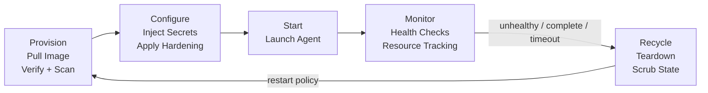
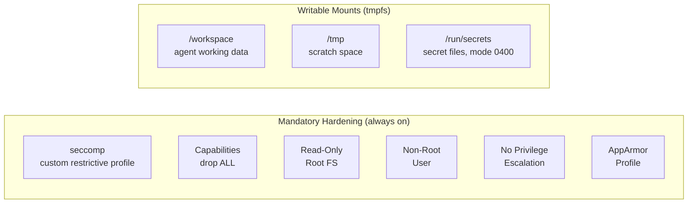

# Container Lifecycle

Every agent container follows a managed lifecycle. No container runs unbounded.



## Phases

| Phase | What Happens |
|---|---|
| **Provision** | Pull agent image, verify signature (cosign), scan for critical CVEs, validate against [[arch-security-tooling#Kyverno\|Kyverno]] admission policies, allocate resources |
| **Configure** | Write secrets to tmpfs via [[arch-secrets-management|envelope encryption + 1Password]], apply mandatory hardening, inject container token |
| **Start** | Launch the agent process inside the container |
| **Monitor** | Continuous health checks, resource usage tracking, heartbeat validation |
| **Recycle** | Teardown on completion, failure, or timeout — scrub ephemeral state, reclaim resources |

## Mandatory Container Hardening

Applied at the Configure phase to **every** container. This is the security floor — non-negotiable regardless of which [[arch-security-tooling|security tools]] are enabled.



| Control | Setting | Purpose |
|---|---|---|
| **seccomp** | Custom restrictive allowlist profile | Block syscalls the agent doesn't need — reduces kernel attack surface |
| **Capabilities** | `drop: ALL` — add back only what's explicitly required | Removes CAP_NET_RAW, CAP_MKNOD, CAP_SYS_CHROOT, etc. |
| **Read-only rootfs** | `readOnlyRootFilesystem: true` | Prevents modification of container binaries — agent writes only to tmpfs mounts |
| **Non-root user** | `runAsNonRoot: true`, `runAsUser: 65534` | Container escape as non-root limits host impact |
| **No privilege escalation** | `allowPrivilegeEscalation: false` / `--security-opt=no-new-privileges:true` | Blocks setuid/setgid binaries from escalating within the container |
| **AppArmor** | Custom profile denying `/proc/sys`, `/sys`, mount operations | Mandatory access control on sensitive pseudo-filesystems |
| **Secrets delivery** | File-based via tmpfs at `/run/secrets/<name>`, mode 0400, owned by agent UID | Eliminates `/proc/*/environ` exposure — see [[arch-secrets-management]] |
| **Token delivery** | File-based at `/run/secrets/agent-token`, mode 0400 | Token never exposed via env vars — see [[arch-identity-and-trust]] |
| **PID namespace** | `shareProcessNamespace: false` | Containers cannot see or signal each other's processes |

### Docker Equivalent

```bash
docker run \
  --security-opt seccomp=agent-seccomp.json \
  --security-opt apparmor=agent-apparmor \
  --security-opt no-new-privileges:true \
  --cap-drop ALL \
  --read-only \
  --tmpfs /workspace:size=500M \
  --tmpfs /tmp:size=100M \
  --mount type=tmpfs,destination=/run/secrets,tmpfs-mode=0400 \
  --user 65534:65534 \
  agent-image:latest
```

## Image Requirements

| Requirement | Detail |
|---|---|
| **Distroless base** | All agent images must use `distroless` or `scratch` base |
| **No shells** | No `/bin/sh`, `bash`, `zsh` — prevents shell-based exploitation |
| **No network utilities** | No `curl`, `wget`, `nc` — makes exfiltration harder |
| **cosign signature** | Required — unsigned images rejected |
| **Vulnerability scan** | Critical CVEs → image rejected until patched |

## Lifecycle Rules

- **Restart policy** determines whether a recycled container re-provisions or terminates permanently
- **Orphan reaping**: the monitor phase detects containers with no active task assignment and recycles them
- **Timeouts**: every container has a maximum TTL — no indefinite execution
- **State is ephemeral**: container filesystem is destroyed on recycle — durable outputs must be written to [[arch-shared-state|Shared State]]
- **Secure scrubbing**: ephemeral tmpfs mounts are memory-backed — pages freed on unmount
