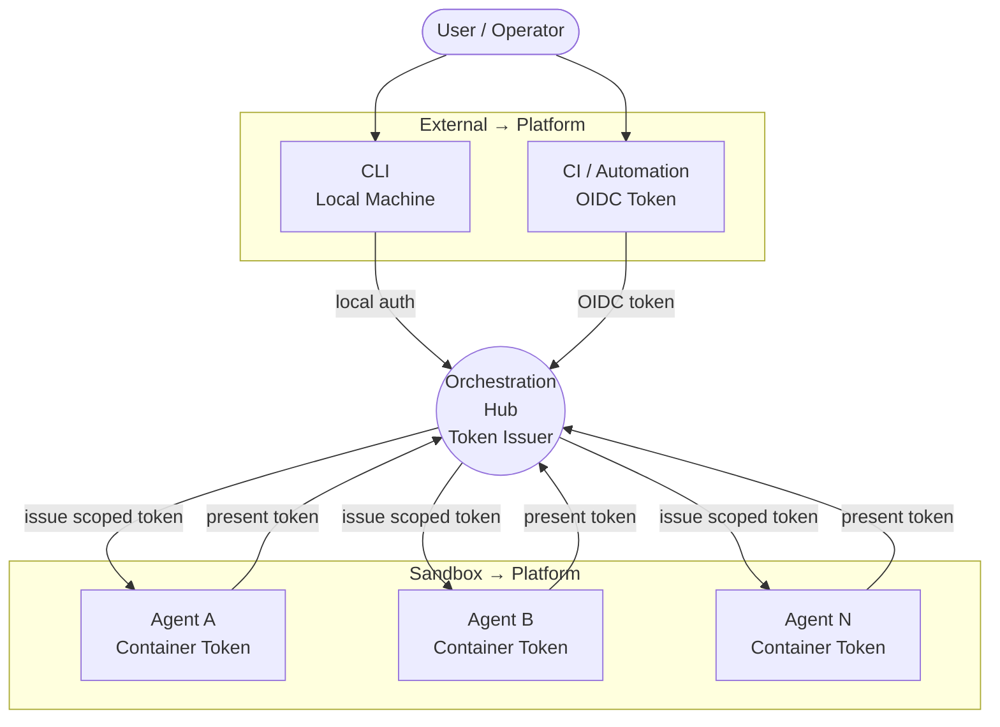
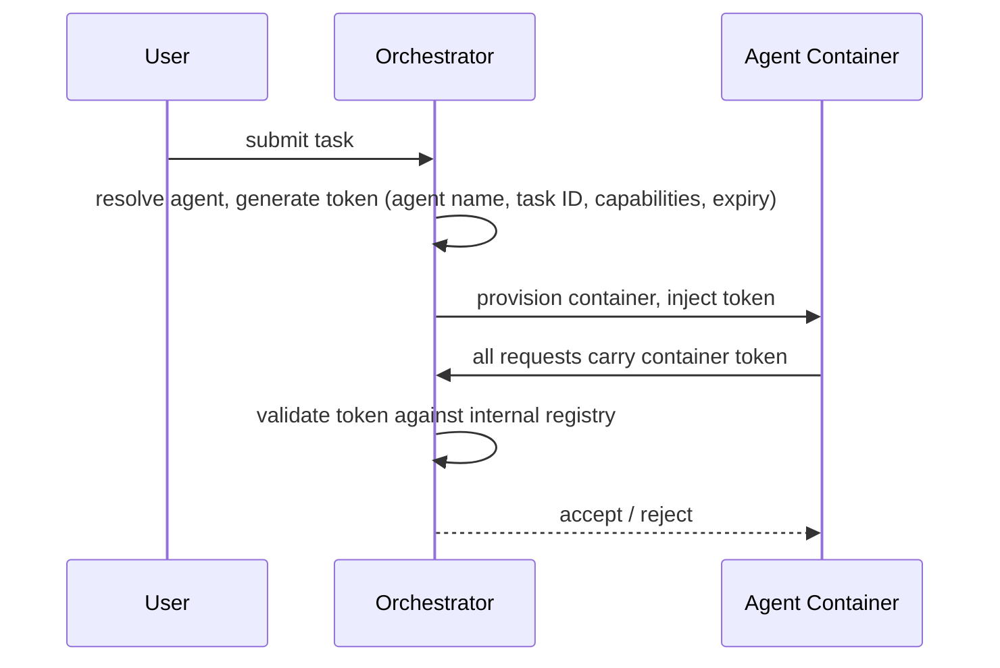
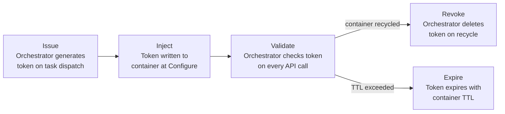
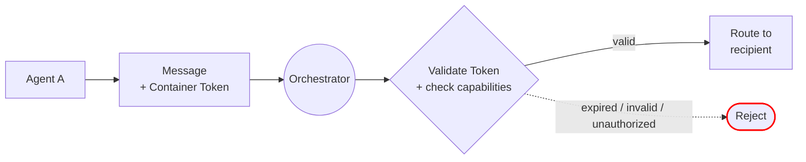

# Identity & Trust

Establishes who or what is making a request at every boundary in the system. Without this layer, any component can impersonate any other.

**New in PHASE_2.** Introduces orchestrator-issued container tokens — the first identity mechanism. Each container receives a unique token at provisioning time, and the orchestrator validates it on every API call. Phase 1 had no identity system (implicit trust via Docker labels).

**Phase 2 scope:** Container tokens with capability scoping, image verification with vulnerability scanning. No cryptographic workload identity (SPIRE/SVID) or mTLS yet.

## Trust Boundaries

Three boundaries where identity must be verified. Each crossing requires a different credential.

| Boundary | Who crosses | Credential | Verified by |
|---|---|---|---|
| **External → Platform** | User (CLI) | Local OS identity / session | Orchestrator |
| **External → Platform** | CI pipeline | OIDC identity token (from CI platform) | Orchestrator + 1Password |
| **Platform → Sandbox** | Orchestrator → Agent | Container token issued at provisioning | Agent receives at Configure phase |
| **Sandbox → Platform** | Agent → Orchestrator | Container token | Orchestrator validates on every request |

---

## User Authentication

Two paths into the orchestrator depending on context.

| Context | Auth Method | Token Lifetime | Stored In |
|---|---|---|---|
| **Local CLI** | OS session identity — you're on the machine | Session duration | N/A |
| **CI / Automation** | OIDC identity token — CI platform cryptographically proves pipeline identity | Pipeline duration | N/A (issued by CI platform) |

---

## Agent Identity (Container Tokens)

Each agent container receives a unique token at the Configure phase of its lifecycle. Agents never self-issue identity. The orchestrator is the sole token issuer and validator.

### Token Issuance Flow

### Token Contents

| Field | Purpose |
|---|---|
| **Token ID** | Unique identifier for this container instance (UUID) |
| **Agent name** | Which agent image this container is running |
| **Task ID** | Which specific task this container was spawned for |
| **Capabilities** | What this agent is allowed to do — scoped per-task |
| **Issued** | Timestamp when the token was created |
| **Expiry** | Matches container TTL — token dies with the container |

### Token Delivery

| Mode | Location | Detail |
|---|---|---|
| **Hardened** | `/run/secrets/agent-token` | tmpfs mount, mode 0400, not visible in `/proc/*/environ` |
| **Legacy** | `/home/developer/.agent-token` | File-based, mode 0400 |

### Token Lifecycle

| Phase | What Happens |
|---|---|
| **Issue** | Task Router dispatches work, Agent Registry issues a token with capabilities from the agent definition |
| **Inject** | Token is written to the container during the Configure lifecycle phase |
| **Validate** | Every API request to the orchestrator includes the token — validated against the internal registry |
| **Expire** | Token TTL matches container TTL — expired tokens are rejected and cleaned up |
| **Revoke** | On container recycle, the token is deleted from the registry |

### Capability Scoping

The token's `capabilities` field enables per-task authorization beyond the image-level role scoping.

| Scenario | How It Works |
|---|---|
| **Same image, different permissions** | Two developer containers can have different capability grants depending on their task |
| **Least privilege** | Token capabilities are a subset of the agent definition's full capability list |
| **Policy enforcement** | Orchestrator checks token capabilities before allowing message routing or task dispatch |

### Why Container Tokens (Not SPIRE)

| Concern | How Container Tokens Handle It |
|---|---|
| **No external infrastructure** | Orchestrator is the sole issuer and validator — no SPIRE server, no PKI, no sidecars |
| **Simple deployment** | Single process handles identity — fits the Phase 2 operational maturity level |
| **Task attribution** | Every token carries agent name + task ID — sufficient for audit logging |
| **Capability scoping** | Token capabilities field enables fine-grained authorization |
| **Expiry** | Tokens are short-lived (container TTL) — no long-lived credentials |

> SPIFFE/SPIRE replaces container tokens in [[../PHASE_3/arch-identity-and-trust|PHASE_3]] for cryptographic workload attestation and mTLS.

---

## Image Integrity & Supply Chain

Before a container is provisioned, the image must be verified.

| Gate | What's Checked | Failure Mode |
|---|---|---|
| **Signature (cosign)** | Image signed by trusted key, digest matches manifest | Unsigned or tampered → rejected |
| **Vulnerability scan** | No critical CVEs in image layers | Critical CVE → blocked until patched |

---

## Message Integrity

All messages through the orchestrator carry the sender's container token. The orchestrator validates identity on every request.

| Control | How |
|---|---|
| **Identity on every message** | Container token is presented with each request — orchestrator validates against internal registry |
| **Capability check** | Orchestrator verifies the token's capabilities allow the requested action |
| **Artifact attribution** | Writes to shared state include the token ID — origin is traceable |
| **Log attribution** | Observability layer records the token's agent name and task ID |

## What's Deferred

| Feature | Phase |
|---|---|
| SPIFFE/SPIRE workload identity (replaces container tokens) | PHASE_3 |
| mTLS between agents and orchestrator | PHASE_3 |
| Replay protection (nonce + timestamp + HMAC) | PHASE_3 |
| HSM-backed root CA, intermediate CA | PHASE_3 |
| SVID deny-list revocation | PHASE_3 |
| Approved base image policy (beyond distroless) | PHASE_3 |
