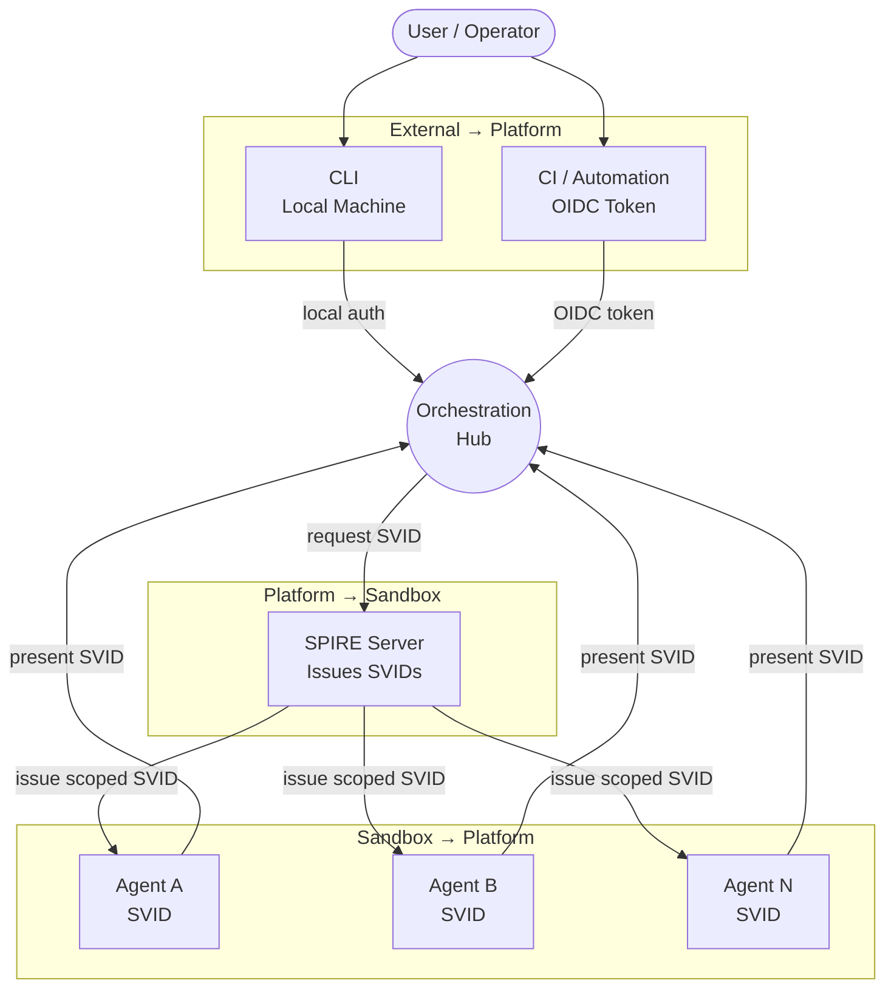
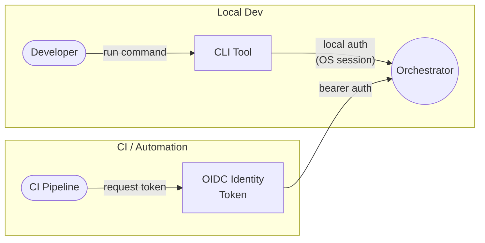
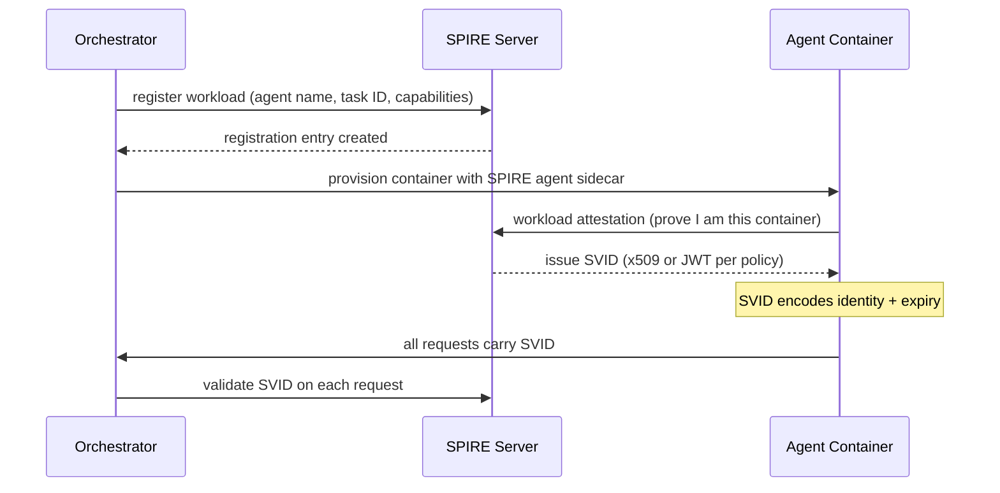
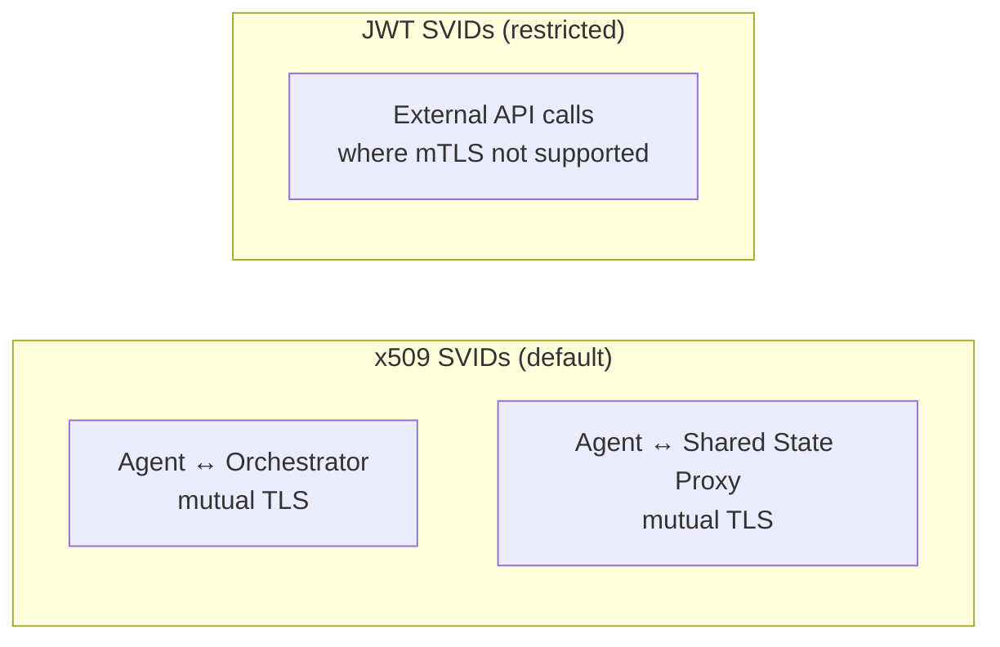
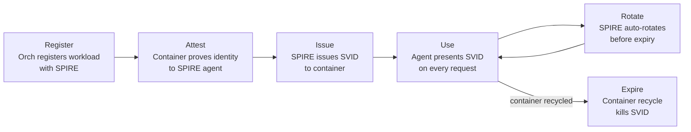
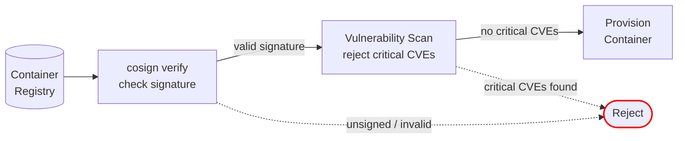
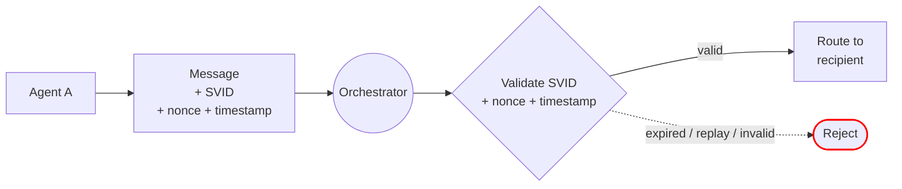

# Identity & Trust

Establishes who or what is making a request at every boundary in the system. Without this layer, any component can impersonate any other.

**New in PHASE_2.** Replaces the orchestrator-issued container tokens from PHASE_1 with cryptographic workload identity via SPIFFE/SPIRE. Agents now receive short-lived SVIDs instead of static tokens, enabling mTLS and workload attestation.

**Phase 2 scope:** Full SPIRE with SVID type policy, aggressive TTLs, vulnerability scanning. No HSM-backed PKI or deny-list revocation yet.

## Trust Boundaries

Three boundaries where identity must be verified. Each crossing requires a different credential.



| Boundary | Who crosses | Credential | Verified by |
|---|---|---|---|
| **External → Platform** | User (CLI) | Local OS identity / session | Orchestrator |
| **External → Platform** | CI pipeline | OIDC identity token (from CI platform) | Orchestrator + 1Password |
| **Platform → Sandbox** | Orchestrator → Agent | SPIFFE SVID issued by SPIRE | Agent receives at start |
| **Sandbox → Platform** | Agent → Orchestrator | SPIFFE SVID | Orchestrator validates on every request |

---

## User Authentication

Two paths into the orchestrator depending on context.



| Context | Auth Method | Token Lifetime | Stored In |
|---|---|---|---|
| **Local CLI** | OS session identity — you're on the machine | Session duration | N/A |
| **CI / Automation** | OIDC identity token — CI platform cryptographically proves pipeline identity | Pipeline duration | N/A (issued by CI platform) |

---

## Agent Identity (SPIFFE / SPIRE)

Each agent container receives a SPIFFE SVID at the Configure phase of its lifecycle. Agents never self-issue identity.

### SVID Issuance Flow



### SVID Contents

```
spiffe://agentic-platform/agent/<agent-name>/task/<task-id>
```

| Field | Purpose |
|---|---|
| **Trust domain** | `agentic-platform` — scopes all identities to this system |
| **Agent name** | Which agent image this container is running |
| **Task ID** | Which specific task this container was spawned for |
| **Expiry** | Short-lived (5 minutes) — auto-rotated before expiry |
| **Capabilities** | Encoded in registration entry — what this agent is allowed to do |

### SVID Type Policy

Two SVID types exist. Each has different security properties.



| SVID Type | Use Case | Security Properties |
|---|---|---|
| **x509** | All agent-to-orchestrator communication, shared state access | Non-replayable (bound to TLS session), enables mTLS |
| **JWT** | External API calls where mTLS is not practical | Bearer token — must have: audience claim, ≤ 60s TTL, never logged |

### SVID TTL Policy

| Parameter | Value | Rationale |
|---|---|---|
| **SVID TTL** | 5 minutes | Limits damage window from compromised SVID |
| **Rotation trigger** | 50% of TTL (2.5 minutes) | SPIRE agent requests renewal before expiry |
| **Grace period** | 30 seconds after expiry | Allows in-flight requests to complete |
| **Max container TTL** | Matches [[arch-container-lifecycle]] lifecycle TTL | SVID cannot outlive its container |

### Why SPIFFE/SPIRE

| Concern | How SPIRE handles it |
|---|---|
| **No static secrets** | SVIDs are short-lived and auto-rotated — no long-lived credentials in containers |
| **Workload attestation** | SPIRE verifies the container via node and workload attestors (Docker, K8s) |
| **Multi-environment** | SPIRE has attestors for Docker, Kubernetes, and bare metal |
| **mTLS built in** | x509 SVIDs enable mTLS between agent and orchestrator out of the box |
| **No agent cooperation needed** | The SPIRE agent sidecar handles attestation — the agent process just uses the SVID |

### Identity Lifecycle



| Phase | What Happens |
|---|---|
| **Register** | Orchestrator creates a SPIRE registration entry with agent name, task ID, and allowed capabilities |
| **Attest** | SPIRE workload attestor verifies the container's identity (Docker PID, K8s pod, etc.) |
| **Issue** | SPIRE issues an SVID (x509 or JWT per policy) to the verified container |
| **Use** | Agent includes the SVID in every request to the orchestrator and shared state |
| **Rotate** | SPIRE auto-rotates the SVID before expiry (at 50% TTL) — no agent involvement needed |
| **Expire** | On container recycle, the registration entry is deleted and the SVID becomes invalid |

---

## Image Integrity & Supply Chain

Before a container is provisioned, the image must be verified.



| Gate | What's Checked | Failure Mode |
|---|---|---|
| **Signature (cosign)** | Image signed by trusted key, digest matches manifest | Unsigned or tampered → rejected |
| **Vulnerability scan** | No critical CVEs in image layers | Critical CVE → blocked until patched |

---

## Message Integrity

All messages through the orchestrator carry the sender's SVID. The orchestrator validates identity on every request.



| Control | How |
|---|---|
| **Identity on every message** | SVID is presented with each request — orchestrator validates against SPIRE |
| **Replay prevention** | Nonce + timestamp on each message — orchestrator rejects duplicates and expired payloads |
| **Artifact attribution** | Writes to shared state include the SVID — origin is cryptographically verifiable |
| **Log attribution** | Observability layer records the SVID claim — unsigned log entries are flagged |
| **mTLS** | x509 SVIDs enable mutual TLS between agent containers and the orchestrator |

## What's Deferred

| Feature | Phase |
|---|---|
| HSM-backed root CA, intermediate CA | PHASE_3 |
| SVID deny-list revocation | PHASE_3 |
| Detailed replay protection (nonce storage, HMAC binding) | PHASE_3 |
| Approved base image policy (beyond distroless) | PHASE_3 |
