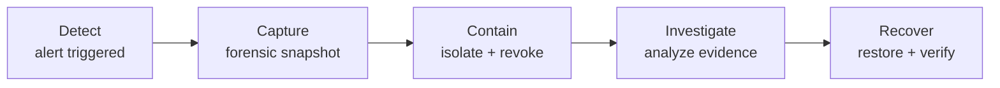
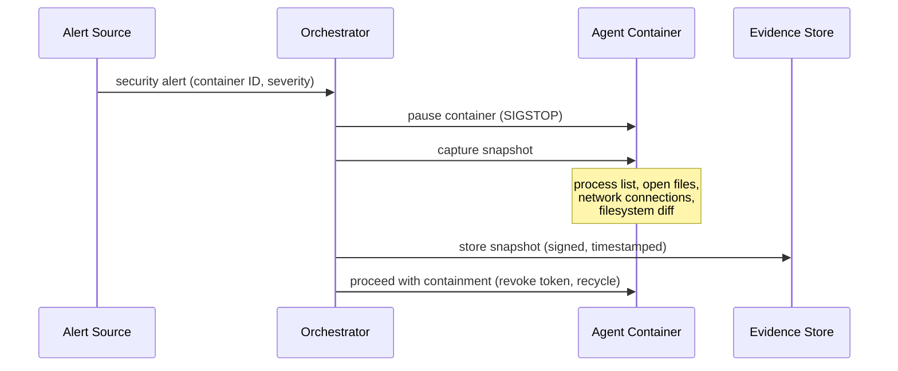

# Incident Response

Procedures for detecting, containing, and recovering from security incidents. Automated responses include a forensic capture step before any destructive action.

**Phase 2 scope:** IR runbooks per threat actor, forensic capture before recycle. No escalation matrix or known-good baseline yet.

## Response Lifecycle

| Phase | What Happens | Who |
|---|---|---|
| **Detect** | Alert from OPA policy violation, observability anomaly, or container health check failure | Automated |
| **Capture** | Forensic snapshot of container state before any destructive action | Automated |
| **Contain** | Revoke container token, recycle container, quarantine is manual | Automated + Operator |
| **Investigate** | Analyze captured evidence, trace attack path, assess blast radius | Operator |
| **Recover** | Rotate affected secrets, verify data integrity, resume operations | Operator |

## Forensic Capture

Every automated container recycle must capture evidence **before** destroying the container.

| Captured Data | How | Retention |
|---|---|---|
| **Process list** | `/proc` snapshot | 90 days |
| **Open file descriptors** | `/proc/<pid>/fd` snapshot | 90 days |
| **Network connections** | `/proc/<pid>/net/tcp` | 90 days |
| **Filesystem diff** | Overlay diff layer (changes from image baseline) | 90 days |
| **Container logs** | Full stdout/stderr | 90 days |
| **tmpfs contents** | `/workspace`, `/tmp` snapshot (NOT `/run/secrets`) | 90 days, encrypted |

## Runbooks

### T1: Compromised Agent

| Step | Action |
|---|---|
| **Capture** | Forensic snapshot before recycle |
| **Contain** | Revoke container token (immediate rejection on next API call), recycle container |
| **Scope** | Check: what secrets did this agent have? What shared state did it write? |
| **Rotate** | Rotate all secrets the agent had access to |
| **Verify** | Review shared state artifacts attributed to this agent's token ID |

### T2: Malicious Insider

| Step | Action |
|---|---|
| **Contain** | Revoke operator credentials immediately |
| **Scope** | Audit trail: which vaults, policies, and agents were accessed? |
| **Rotate** | Rotate all secrets in accessed vaults (envelope encryption limits exposure — needs both 1Password + KMS) |
| **Review** | Check all OPA/Kyverno policy changes for backdoors |
| **Restore** | Restore policies from version-controlled known-good commit |

### T3: Supply Chain Compromise

| Step | Action |
|---|---|
| **Block** | Reject compromised image at Provision gate |
| **Identify** | Which containers are running the compromised image? |
| **Capture** | Forensic snapshots for all affected containers |
| **Recycle** | Recycle all affected containers |
| **Rebuild** | Patch and rebuild from trusted base, re-sign with cosign |

### T4: External Attacker

| Step | Action |
|---|---|
| **Log** | Capture connection details |
| **Block** | Block source at network edge |
| **Assess** | Verify no traffic reached agents (mTLS should have rejected) |
| **Harden** | Tighten egress rules, review exposed endpoints |

## What's Deferred

| Feature | Phase |
|---|---|
| Post-mortem phase (update defenses) | PHASE_3 |
| Escalation severity matrix | PHASE_3 |
| Known-good baseline definition | PHASE_3 |
| Memory dump capture (critical severity) | PHASE_3 |
| WORM evidence store | PHASE_3 |
| Automated downstream notification on quarantine | PHASE_3 |
