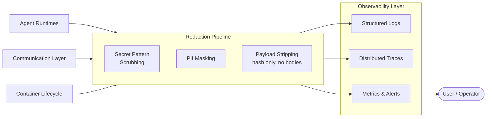

# Observability Layer

All agent activity, container lifecycle events, and inter-agent communication flow into a unified observability stack. A mandatory redaction pipeline strips sensitive data before storage.

## Data Classification

All data in the system is classified before storage. Classification drives access control, retention, and redaction.

| Level | Description | Examples | Handling |
|---|---|---|---|
| **Public** | Non-sensitive, shareable | Agent task names, completion status | No restrictions |
| **Internal** | Platform operational data | Metrics, resource usage, task throughput | Access scoped to operator |
| **Confidential** | Business-sensitive agent outputs | Generated reports, embeddings, artifacts | Namespace-scoped, encrypted at rest |
| **Restricted** | Credentials, PII, cryptographic material | API keys, tokens, SVID private keys | Never logged, redacted on sight |

## Redaction Pipeline

Mandatory processing between data sources and observability storage. Cannot be disabled.

| Stage | What It Does |
|---|---|
| **Secret scrubbing** | Regex-based removal of known secret patterns (API keys, tokens, connection strings, base64 blobs) |
| **PII masking** | Detect and mask personally identifiable information in structured log fields |
| **Payload stripping** | Distributed traces record payload hash, sender, receiver, timestamp — never full message bodies |
| **Classification gating** | Restricted-class data is dropped from logs/traces entirely — only the access event is recorded |

## Signals

| Signal | Source | Purpose |
|---|---|---|
| **Structured Logs** | Agent runtimes, container lifecycle | Searchable event records — what happened and when |
| **Distributed Traces** | Agent runtimes, communication layer | Request flow across agents — latency, dependencies, failures. Payload hashes only, no bodies. |
| **Metrics & Alerts** | Agent runtimes, container lifecycle | Resource usage, task throughput, error rates, alerting |

## Log Format

All logs are structured (JSON) with consistent fields.

| Field | Description |
|---|---|
| **timestamp** | ISO 8601 UTC |
| **agent_name** | Which agent produced this log |
| **task_id** | Which task this log belongs to |
| **svid** | The agent's SPIFFE identity |
| **level** | debug, info, warn, error |
| **classification** | Data classification level of this entry |
| **message** | Human-readable log message |
| **metadata** | Structured key-value pairs |

## What's Deferred

| Feature | Phase |
|---|---|
| Hash-chained audit trail | PHASE_3 |
| WORM storage | PHASE_3 |
| External audit log forwarding | PHASE_3 |
| Audit trail integrity verification | PHASE_3 |
