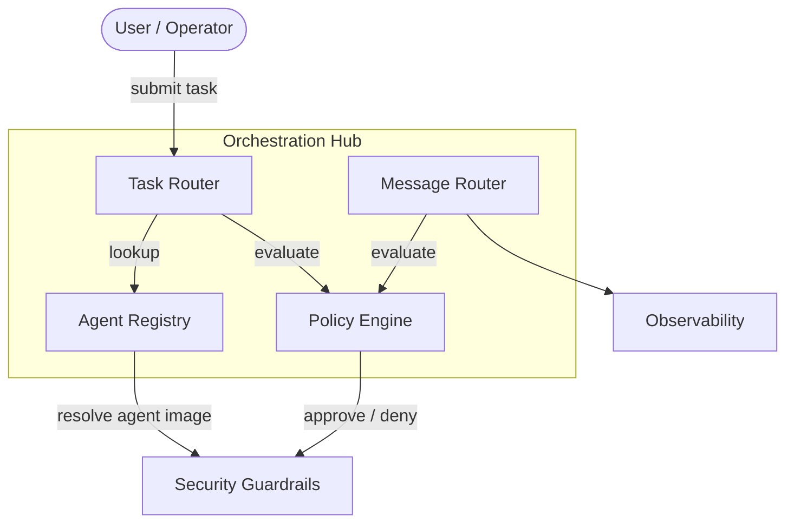
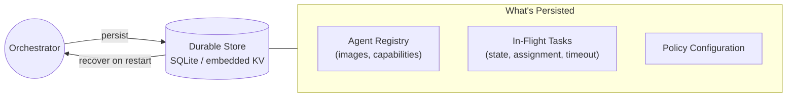

# Orchestration Layer

The orchestration hub serves two roles: **task dispatch** (routing work to agents) and **communication bus** (routing all agent-to-agent messages). There is no separate message broker.

## Hub Overview

## Components

| Component | Responsibility |
|---|---|
| **Task Router** | Receives work requests from users, resolves which agent handles them |
| **Agent Registry** | Catalog of available agents, their capabilities, and container images |
| **Policy Engine** | Evaluates authorization for both task dispatch and agent-to-agent messages. Delegates to [[arch-security-tooling#OPA|OPA]] when enabled. |
| **Message Router** | Routes all inter-agent communication — request/reply, events, broadcasts |

## Task Dispatch Flow

1. User submits a task
2. Task Router queries the Agent Registry for a capable agent
3. Policy Engine evaluates authorization (can this agent run? with what capabilities?)
4. On approval, the task is dispatched into the [[arch-security-guardrails|Security Guardrails]] layer

## Message Routing Flow

1. Agent sends a message (result, event, delegation request) to the orchestrator
2. Message Router validates the payload schema
3. Policy Engine checks scope (can this agent send this message to that target?)
4. Agent identity token (SVID) is verified
5. Message is logged to [[arch-observability|Observability]] and routed to the recipient

See [[arch-agent-communication]] for the full communication model, delegation patterns, and guardrails.

## State Persistence

The orchestrator persists critical state to survive restarts.

| Data | Persisted | Recovery |
|---|---|---|
| **Agent registry** | Yes | Rebuilt from config + registry on restart |
| **In-flight tasks** | Yes | Resumed or safely timed out on restart |
| **Policy config** | Yes | Loaded from version-controlled source on restart |
| **Message queue** | No | In-flight messages lost — agents retry via standard timeout |

## Degraded Mode

When the orchestrator detects internal failures, it enters a degraded read-only mode rather than crashing.

| Mode | Behavior |
|---|---|
| **Normal** | Full task dispatch, message routing, policy evaluation |
| **Degraded (read-only)** | No new task dispatch, no new container provisioning. Existing containers continue running. Message routing and health checks continue. Alerts operator. |
| **Offline** | Orchestrator unreachable. Existing containers continue until TTL. No new work. |

## Basic Monitoring

| Check | Action on Failure |
|---|---|
| **Orchestrator health endpoint** | If unreachable, alert operator |
| **Task throughput** | If zero tasks dispatched for configurable window, alert operator |
| **Container orphan scan** | If containers exist with no matching orchestrator task record, alert + recycle |
