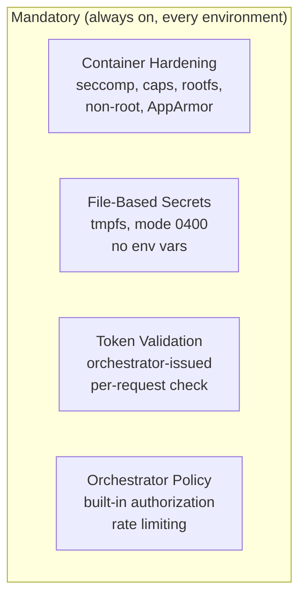
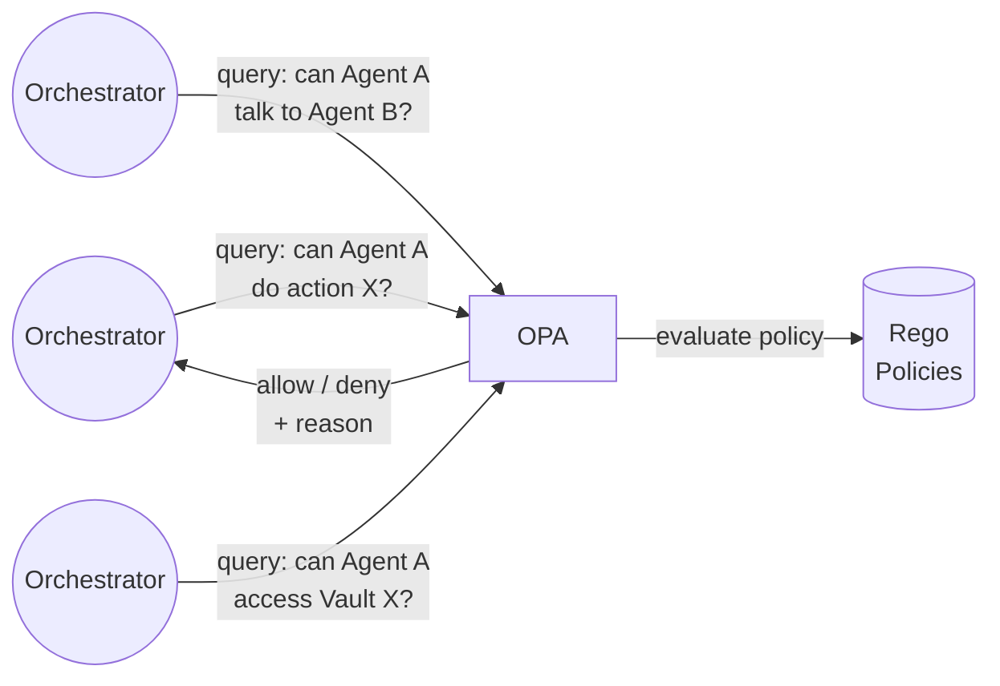
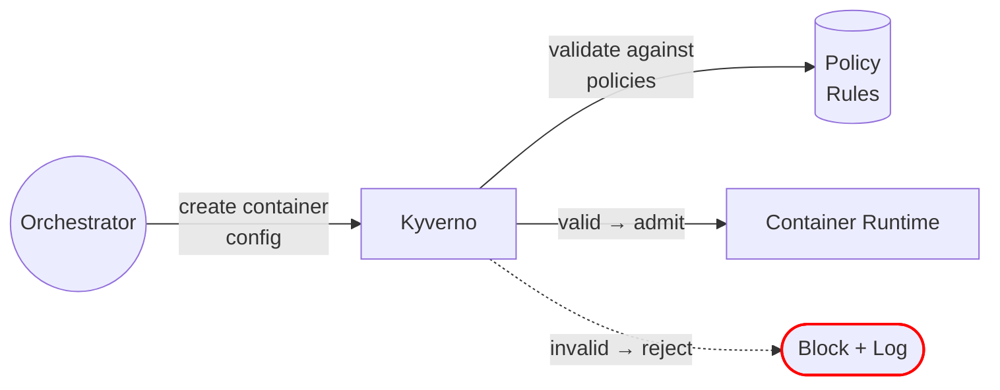

# Security Tooling

Runtime security has two tiers: a **mandatory hardening baseline** that is always on, and **optional tooling** that is enabled per environment.

**Phase 2 scope:** OPA for policy decisions, Kyverno for admission control. Envoy, Cilium, and Falco are deferred.

## Mandatory Baseline (always on)

These controls apply in every environment. They cannot be disabled.

| Control | What It Enforces |
|---|---|
| **Container hardening** | seccomp, drop all caps, read-only rootfs, non-root, no-new-privileges, AppArmor |
| **File-based secrets** | Secrets on tmpfs, not env vars — eliminates /proc/*/environ exposure |
| **Token validation** | Container token verified on every API request — expired or revoked tokens rejected |
| **Orchestrator built-in policy** | Token-based authorization, rate limiting, container config validation |

See [[arch-brainbox#Mandatory Brainbox Hardening]] for the full hardening spec.

## OPA — Policy Decisions

Evaluates "should this be allowed?" at every enforcement point. Policies are declarative Rego files.

| Function | Detail |
|---|---|
| **Task authorization** | Can this agent run this task with these capabilities? |
| **Communication scope** | Can Agent A send messages to Agent B? |
| **Secret access** | Can this agent access this 1Password vault? |
| **Delegation approval** | Can Agent A request external delegation with these capabilities? |
| **Cross-namespace access** | Can Agent A read data from Agent B's namespace in shared state? |
| **When disabled** | Orchestrator's built-in policy engine handles all decisions (less granular) |

## Kyverno — Admission Control

Validates infrastructure configurations before they are applied. Prevents bad state from ever existing.

| Function | Detail |
|---|---|
| **Resource limits required** | Reject any container config missing CPU/memory/disk limits |
| **No host mounts** | Block any config that attempts to mount host filesystem |
| **Approved images only** | Reject configs referencing images not in the approved registry |
| **No privileged containers** | Block privileged mode, host networking, host PID namespace |
| **Distroless enforcement** | Reject images not built from an approved distroless base |
| **When disabled** | Orchestrator's built-in config validation only (less strict) |

## Graceful Degradation

When an optional tool is disabled or crashes, the mandatory baseline still holds.

| Tool Disabled | What Still Protects You |
|---|---|
| **OPA off** | Orchestrator's built-in policy engine handles authorization. Container hardening limits blast radius. |
| **Kyverno off** | Orchestrator validates configs. Hardening is applied by the provisioner, not Kyverno. |

## Health Monitoring

| Requirement | Detail |
|---|---|
| **Health check** | Each tool exposes a health endpoint or is monitored via process supervision |
| **Failure alerting** | Tool crash or unreachability triggers immediate alert to operator |
| **Policy version control** | All OPA/Kyverno policies are version-controlled and changes are logged |

## What's Deferred

| Tool | Purpose | Phase |
|---|---|---|
| **Envoy + SPIRE** | mTLS termination, identity validation, traffic inspection, rate limiting | PHASE_3 |
| **Cilium** | eBPF kernel-level DNS filtering, egress enforcement, identity-aware networking | PHASE_3 |
| **Falco** | Syscall monitoring, container escape detection, automated response | PHASE_3 |
| Envoy bypass prevention | iptables redirect + NetworkPolicy | PHASE_3 |
| Falco circuit breaker | Rate-limited automated recycle | PHASE_3 |
| Environment profiles (per-tool flags) | Flaggable on/off per environment | PHASE_3 |
