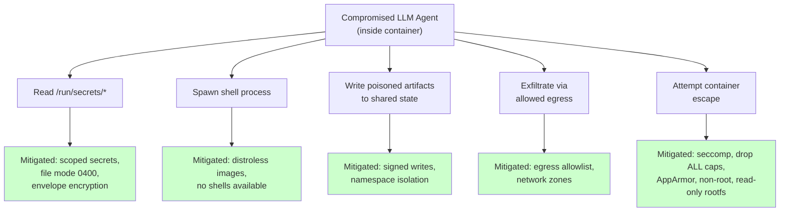
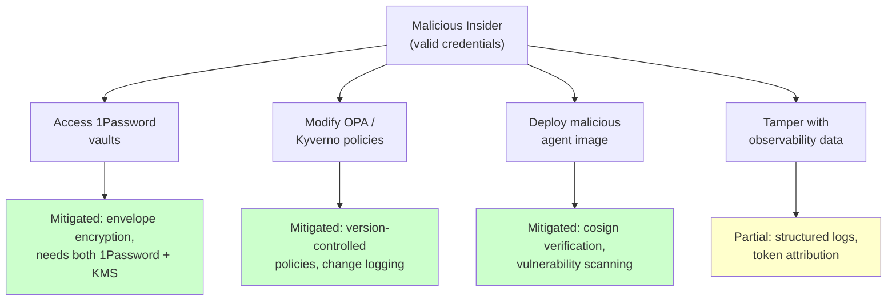
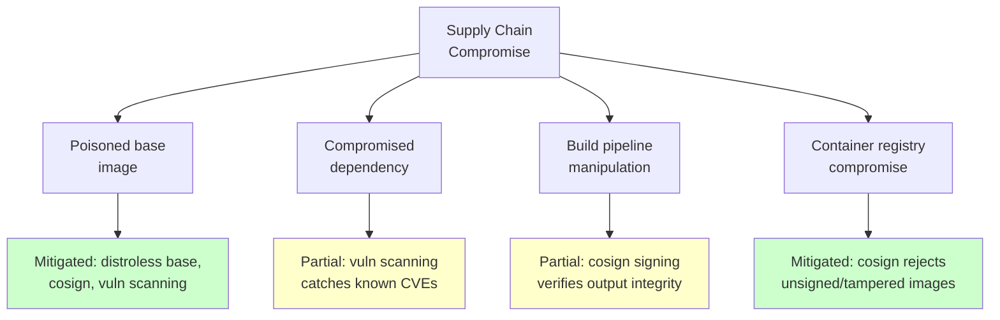
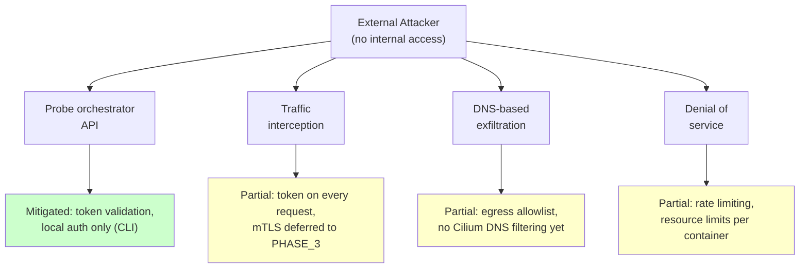
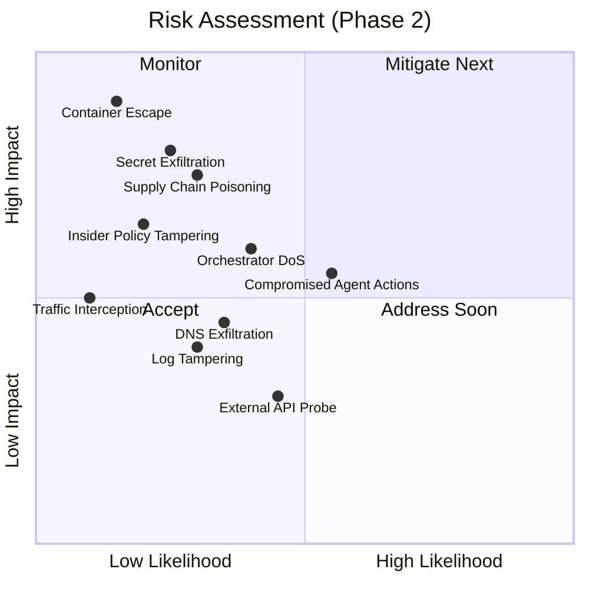

# Threat Model

Four threat actors mapped to attack paths through the architecture. Risk assessed on a likelihood × impact quadrant.

## Threat Actors

| Actor | Description | Motivation |
|---|---|---|
| **T1: Compromised LLM Agent** | An agent whose LLM is manipulated via prompt injection, poisoned context, or adversarial input | Exfiltrate data, escalate privileges, corrupt shared state |
| **T2: Malicious Insider** | An authorized operator whose credentials are stolen or who acts maliciously | Access secrets, modify policies, manipulate agent behavior |
| **T3: Supply Chain** | Compromised dependency, base image, or build pipeline | Inject backdoors, establish persistence, access secrets |
| **T4: External Attacker** | No internal access — probing from outside the platform boundary | Gain initial access, move laterally, exfiltrate data |

## Attack Paths

### T1: Compromised Agent — Inside the Sandbox

### T2: Malicious Insider — Valid Credentials

### T3: Supply Chain — Build Pipeline

### T4: External Attacker — No Initial Access

## Risk Quadrant

## Addressed in This Phase

| Threat | Key Mitigations |
|---|---|
| **Container Escape** | Full mandatory hardening: custom seccomp, drop ALL caps, AppArmor, non-root, read-only rootfs |
| **Secret Exfiltration** | Envelope encryption, file-based delivery, scoped vaults, egress allowlist |
| **Supply Chain** | cosign verification, vulnerability scanning, distroless images |
| **Agent Impersonation** | Container token on every request, orchestrator validation, capability scoping |
| **Cross-Agent Data Leak** | Namespace isolation, signed writes, authenticated proxy |
| **Insider Secrets Access** | Envelope encryption (needs both 1Password + KMS) |

## Outstanding Gaps

| Gap | Why It Persists | Addressed In |
|---|---|---|
| No cryptographic identity | Container tokens are bearer tokens, not cryptographic attestation | PHASE_3 (SPIRE/SVID) |
| No kernel-level network enforcement | Egress allowlist at container level, not eBPF | PHASE_3 (Cilium) |
| No runtime syscall monitoring | Prevention via seccomp/AppArmor, but no detection | PHASE_3 (Falco) |
| No tamper-proof audit trail | Structured logs with attribution, but no hash chain or WORM | PHASE_3 |
| No DNS filtering | Egress allowlist blocks IPs, not DNS tunneling | PHASE_3 (Cilium) |
| Compromised agent actions within scope | Agent can still misuse its legitimate capabilities | Accepted residual risk |
