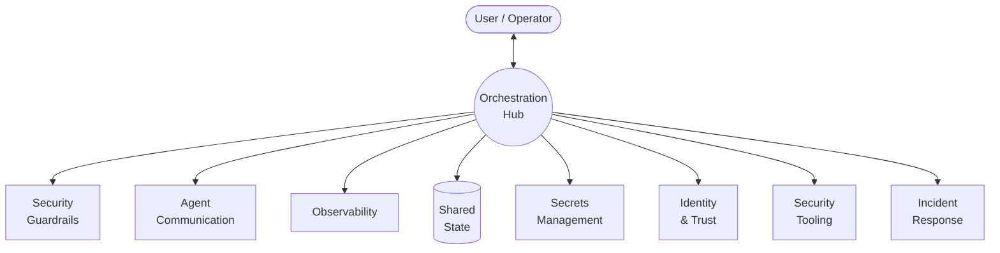

# Agentic Workflow Architecture

High-level architecture for autonomous agent workflows with security guardrails, agent autonomy, and observability.

## Design Principles

- **Security**: Agents operate within sandboxed containers — filesystem access is scoped, not host-level
- **Autonomy**: Within their container boundary, agents have full filesystem and process control
- **Observability**: All agent activity is captured, traced, and auditable

## Overview

## Layer Details

| Layer | Description | Detail |
|---|---|---|
| **Orchestration** | Task routing, agent registry, policy evaluation, message routing | [[arch-orchestration]] |
| **Identity & Trust** | SPIFFE/SPIRE workload identity, user auth, image integrity | [[arch-identity-and-trust]] |
| **Security Guardrails** | Access control, brainbox sandbox, enforcement boundaries | [[arch-security-guardrails]] |
| **Brainbox Lifecycle** | Provision, configure, start, monitor, recycle | [[arch-brainbox]] |
| **Agent Communication** | Star topology, delegation model, communication guardrails | [[arch-agent-communication]] |
| **Observability** | Logs, traces, metrics, audit trail | [[arch-observability]] |
| **Secrets Management** | 1Password + direnv secret injection flow | [[arch-secrets-management]] |
| **Shared State** | Vector DB, artifact store | [[arch-shared-state]] |
| **Security Tooling** | Envoy, OPA, Cilium, Falco, Kyverno — all optional, flaggable per environment | [[arch-security-tooling]] |
| **Incident Response** | Detection, forensic capture, containment, recovery runbooks per threat actor | [[arch-incident-response]] |
| **Threat Model** | Threat actors, attack paths, risk matrix, assumptions | [[arch-threat-model]] |
