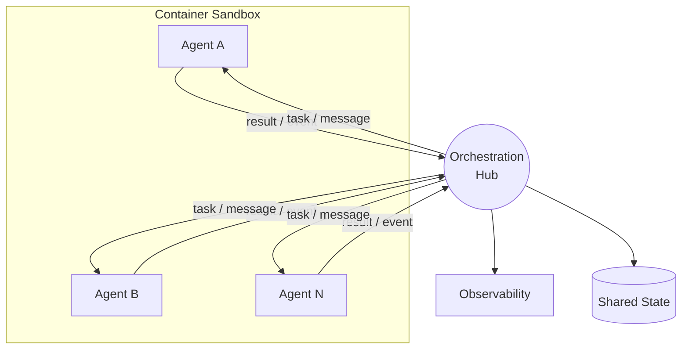
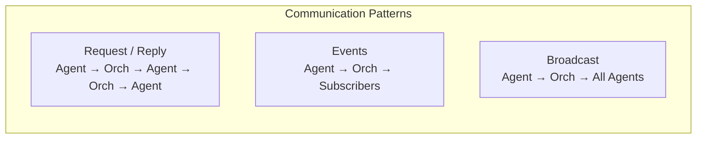
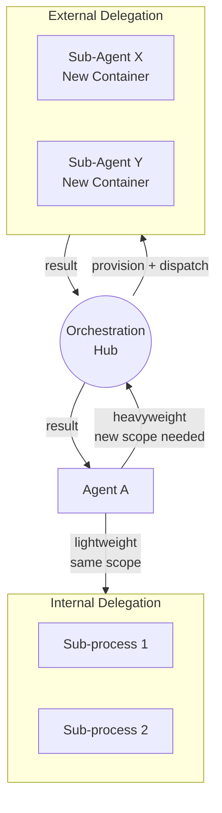
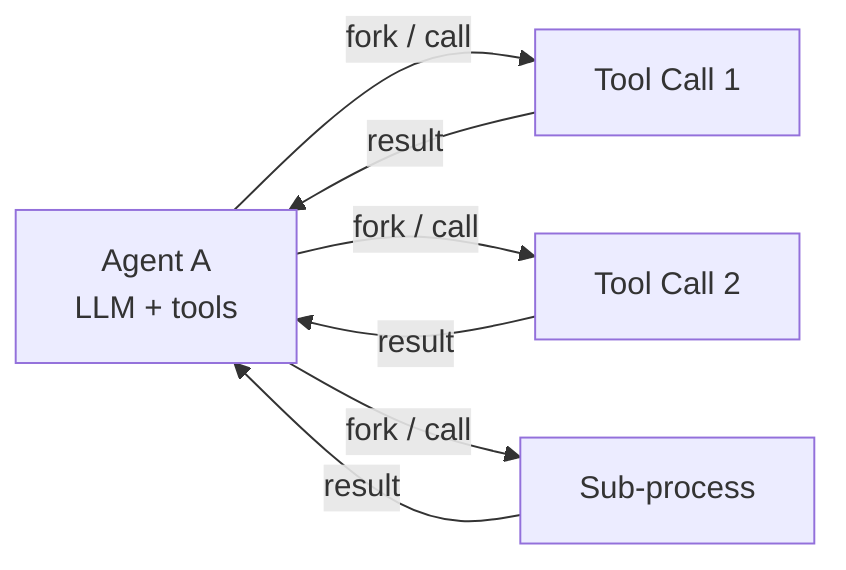
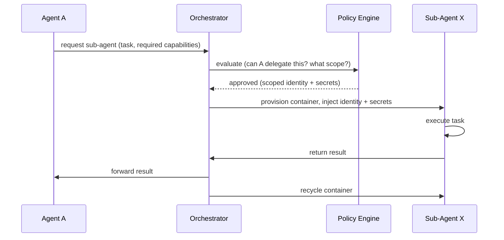
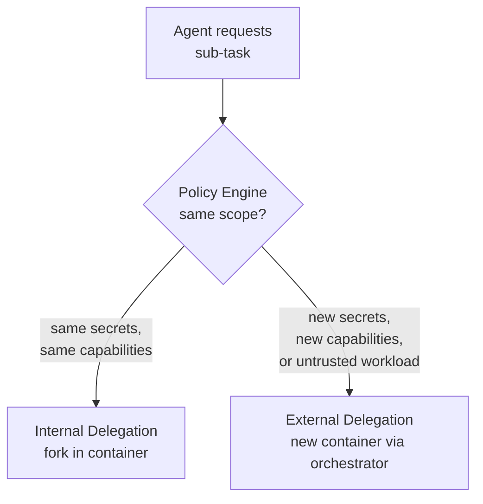

# Agent Communication Layer

There is no separate message broker. The [[arch-orchestration|Orchestration Hub]] is the bus. All agent-to-agent communication routes through the orchestrator, which already owns identity, policy, and lifecycle management.

## Star Topology

Agents never talk to each other directly. Every message passes through the orchestrator where it is validated, policy-checked, logged, and routed.

### Why star, not mesh

| Concern | Star (orchestrator is bus) | Mesh (dedicated broker) |
|---|---|---|
| **Infrastructure** | One component to deploy across all environments | Broker to deploy, secure, and maintain alongside orchestrator |
| **Security** | Single chokepoint — policy, identity, rate limiting in one place | Duplicate auth and policy enforcement on broker |
| **Observability** | Every message is already visible to the orchestrator | Broker needs its own instrumentation |
| **Failure mode** | Orchestrator down = all comms stop (acceptable for solo operator) | Broker can fail independently, partial outage scenarios |
| **Scale ceiling** | Bottleneck under high-frequency agent-to-agent streaming | Broker handles backpressure and persistence natively |

If a high-frequency streaming pattern emerges later, a broker can be introduced for that specific use case without rearchitecting the rest.

## Message Patterns

All patterns flow through the orchestrator.

| Pattern | Flow | Use Case |
|---|---|---|
| **Request / Reply** | Agent A → Orch → Agent B → result → Orch → Agent A | "Agent B, process this data and return the result" |
| **Events** | Agent A → Orch → subscribed agents | Status updates, progress signals, completion notifications |
| **Broadcast** | Agent A → Orch → all active agents | "Dataset ready", "system shutting down" |

## Delegation Model

Two delegation paths based on scope. The [[arch-orchestration|Policy Engine]] enforces which path is required.

### Overview

### Internal Delegation (lightweight)

Agent handles sub-tasks within its own container. No orchestrator involvement.

| Property | Detail |
|---|---|
| **When to use** | Sub-tasks that need the same secrets, same capabilities, same identity |
| **Lifecycle** | Managed by the agent — orchestrator has no visibility |
| **Identity** | Inherits parent agent's token — no separate identity |
| **Examples** | LLM tool calls, data transformation steps, internal retries |
| **Risk** | No blast radius reduction — if the agent is compromised, all sub-tasks are too |

### External Delegation (heavyweight)

Agent requests the orchestrator to spawn a new container with its own identity.

| Property | Detail |
|---|---|
| **When to use** | Sub-tasks that need different secrets, different capabilities, or different trust level |
| **Lifecycle** | Orchestrator provisions, monitors, and recycles the sub-agent container |
| **Identity** | Sub-agent gets its own scoped token — independent from parent |
| **Examples** | Calling an external API with different credentials, running untrusted code, accessing a different vault |
| **Risk** | Full blast radius reduction — sub-agent compromise doesn't compromise parent |

### Policy Decides the Path

| Trigger | Delegation Path |
|---|---|
| Sub-task needs the same secrets and capabilities as parent | Internal — stays in container |
| Sub-task needs access to a different 1Password vault | External — orchestrator provisions with scoped secrets |
| Sub-task runs untrusted or user-provided code | External — isolated container, minimal capabilities |
| Sub-task is an LLM tool call within the agent's existing scope | Internal — fast, no round-trip |
| Sub-task requires a different container image | External — orchestrator pulls and provisions |

## Communication Guardrails

All enforced at the orchestrator since it is the bus.

| Control | How |
|---|---|
| **Message Validation** | Orchestrator rejects malformed payloads before routing |
| **Rate Limiting** | Per-agent message quotas enforced at the orchestrator |
| **Scope Check** | Policy engine evaluates every cross-agent message — can A talk to B? |
| **Identity Verification** | Every message must carry a valid agent token issued by the orchestrator |
| **Audit** | Every message is logged with sender, receiver, timestamp, and payload hash |
