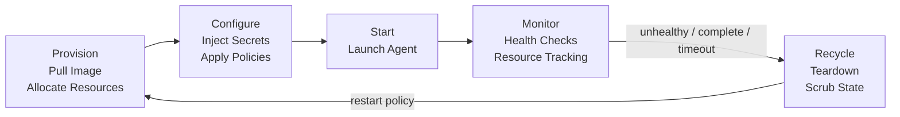
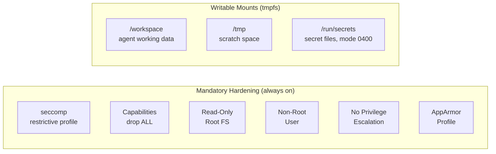
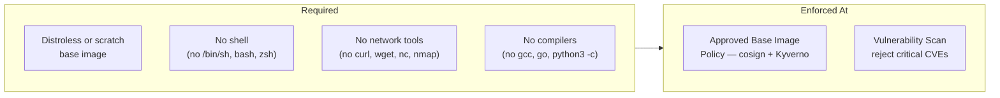

# Container Lifecycle

Every agent container follows a managed lifecycle. No container runs unbounded.



## Phases

| Phase | What Happens |
|---|---|
| **Provision** | Pull or build the agent image, allocate resources from the container runtime |
| **Configure** | Inject secrets via [[arch-secrets-management|1Password + direnv]], apply mount policies, set environment variables — nothing baked into the image |
| **Start** | Launch the agent process inside the container |
| **Monitor** | Continuous health checks, resource usage tracking, heartbeat validation |
| **Recycle** | Teardown on completion, failure, or timeout — scrub ephemeral state, reclaim resources |

## Mandatory Container Hardening

Applied at the Configure phase to **every** container in **every** environment. This is the security floor — non-negotiable regardless of which [[arch-security-tooling|security tools]] are enabled.



| Control | Setting | Purpose |
|---|---|---|
| **seccomp** | Custom restrictive allowlist profile | Block syscalls the agent doesn't need — reduces kernel attack surface |
| **Capabilities** | `drop: ALL` — add back only what's explicitly required | Removes CAP_NET_RAW (ARP spoofing), CAP_MKNOD, CAP_SYS_CHROOT, etc. |
| **Read-only rootfs** | `readOnlyRootFilesystem: true` | Prevents modification of container binaries — agent writes only to tmpfs mounts |
| **Non-root user** | `runAsNonRoot: true`, `runAsUser: 65534` | Container escape as non-root limits host impact |
| **No privilege escalation** | `allowPrivilegeEscalation: false` / `--security-opt=no-new-privileges:true` | Blocks setuid/setgid binaries from escalating within the container |
| **AppArmor** | Custom profile denying `/proc/sys`, `/sys`, mount operations | Mandatory access control on sensitive pseudo-filesystems |
| **Secrets delivery** | File-based via tmpfs at `/run/secrets/<name>`, mode 0400, owned by agent UID | Eliminates `/proc/*/environ` exposure — see [[arch-secrets-management]] |
| **SPIRE sidecar** | Separate container, shared only via Unix socket on emptyDir volume | Prevents compromised agent from reading SVID private keys — see [[arch-identity-and-trust]] |
| **PID namespace** | `shareProcessNamespace: false` | Agent cannot see or signal SPIRE sidecar processes |

### Docker Equivalent

```bash
docker run \
  --security-opt seccomp=agent-seccomp.json \
  --security-opt apparmor=agent-apparmor \
  --security-opt no-new-privileges:true \
  --cap-drop ALL \
  --read-only \
  --tmpfs /workspace:size=500M \
  --tmpfs /tmp:size=100M \
  --mount type=tmpfs,destination=/run/secrets,tmpfs-mode=0400 \
  --user 65534:65534 \
  agent-image:latest
```

## Image Requirements

Agent images must be minimal. Every tool available inside a container is a tool an attacker can use.



| Requirement | Detail |
|---|---|
| **Distroless base** | All agent images must use `distroless` or `scratch` base — approved base image policy enforced at [[arch-identity-and-trust#Image Integrity & Supply Chain\|Provision]] |
| **No shells** | No `/bin/sh`, `bash`, `zsh`, or other interactive shells — prevents shell-based exploitation |
| **No network utilities** | No `curl`, `wget`, `nc`, `nmap`, `dig` — makes data exfiltration significantly harder |
| **No package managers** | No `apt`, `apk`, `pip`, `npm` — prevents installing tools at runtime |
| **No compilers** | No `gcc`, `go`, `python3` (as compiler) — prevents in-container payload compilation |
| **Static binaries** | Agent binary should be statically linked where possible — no dependency on shared libraries |
| **Image scanning** | All images scanned for critical CVEs before entering approved registry — see [[arch-identity-and-trust#Image Integrity & Supply Chain]] |

## Lifecycle Rules

- **Restart policy** determines whether a recycled container re-provisions (crash recovery, new task) or terminates permanently
- **Orphan reaping**: the monitor phase detects containers with no active task assignment and recycles them
- **Timeouts**: every container has a maximum TTL — no indefinite execution
- **State is ephemeral**: container filesystem is destroyed on recycle — durable outputs must be written to [[arch-shared-state|Shared State]]
- **Secure scrubbing**: ephemeral tmpfs mounts are memory-backed — pages freed on unmount. For sensitive workloads, use encrypted tmpfs with key destruction on recycle
