# Identity & Trust

Establishes who or what is making a request at every boundary in the system. Without this layer, any component can impersonate any other.

Replaces the orchestrator-issued container tokens from PHASE_2 with cryptographic workload identity via SPIFFE/SPIRE. Agents now receive short-lived SVIDs instead of container tokens, enabling mTLS, workload attestation, and HSM-backed PKI.

## Trust Boundaries

Three boundaries where identity must be verified. Each crossing requires a different credential.

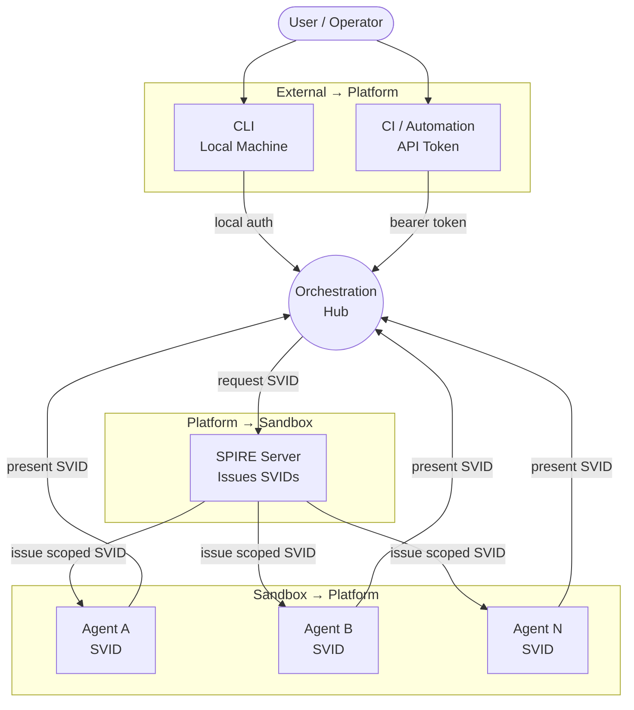

| Boundary | Who crosses | Credential | Verified by |
|---|---|---|---|
| **External → Platform** | User (CLI) | Local OS identity / session | Orchestrator |
| **External → Platform** | CI pipeline | API token (from 1Password) | Orchestrator |
| **Platform → Sandbox** | Orchestrator → Agent | SPIFFE SVID issued by SPIRE | Agent receives at start |
| **Sandbox → Platform** | Agent → Orchestrator | SPIFFE SVID | Orchestrator validates on every request |

---

## User Authentication

Two paths into the orchestrator depending on context.

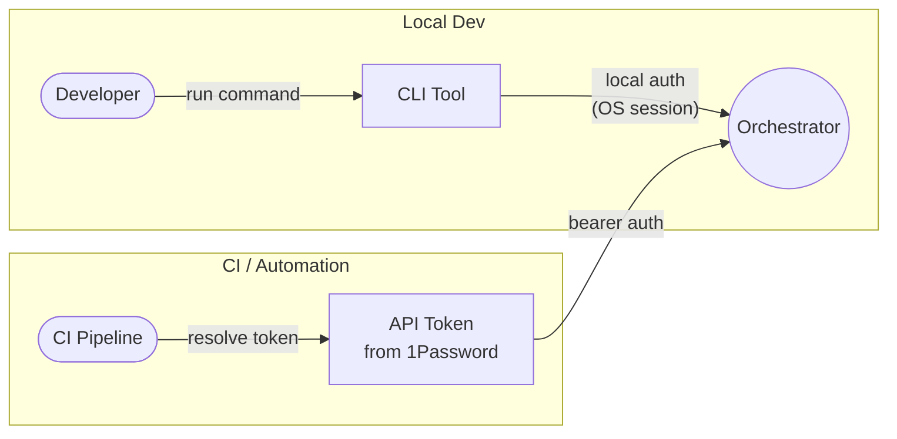

| Context | Auth Method | Token Lifetime | Stored In |
|---|---|---|---|
| **Local CLI** | OS session identity — you're on the machine | Session duration | N/A |
| **CI / Automation** | Scoped API token, resolved via `op` at pipeline start | Short-lived (pipeline duration) | 1Password vault |

### API Token Lifecycle

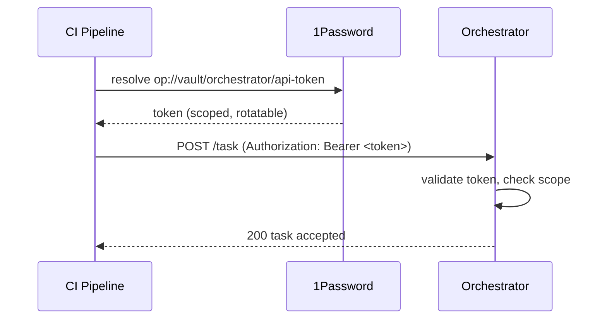

---

## Agent Identity (SPIFFE / SPIRE)

Each agent container receives a SPIFFE SVID (SPIFFE Verifiable Identity Document) at the Configure phase of its lifecycle. Agents never self-issue identity.

### SVID Issuance Flow

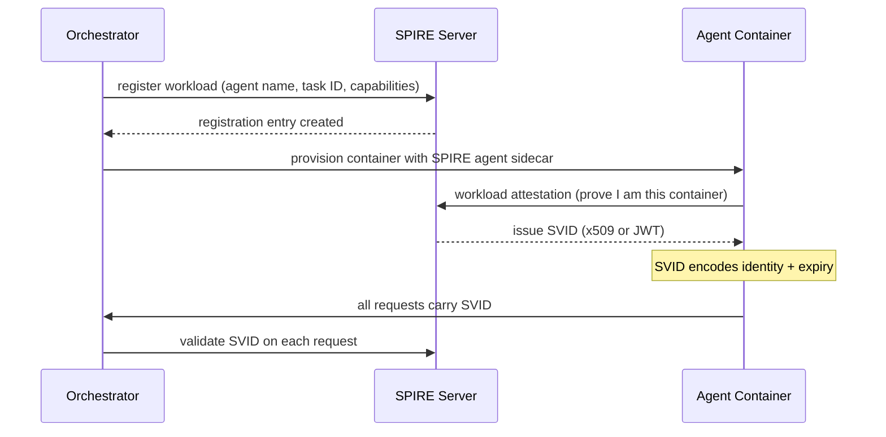

### SVID Contents

The SVID encodes everything the orchestrator needs to make policy decisions.

```
spiffe://agentic-platform/agent/<agent-name>/task/<task-id>
```

| Field | Purpose |
|---|---|
| **Trust domain** | `agentic-platform` — scopes all identities to this system |
| **Agent name** | Which agent image this container is running |
| **Task ID** | Which specific task this container was spawned for |
| **Expiry** | Matches container TTL — identity dies with the container |
| **Capabilities** | Encoded in registration entry — what this agent is allowed to do |

### SVID Type Policy

Two SVID types exist. Each has different security properties — use the right one for the context.

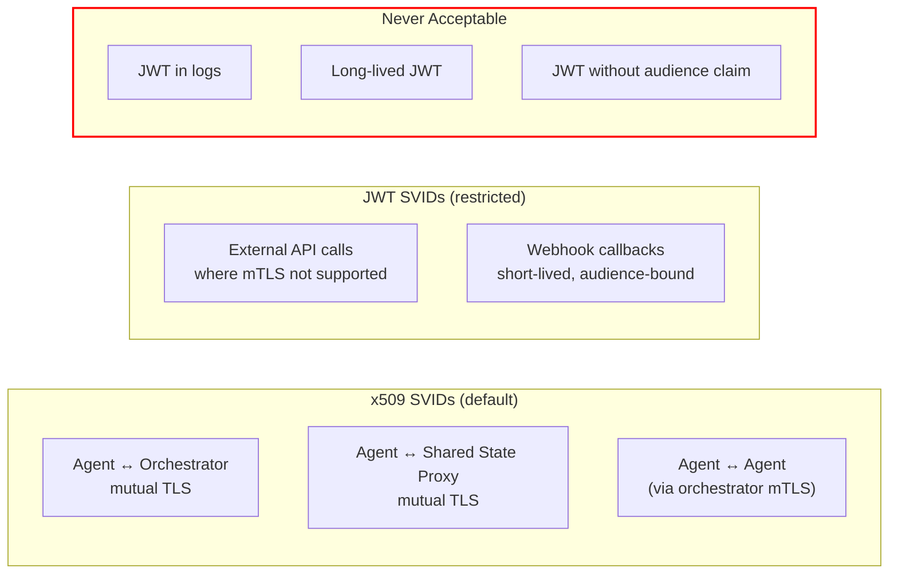

| SVID Type | Use Case | Security Properties |
|---|---|---|
| **x509** | All agent-to-orchestrator communication, shared state access, inter-agent routing | Non-replayable (bound to TLS session), enables mTLS, cannot be exfiltrated from wire |
| **JWT** | External API calls where mTLS is not practical | Bearer token — **replayable if stolen**. Must have: audience claim, ≤ 60s TTL, never logged |

| Envoy Trust Rule | Detail |
|---|---|
| **SPIRE trust bundle only** | Envoy accepts only certificates from the SPIRE trust bundle — rejects system CAs |
| **Max chain depth: 2** | Root → Intermediate → SVID. No deeper chains accepted |
| **Certificate pinning** | Orchestrator and shared state proxy pin to SPIRE-issued certificates only |

### Why SPIFFE/SPIRE

| Concern | How SPIRE handles it |
|---|---|
| **No static secrets** | SVIDs are short-lived and auto-rotated — no long-lived credentials in containers |
| **Workload attestation** | SPIRE verifies the container is what it claims via node and workload attestors (Docker, K8s) |
| **Multi-environment** | SPIRE has attestors for Docker, Kubernetes, and bare metal — fits local dev, CI, and K8s |
| **mTLS built in** | x509 SVIDs enable mTLS between agent and orchestrator out of the box |
| **No agent cooperation needed** | The SPIRE agent sidecar handles attestation — the agent process just uses the SVID |

### Identity Lifecycle

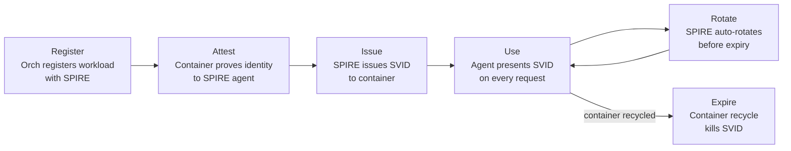

| Phase | What Happens |
|---|---|
| **Register** | Orchestrator creates a SPIRE registration entry with agent name, task ID, and allowed capabilities |
| **Attest** | SPIRE workload attestor verifies the container's identity (Docker PID, K8s pod, etc.) |
| **Issue** | SPIRE issues an SVID (x509 cert or JWT) to the verified container |
| **Use** | Agent includes the SVID in every request to the orchestrator and shared state |
| **Rotate** | SPIRE auto-rotates the SVID before expiry — no agent involvement needed |
| **Expire** | On container recycle, the registration entry is deleted and the SVID becomes invalid |

---

## SPIRE PKI & Root CA Lifecycle

The SPIRE root CA is the most sensitive cryptographic material in the system. Compromise of the root key breaks all identity guarantees.

### CA Hierarchy

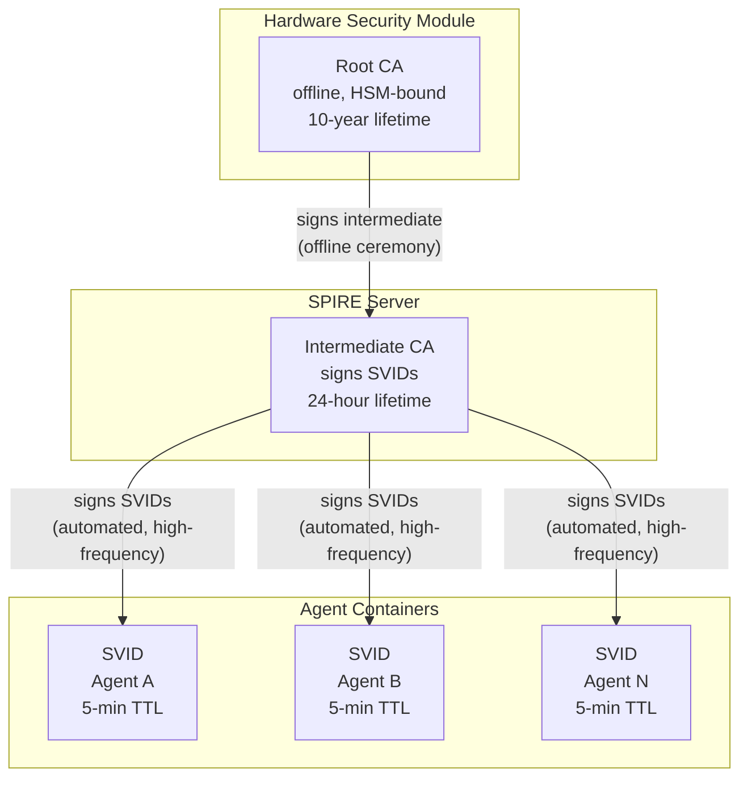

| Layer | Key Storage | Lifetime | Rotation |
|---|---|---|---|
| **Root CA** | HSM / TPM — never exported, never online except during signing ceremony | 10 years | Manual ceremony with trust bundle overlap |
| **Intermediate CA** | SPIRE server memory — encrypted at rest on disk | 24 hours | Auto-rotated by SPIRE, signed by root CA |
| **SVID** | Agent sidecar memory — never written to disk | 5 minutes | Auto-rotated by SPIRE agent before expiry |

### Root CA Rotation

Root key rotation is a planned ceremony, not an automated process.

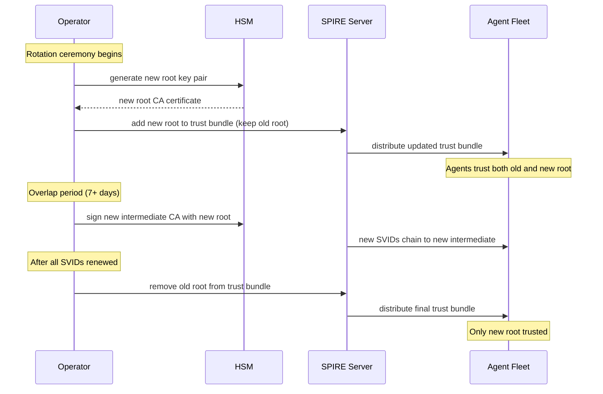

| Step | Detail |
|---|---|
| **Generate new root** | New key pair created in HSM — old key remains active |
| **Add to trust bundle** | Both old and new root CAs are trusted simultaneously |
| **Overlap period** | Minimum 7 days — all agents receive updated trust bundle before old root is removed |
| **Sign new intermediate** | New intermediate CA signed by new root — SPIRE begins issuing SVIDs under new chain |
| **Remove old root** | Only after all active SVIDs chain to the new root — verified by SPIRE telemetry |

### SVID TTL Policy

Aggressive TTLs limit the damage window from a compromised SVID.

| Parameter | Value | Rationale |
|---|---|---|
| **SVID TTL** | 5 minutes | Compromise window bounded — stolen SVID expires before meaningful exfiltration |
| **Rotation trigger** | 50% of TTL (2.5 minutes) | SPIRE agent requests renewal well before expiry |
| **Grace period** | 30 seconds after expiry | Allows in-flight requests to complete |
| **Max container TTL** | Matches [[arch-brainbox]] lifecycle TTL | SVID cannot outlive its container |

### SVID Revocation

SPIRE does not natively support certificate revocation lists (CRLs). Deleting a registration entry prevents renewal but does not invalidate an already-issued SVID. The deny-list compensates for this gap.

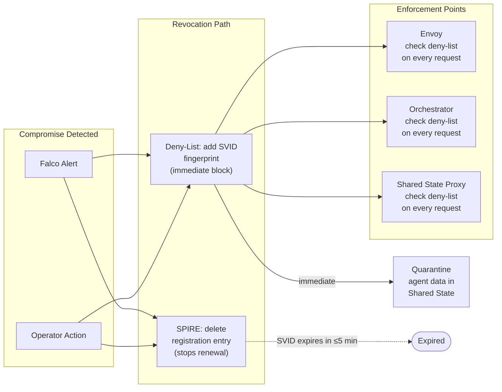

| Mechanism | Timing | What It Does |
|---|---|---|
| **Delete registration entry** | Immediate | Stops SPIRE from renewing the SVID — it expires within 5 minutes |
| **Deny-list at enforcement points** | Immediate | Envoy, orchestrator, and shared state proxy reject any request bearing the denied SVID fingerprint |
| **Quarantine shared state** | Immediate | All data attributed to the revoked SVID is flagged as untrusted — see [[arch-shared-state#Quarantine]] |
| **Natural expiry** | ≤ 5 minutes | Even without deny-list, the short TTL ensures the SVID dies quickly |

---

## Image Integrity & Supply Chain

Before a container is provisioned, the image itself must be verified. This happens at the Provision phase, before SPIRE attestation.

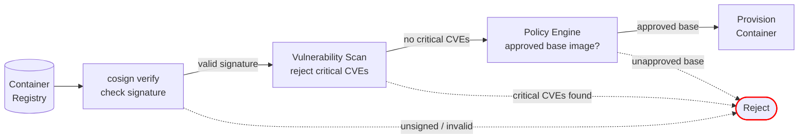

| Gate | What's Checked | Failure Mode |
|---|---|---|
| **Signature (cosign)** | Image signed by trusted key, digest matches manifest | Unsigned or tampered → rejected |
| **Vulnerability scan** | No critical CVEs in image layers | Critical CVE → blocked until patched |
| **Base image policy** | Image built from an approved base | Unapproved base → rejected |

---

## Message & Data Integrity

All messages through the orchestrator carry the sender's SVID. The orchestrator validates identity on every request.

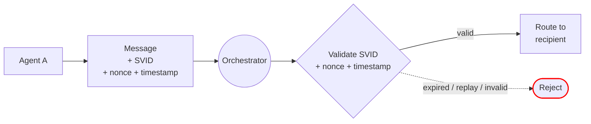

| Control | How |
|---|---|
| **Identity on every message** | SVID is presented with each request — orchestrator validates against SPIRE |
| **Replay prevention** | Nonce + timestamp + signature on each message — orchestrator rejects duplicates and expired payloads |
| **Artifact attribution** | Writes to shared state include the SVID — origin is cryptographically verifiable |
| **Log attribution** | Observability layer records the SVID claim — unsigned log entries are flagged |
| **mTLS** | x509 SVIDs enable mutual TLS between agent containers and the orchestrator |

### Replay Protection Detail

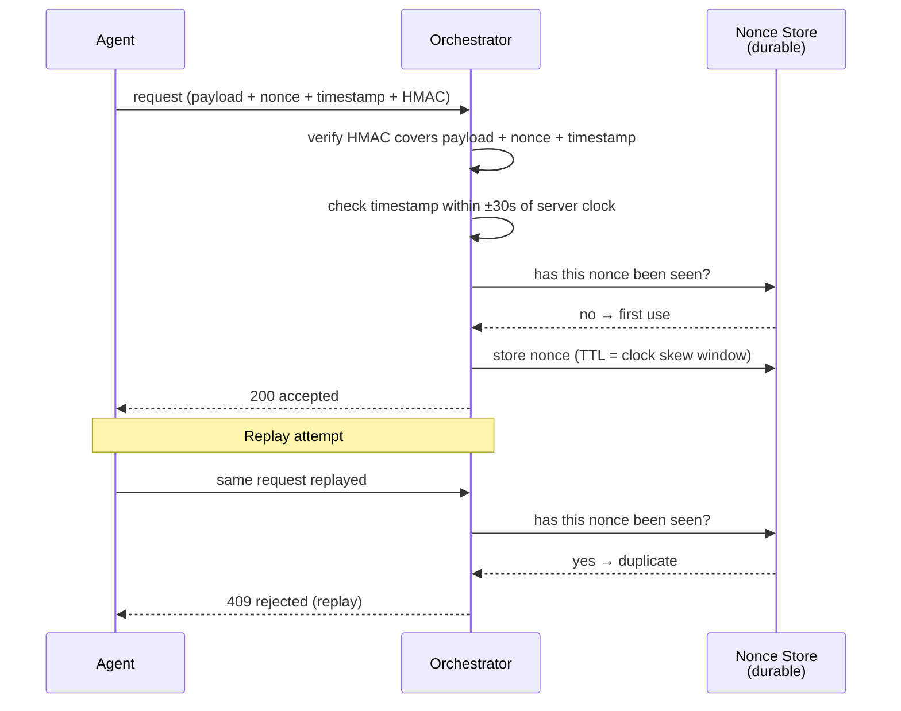

| Parameter | Value | Rationale |
|---|---|---|
| **Nonce generation** | Server-issued or agent-generated UUID v4 | Unpredictable, non-sequential |
| **Nonce storage** | Durable key-value store with TTL-based expiry | Survives orchestrator restart — prevents replay after recovery |
| **Clock skew tolerance** | ±30 seconds | Requires NTP on all hosts — reject messages outside window |
| **Cryptographic binding** | HMAC-SHA256 over `payload \|\| nonce \|\| timestamp` using SVID-derived key | Attacker cannot modify payload without invalidating the signature |
| **Nonce TTL** | 60 seconds (2× clock skew window) | Nonces expire after replay window closes — bounds storage growth |

---

## Gaps This Page Addresses

- [x] No authentication model (user → orchestrator → agent)
- [x] Agent impersonation on the orchestrator
- [x] No image signing or supply chain verification
- [x] No message integrity or replay protection
- [x] No cryptographic attribution for shared state writes or audit logs
- [x] No encryption in transit (mTLS via SPIFFE x509 SVIDs)
- [x] SPIRE root CA lifecycle unspecified — root key in HSM, intermediate CA for daily issuance, rotation ceremony with overlap
- [x] SVID revocation not possible — compensated by 5-minute TTLs and deny-list at all enforcement points
- [x] No SVID TTL policy — 5-minute TTLs bound compromise window
- [x] SVID type (x509 vs JWT) unspecified — x509 for mTLS, JWT restricted to external APIs with audience claim and ≤60s TTL
- [x] Replay protection underspecified — server-issued nonces, durable storage, HMAC binding, clock skew tolerance
