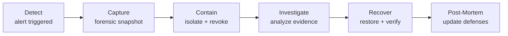
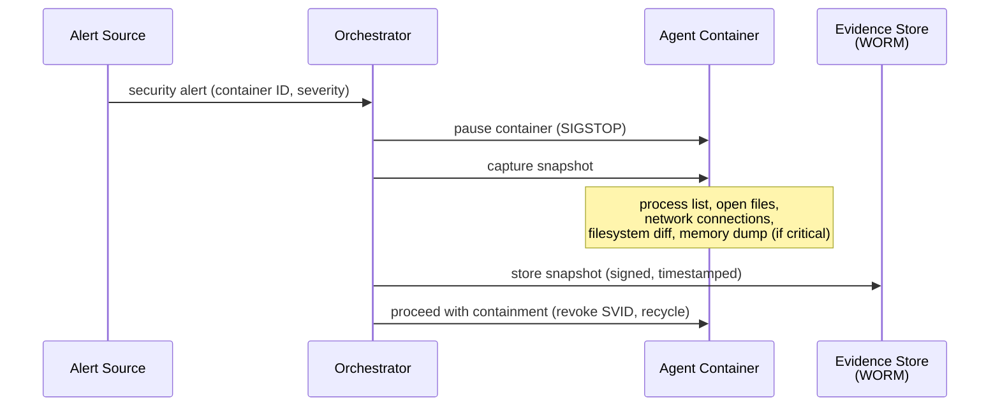
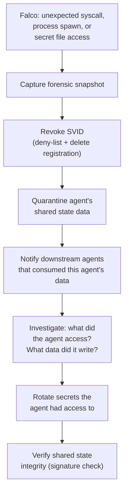
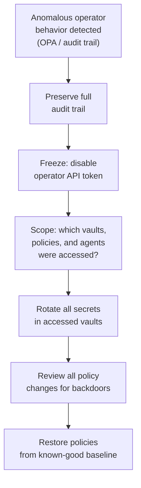
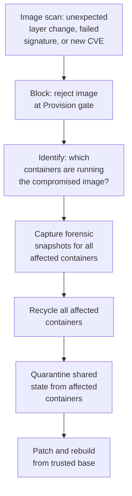
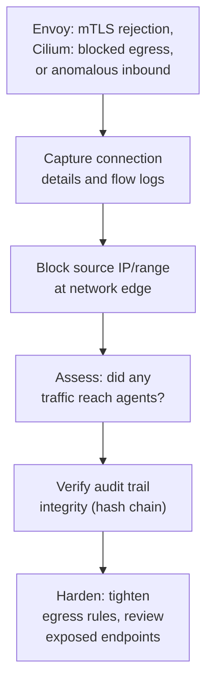

# Incident Response

Procedures for detecting, containing, investigating, and recovering from security incidents. Every automated response includes a forensic capture step before destructive action.

## Response Lifecycle

| Phase | What Happens | Who |
|---|---|---|
| **Detect** | Alert from Falco, Cilium, OPA, Envoy, or observability anomaly | Automated |
| **Capture** | Forensic snapshot of container state before any destructive action | Automated |
| **Contain** | Revoke SVID, quarantine shared state, isolate network | Automated (with circuit breaker) |
| **Investigate** | Analyze captured evidence, trace attack path, assess blast radius | Operator |
| **Recover** | Rotate affected secrets, verify known-good state, resume operations | Operator |
| **Post-Mortem** | Update policies, rules, and documentation based on findings | Operator |

## Forensic Capture

Every automated response (container recycle, SVID revocation) must capture forensic evidence **before** destroying the container.

| Captured Data | How | Retention |
|---|---|---|
| **Process list** | `ps aux` equivalent from `/proc` | 90 days |
| **Open file descriptors** | `/proc/<pid>/fd` snapshot | 90 days |
| **Network connections** | `/proc/<pid>/net/tcp` + Cilium flow log | 90 days |
| **Filesystem diff** | Overlay diff layer (changes from image baseline) | 90 days |
| **Container logs** | Full stdout/stderr captured before recycle | 90 days |
| **tmpfs contents** | `/workspace`, `/tmp` snapshot (NOT `/run/secrets`) | 90 days, encrypted |
| **Memory dump** | Full process memory (critical severity only) | 30 days, encrypted, restricted access |

Forensic snapshots are stored in a WORM (write-once-read-many) evidence store, signed by the orchestrator's identity, and never modified after creation.

## Runbooks by Threat Actor

### T1: Compromised LLM Agent

| Step | Detail |
|---|---|
| **Contain** | Revoke SVID, quarantine shared state, recycle container (after capture) |
| **Blast radius** | Limited: agent had own-namespace secrets, own-namespace shared state, allowlisted egress only |
| **Investigate** | Check artifact signatures, trace Cilium flow logs for exfiltration, review observability traces |
| **Recover** | Rotate affected secrets, re-verify quarantined data, resume with fresh container |

### T2: Malicious Insider

| Step | Detail |
|---|---|
| **Contain** | Revoke operator credentials immediately — backup contact has emergency shutdown only |
| **Blast radius** | Potentially full — operator has broad access. Envelope encryption limits secret exposure (needs both 1Password + KMS). |
| **Investigate** | Audit trail hash chain verification, review all policy changes, check for SPIRE registration entry manipulation |
| **Recover** | Rotate all secrets, restore policies from version control, re-attest all running containers |

### T3: Supply Chain Compromise

| Step | Detail |
|---|---|
| **Contain** | Block compromised image, recycle all running instances, quarantine their shared state |
| **Blast radius** | All containers running the affected image — could be multiple agents |
| **Investigate** | Diff image layers against known-good, check for embedded backdoors, trace supply chain |
| **Recover** | Rebuild from trusted base, re-sign with cosign, redeploy, verify shared state integrity |

### T4: External Attacker

| Step | Detail |
|---|---|
| **Contain** | Block at network edge, verify no compromise inside perimeter |
| **Blast radius** | Typically zero if mTLS and network policies held — external attacker has no valid SVID |
| **Investigate** | Review Envoy access logs, Cilium flow logs, check for any successful connections |
| **Recover** | Update network policies, rotate any exposed endpoints, verify no persistence |

## Known-Good Baseline

A verified reference state used to confirm recovery is complete.

| Component | Baseline Definition | Verification |
|---|---|---|
| **Agent images** | Signed image digests in approved registry | `cosign verify` against pinned key |
| **OPA policies** | Version-controlled Rego files at tagged commit | Git hash comparison |
| **Kyverno policies** | Version-controlled YAML at tagged commit | Git hash comparison |
| **SPIRE configuration** | Version-controlled registration entries | Diff against running state |
| **1Password vaults** | Expected secret count and last-rotated timestamps | Automated inventory check |
| **Orchestrator config** | Version-controlled configuration at tagged commit | Git hash comparison |
| **Shared state integrity** | All artifacts pass SVID signature verification | Background integrity scan |

## Escalation

| Severity | Automated Response | Operator Action Required |
|---|---|---|
| **Low** | Log to observability | Review during next session |
| **Medium** | Log + alert operator | Investigate within 4 hours |
| **High** | Capture + contain + alert | Investigate immediately |
| **Critical** | Capture + contain + safe mode + alert backup contact | Investigate immediately, consider full shutdown |
