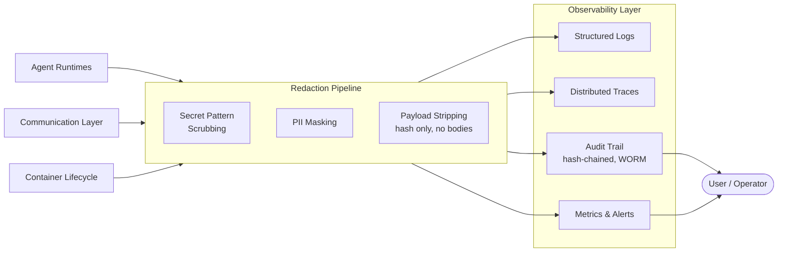

# Observability Layer

All agent activity, container lifecycle events, and inter-agent communication flow into a unified observability stack. A mandatory redaction pipeline strips sensitive data before storage.

## Data Classification

All data in the system is classified before storage. Classification drives access control, retention, and redaction.

| Level | Description | Examples | Handling |
|---|---|---|---|
| **Public** | Non-sensitive, shareable | Agent task names, completion status | No restrictions |
| **Internal** | Platform operational data | Metrics, resource usage, task throughput | Access scoped to operator |
| **Confidential** | Business-sensitive agent outputs | Generated reports, embeddings, artifacts | Namespace-scoped, encrypted at rest |
| **Restricted** | Credentials, PII, cryptographic material | API keys, tokens, SVID private keys | Never logged, redacted on sight, shortest retention |

Classification is required on:
- All [[arch-shared-state|Shared State]] writes (metadata tag on every artifact/embedding)
- All observability data (drives redaction rules)
- All cross-agent communication payloads (drives OPA access policy)

## Redaction Pipeline

Mandatory processing between data sources and observability storage. Cannot be disabled.

| Stage | What It Does |
|---|---|
| **Secret scrubbing** | Regex-based removal of known secret patterns (API keys, tokens, connection strings, base64 blobs) |
| **PII masking** | Detect and mask personally identifiable information in structured log fields |
| **Payload stripping** | Distributed traces record payload hash, sender, receiver, timestamp — never full message bodies |
| **Classification gating** | Restricted-class data is dropped from logs/traces entirely — only the access event is recorded |

## Signals

| Signal | Source | Purpose |
|---|---|---|
| **Structured Logs** | Agent runtimes, container lifecycle | Searchable event records — what happened and when |
| **Distributed Traces** | Agent runtimes, communication layer | Request flow across agents — latency, dependencies, failures. Payload hashes only, no bodies. |
| **Metrics & Alerts** | Agent runtimes, container lifecycle | Resource usage, task throughput, error rates, SLA alerting |
| **Audit Trail** | Communication layer, security guardrails | Hash-chained, append-only record of who did what — agent actions, policy decisions, data access |

## Audit Trail Integrity

| Control | Detail |
|---|---|
| **Hash chaining** | Each audit entry includes a hash of the previous entry — any deletion or modification breaks the chain |
| **WORM storage** | Audit trail stored in write-once-read-many backend (S3 Object Lock or equivalent) |
| **External forwarding** | Critical audit logs forwarded in real-time to a separate, independently secured collector |
| **Integrity verification** | Periodic out-of-band process verifies the hash chain and alerts on any breaks |
