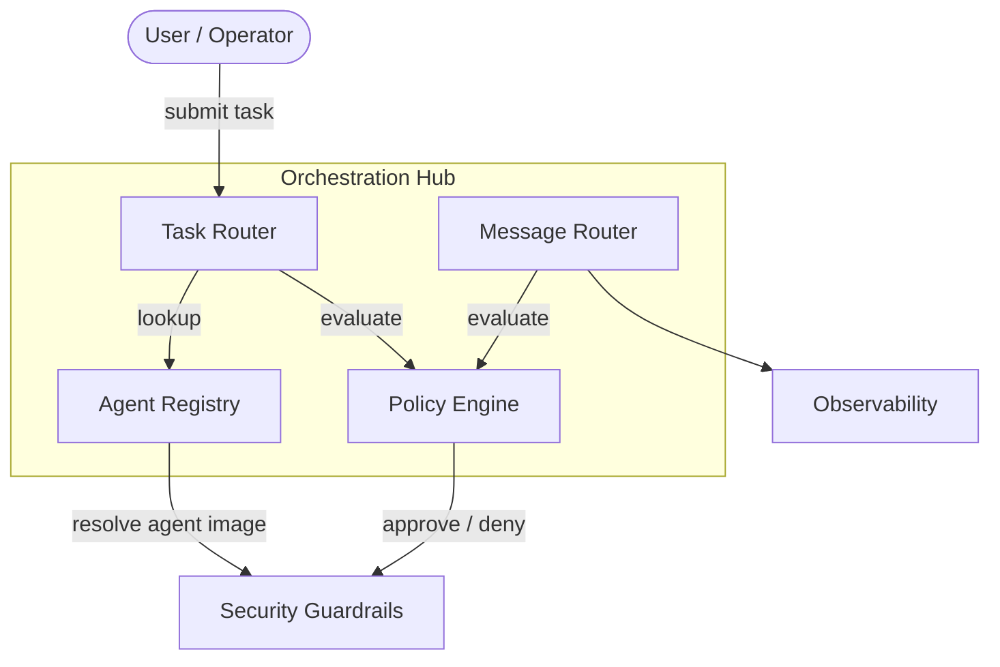
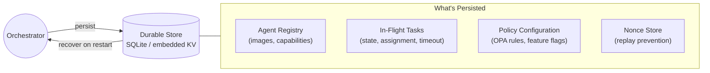
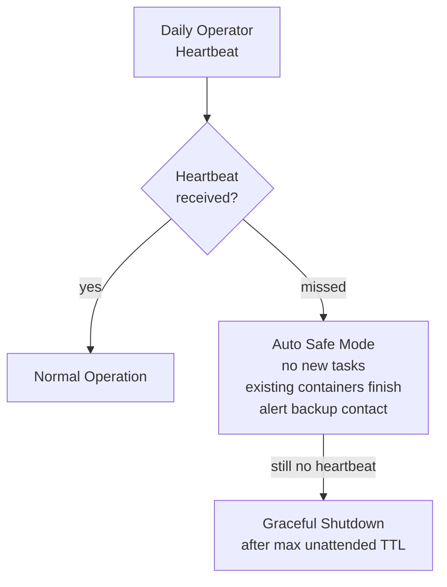

# Orchestration Layer

The orchestration hub serves two roles: **task dispatch** (routing work to agents) and **communication bus** (routing all agent-to-agent messages). There is no separate message broker.

## Hub Overview

## Components

| Component | Responsibility |
|---|---|
| **Task Router** | Receives work requests from users, resolves which agent handles them |
| **Agent Registry** | Catalog of available agents, their capabilities, and container images |
| **Policy Engine** | Evaluates authorization for both task dispatch and agent-to-agent messages |
| **Message Router** | Routes all inter-agent communication — request/reply, events, broadcasts |

## Task Dispatch Flow

1. User submits a task
2. Task Router queries the Agent Registry for a capable agent
3. Policy Engine evaluates authorization (can this agent run? with what capabilities?)
4. On approval, the task is dispatched into the [[arch-security-guardrails|Security Guardrails]] layer

## Message Routing Flow

1. Agent sends a message (result, event, delegation request) to the orchestrator
2. Message Router validates the payload schema
3. Policy Engine checks scope (can this agent send this message to that target?)
4. Agent identity token is verified
5. Message is logged to [[arch-observability|Observability]] and routed to the recipient

See [[arch-agent-communication]] for the full communication model, delegation patterns, and guardrails.

## Resilience

The orchestrator is a single point of failure — task router, message bus, policy engine, and identity validator in one process. These controls bound the blast radius of orchestrator failure.

### State Persistence

| Data | Persisted | Recovery |
|---|---|---|
| **Agent registry** | Yes | Rebuilt from config + registry on restart |
| **In-flight tasks** | Yes | Resumed or safely timed out on restart |
| **Policy config** | Yes | Loaded from version-controlled source on restart |
| **Nonce store** | Yes | Prevents replay attacks across restarts |
| **Message queue** | No | In-flight messages lost — agents retry via standard timeout |

### Degraded Mode

When the orchestrator detects internal failures, it enters a degraded read-only mode rather than crashing.

| Mode | Behavior |
|---|---|
| **Normal** | Full task dispatch, message routing, policy evaluation |
| **Degraded (read-only)** | No new task dispatch, no new container provisioning. Existing containers continue running. Message routing and health checks continue. Alerts operator. |
| **Offline** | Orchestrator unreachable. Existing containers continue until TTL. No new work. External watchdog triggers alert. |

### External Watchdog

An independent process (outside the orchestrator) monitors health and takes action.

| Check | Action on Failure |
|---|---|
| **Orchestrator health endpoint** | If unreachable for 3 consecutive checks (30s interval), alert operator |
| **Task throughput** | If zero tasks dispatched for configurable window, alert operator |
| **Container orphan scan** | If containers exist with no matching orchestrator task record, alert + recycle |

## Solo Operator Safety

The system is operated by a single person. These controls handle operator unavailability.

| Control | Detail |
|---|---|
| **Dead-man switch** | Daily heartbeat required (CLI command, API call, or webhook). Missed heartbeat → safe mode. |
| **Safe mode** | No new task dispatch. Existing containers run to completion or TTL. All recycle events logged but no new provisioning. |
| **Max unattended runtime** | Configurable ceiling (default: 24 hours). After this, graceful shutdown — all containers recycled, orchestrator stops. |
| **Backup contact** | Designated contact receives alerts when safe mode activates. Contact has emergency shutdown capability only (no dispatch). |
| **Shutdown procedure** | Documented for non-expert execution: single command or button to gracefully drain all containers and stop the orchestrator. |
