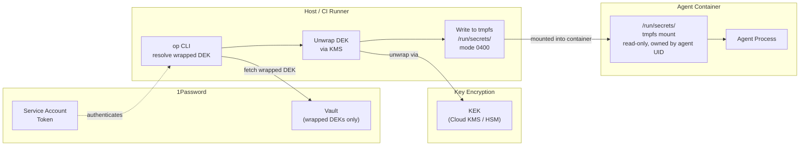
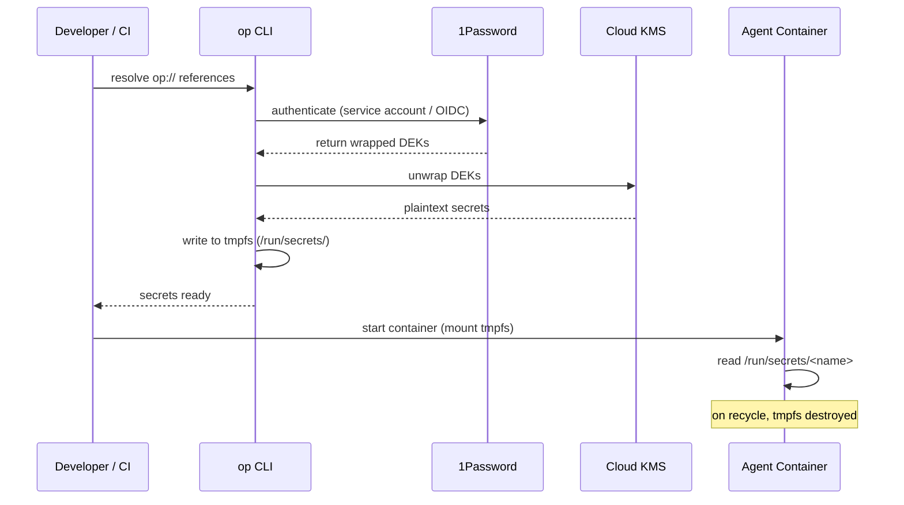
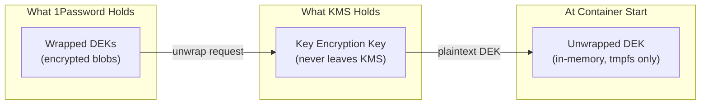
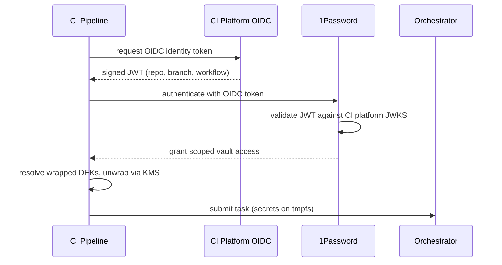

# Secrets Management

Secrets are never stored in files, images, or git. 1Password stores **wrapped keys only** via envelope encryption — not plaintext secrets. Secrets are delivered to containers as files on tmpfs, never as environment variables.

## Secret Flow



## How It Works

### 1. Secrets live in 1Password only

Secrets are organized in vaults with scoped access. Each agent workload or environment gets its own vault (or section) so permissions stay narrow.

```
op://AgentVault/openai/api-key
op://AgentVault/database/connection-string
op://AgentVault/registry/pull-token
```

### 2. `.envrc` references secrets by URI — never by value

The `.envrc` file contains only `op://` references. It is safe to commit — no secret material is present.

```bash
# .envrc — safe to commit
export OPENAI_API_KEY="op://AgentVault/openai/api-key"
export DATABASE_URL="op://AgentVault/database/connection-string"
export REGISTRY_TOKEN="op://AgentVault/registry/pull-token"
```

### 3. direnv + `op` CLI resolves at shell entry

When direnv loads the `.envrc`, the `op` CLI resolves each `op://` reference against the authenticated 1Password session. Secrets exist only as in-memory environment variables on the host — never written to disk.

```bash
# .envrc — using op inject for resolution
eval "$(op inject <<< "$(cat .envrc.tpl)")"

# or direct per-variable resolution
export OPENAI_API_KEY="$(op read op://AgentVault/openai/api-key)"
```

### 4. Secrets are delivered as files on tmpfs

During the [[arch-container-lifecycle|Configure phase]], secrets are written to a tmpfs mount at `/run/secrets/` with restrictive permissions. The agent reads them as files — they never appear in `/proc/*/environ`.

```bash
# Docker example — file-based delivery
docker run \
  --read-only \
  --mount type=tmpfs,destination=/run/secrets,tmpfs-mode=0400 \
  --user 65534:65534 \
  agent-image:latest

# Secrets written to tmpfs before container start:
# /run/secrets/openai-api-key (mode 0400, owned by 65534)
# /run/secrets/database-url    (mode 0400, owned by 65534)
```

## Secret Flow Detail



## Envelope Encryption

1Password is no longer a single point of failure for plaintext secrets.



| Component | What It Holds | If Compromised |
|---|---|---|
| **1Password** | Wrapped (encrypted) DEKs only | Attacker gets encrypted blobs — useless without KMS |
| **Cloud KMS / HSM** | Key Encryption Key (KEK) | Attacker can unwrap DEKs — but needs 1Password access too |
| **Both compromised** | Full secret access | Requires simultaneous compromise of two independent systems |

## Authentication

| Context | Auth Method |
|---|---|
| **Developer workstation** | 1Password desktop app + biometric unlock |
| **CI / automation** | OIDC federation (GitHub Actions / GitLab CI identity token) — no static Service Account token |
| **CI fallback** | Service Account token: pinned to IP ranges, auto-rotated daily, anomaly-monitored |
| **Container runtime** | No direct 1Password access — secrets are pre-resolved and delivered as files |

### CI OIDC Federation



No static Service Account token needed. The CI platform's OIDC identity cryptographically proves the pipeline's identity.

## Break-Glass Procedure

For 1Password or KMS outages. Emergency-only — triggers mandatory rotation after use.

| Step | Action |
|---|---|
| 1 | Retrieve sealed break-glass credential file (stored offline, encrypted, separate from 1Password) |
| 2 | Decrypt with offline key (held by operator, never in any automated system) |
| 3 | Use break-glass credentials to provision critical agents |
| 4 | All break-glass usage logged to a separate audit channel |
| 5 | **Mandatory**: rotate all secrets used via break-glass once 1Password/KMS is restored |

## Security Properties

| Property | How It's Achieved |
|---|---|
| **No secrets in git** | `.envrc` contains only `op://` URIs, never values |
| **No secrets in images** | Secrets delivered at runtime via tmpfs, not baked at build |
| **No secrets in /proc** | File-based delivery on tmpfs — not environment variables |
| **No plaintext in 1Password** | Envelope encryption: 1Password holds only wrapped DEKs |
| **No static CI tokens** | OIDC federation eliminates Service Account tokens |
| **Scoped access** | Each workload uses a dedicated vault with minimum permissions |
| **Rotation without redeploy** | Update in 1Password — next container start picks up new value |
| **Audit trail** | 1Password logs every access; break-glass has separate audit |
| **Resilience** | Break-glass procedure for 1Password/KMS outages |
