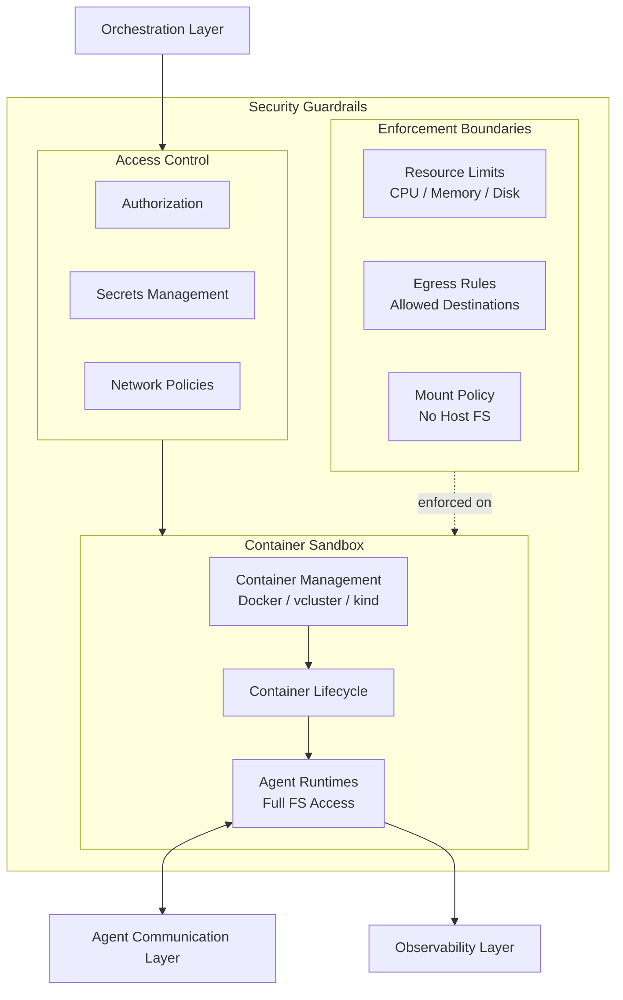
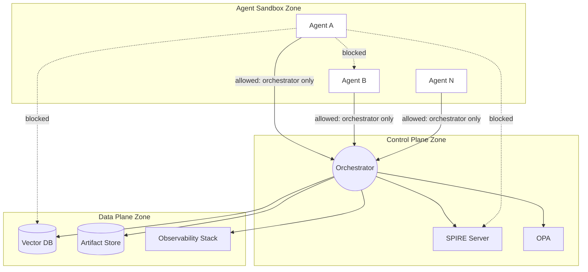

# Security Guardrails

The core security boundary. Everything inside runs in containers — agents get **full filesystem autonomy within their container** but have zero access to the host.

## Access Control

| Control | Purpose |
|---|---|
| **Authorization** | Which agents can be spawned, what capabilities they receive |
| **Secrets Management** | Injected at runtime via 1Password + direnv — see [[arch-secrets-management]] |
| **Network Policies** | Restrict egress to approved destinations only |

## Network Zones

Platform components are segmented into three zones with default-deny between them.

| Zone | Contains | Inbound From | Outbound To |
|---|---|---|---|
| **Agent Sandbox** | All agent containers | Orchestrator (task dispatch, message routing) | Orchestrator only (+ allowlisted external APIs via egress rules) |
| **Control Plane** | Orchestrator, SPIRE Server, OPA | Agent zone (requests), Data zone (responses) | Data zone (store/query), Agent zone (dispatch) |
| **Data Plane** | Vector DB, Artifact Store, Observability | Control plane only (via shared state proxy) | Control plane (query responses) |

### Agent-to-Agent Isolation

Default-deny between all agent containers. Agents cannot communicate directly — all messages route through the orchestrator.

| Rule | Detail |
|---|---|
| **Default-deny NetworkPolicy** | All agent containers start with deny-all ingress and egress |
| **Egress allowlist** | Only orchestrator/Envoy port and explicitly approved external destinations |
| **No CAP_NET_RAW** | Dropped in mandatory hardening — prevents ARP spoofing on shared bridge networks |
| **No CAP_NET_ADMIN** | Dropped in mandatory hardening — prevents network configuration manipulation |
| **East-west monitoring** | Any inter-agent traffic that bypasses policy triggers immediate alert (Cilium or equivalent) |

### SPIRE Server Isolation

The SPIRE server is the identity root — it must be reachable only by the orchestrator and SPIRE agent sidecars.

| Rule | Detail |
|---|---|
| **Ingress** | Only from orchestrator (registration API) and SPIRE agent sidecars (attestation + SVID renewal) |
| **Egress** | Only to HSM/KMS (CA signing) and upstream SPIRE servers (if federated) |
| **Agent containers** | Cannot reach SPIRE server directly — interact only via local SPIRE agent sidecar over Unix socket |

## Enforcement Boundaries

| Boundary | Purpose |
|---|---|
| **Resource Limits** | CPU, memory, ephemeral storage caps per agent container |
| **Egress Rules** | Allowlisted outbound destinations only |
| **Mount Policy** | No host filesystem mounts, no Docker socket, no container runtime sockets |
| **Brainbox Hardening** | Mandatory in all environments — see [[arch-brainbox#Mandatory Brainbox Hardening]] |
| **Network Zones** | Three-zone segmentation with default-deny between zones |

### Brainbox Hardening (always on)

These controls are the security floor. They apply in every environment regardless of which [[arch-security-tooling|optional tools]] are enabled.

| Control | Mandatory Setting |
|---|---|
| seccomp | Custom restrictive profile |
| Capabilities | Drop ALL |
| Root filesystem | Read-only |
| User | Non-root (UID 65534) |
| Privilege escalation | Blocked |
| AppArmor | Custom deny profile |
| Secrets | File-based on tmpfs, not env vars |
| SPIRE sidecar | Separate container, shared Unix socket only |

## Container Management

| Tool | Use Case |
|---|---|
| **Docker** | Single-agent containers, lightweight tasks |
| **vcluster** | Virtual Kubernetes clusters for multi-agent workloads |
| **kind** | Local K8s clusters for development and testing |

See [[arch-brainbox]] for the full container lifecycle detail.
