# Security Tooling

Runtime security has two tiers: a **mandatory hardening baseline** that is always on, and **optional tooling** that is flaggable per environment.

## Mandatory Baseline (always on)

These controls apply in every environment. They cannot be disabled via feature flags.

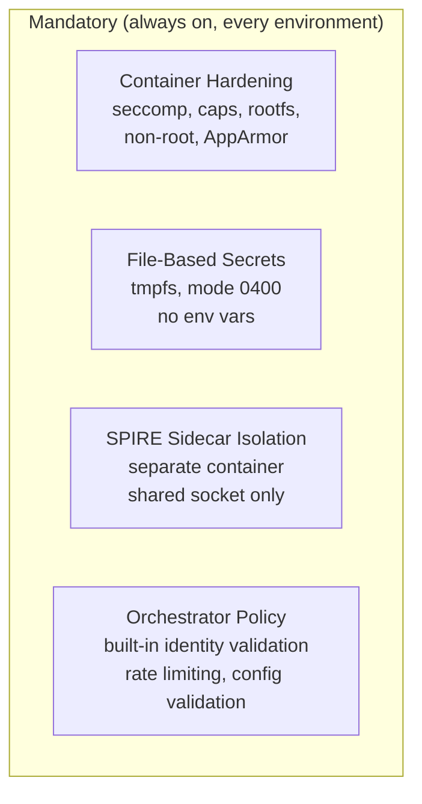

| Control | What It Enforces | Fallback If Absent |
|---|---|---|
| **Container hardening** | seccomp, drop all caps, read-only rootfs, non-root, no-new-privileges, AppArmor | None — this IS the foundation |
| **File-based secrets** | Secrets on tmpfs, not env vars — eliminates /proc/*/environ exposure | None — mandatory delivery mechanism |
| **SPIRE sidecar isolation** | Separate container, Unix socket only, no shared PID namespace | None — prevents SVID key theft |
| **Orchestrator built-in policy** | Identity validation, rate limiting, container config validation | None — orchestrator always runs |

See [[arch-brainbox#Mandatory Brainbox Hardening]] for the full hardening spec.

## Optional Tooling (flaggable)

Five additional tools, all independent. Environments choose which layers to enable based on risk profile.

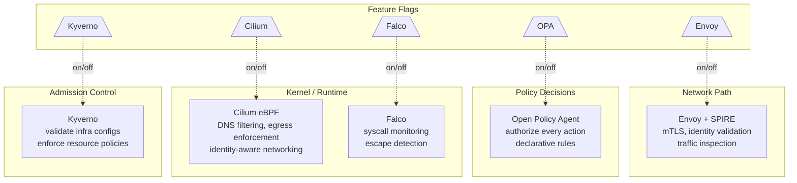

## Where Each Tool Sits

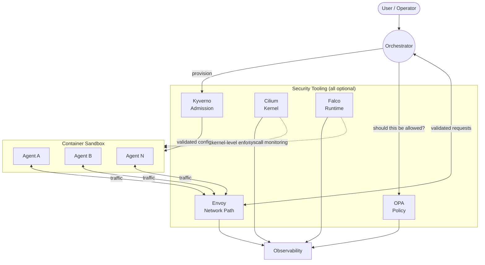

## Tool Details

### Envoy + SPIRE — Network Path

Sits between agents and the orchestrator. Validates identity and inspects traffic.

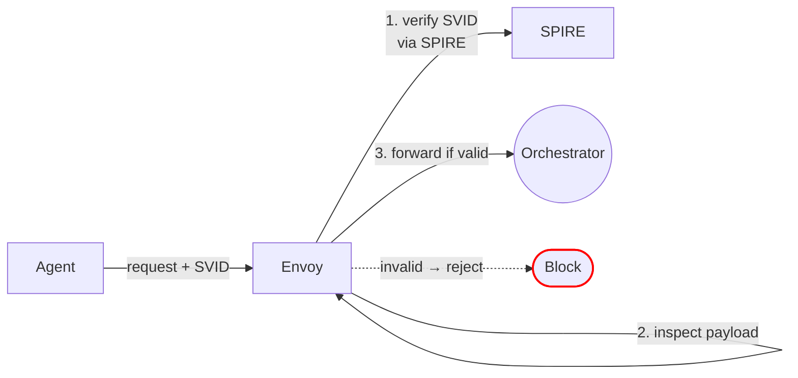

| Function | Detail |
|---|---|
| **mTLS termination** | Enforces encrypted connections using SPIFFE x509 SVIDs |
| **Identity validation** | Verifies the agent's SVID is valid and matches the expected workload |
| **Traffic inspection** | Can inspect request payloads for schema violations or anomalies |
| **Rate limiting** | Per-agent request quotas at the proxy layer |
| **When disabled** | Agents connect directly to orchestrator — orchestrator handles validation itself |

#### Bypass Prevention

When Envoy is enabled, all traffic **must** flow through it. Direct connections to the orchestrator are blocked.

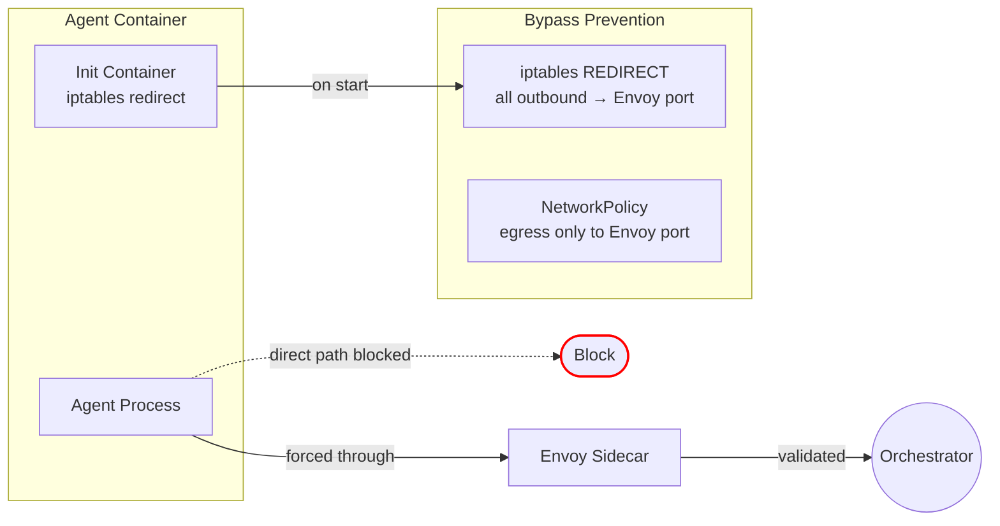

| Control | Detail |
|---|---|
| **iptables redirect** | Init container sets `iptables -t nat -A OUTPUT -p tcp --dport <orch-port> -j REDIRECT --to-port <envoy-port>` |
| **NetworkPolicy** | Egress allowed only to Envoy's listener port — direct orchestrator port denied |
| **CI validation** | Bypass prevention rules verified in CI before deployment |
| **Envoy health gate** | Container does not start accepting work until Envoy sidecar passes health check |

### OPA — Policy Decisions

Evaluates "should this be allowed?" at every enforcement point. Policies are declarative Rego files, not code.

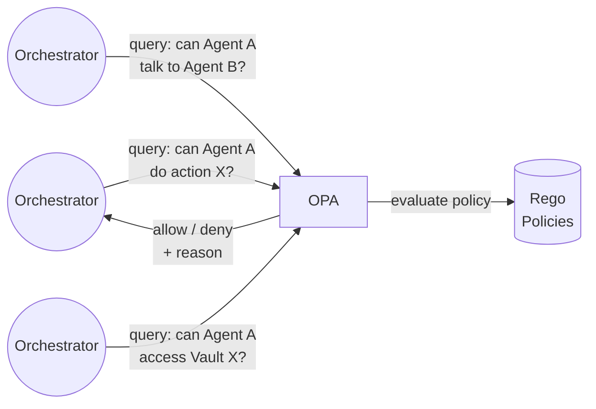

| Function | Detail |
|---|---|
| **Task authorization** | Can this agent run this task with these capabilities? |
| **Communication scope** | Can Agent A send messages to Agent B? |
| **Secret access** | Can this agent access this 1Password vault? |
| **Delegation approval** | Can Agent A request external delegation with these capabilities? |
| **When disabled** | Orchestrator's built-in policy engine handles all decisions (less granular) |

### Cilium — Kernel / Network

eBPF-based networking. Operates at the kernel level — no sidecar overhead, no proxy in the path.

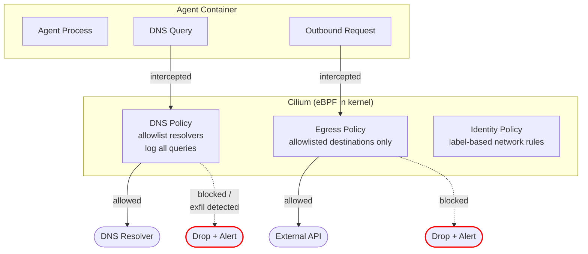

| Function | Detail |
|---|---|
| **DNS filtering** | Intercepts all DNS queries, enforces allowlisted resolvers, detects tunneling patterns |
| **Egress enforcement** | Kernel-level allowlist — not bypassable by container processes (unlike iptables) |
| **Identity-aware networking** | Network policies based on SPIFFE identity labels, not just IP addresses |
| **When disabled** | Standard container networking — Docker/K8s network policies only |

### Falco — Runtime Monitoring

Watches syscalls inside containers. Detects anomalies and triggers automated responses.

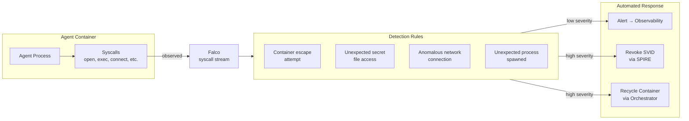

| Function | Detail |
|---|---|
| **Escape detection** | Watches for mount namespace changes, privilege escalation syscalls, /proc manipulation |
| **Secret access monitoring** | Detects unexpected reads of /proc/*/environ or sensitive file paths |
| **Process monitoring** | Flags unexpected child processes (e.g. agent spawning a shell) |
| **Automated response** | Falco alert → webhook → orchestrator revokes SVID + recycles container |
| **When disabled** | No runtime monitoring — rely on container isolation and lifecycle timeouts only |

#### Circuit Breaker

Falco's automated response can be weaponized — an attacker triggers rules intentionally to force-recycle legitimate containers (DoS). The circuit breaker prevents this.

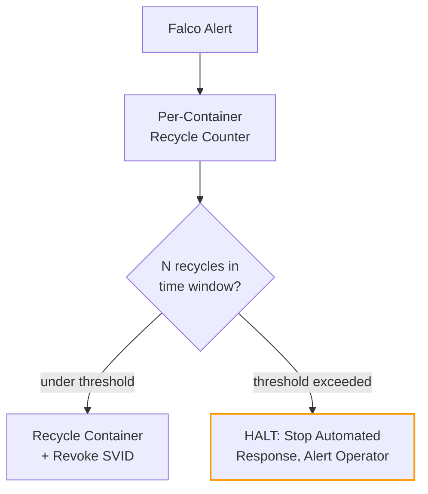

| Parameter | Value | Rationale |
|---|---|---|
| **Recycle threshold** | 3 recycles per container identity within 10 minutes | Prevents infinite recycle loops from weaponized alerts |
| **Scope** | Per-container identity (SVID) | One agent triggering alerts doesn't affect others |
| **On threshold breach** | Halt automated recycle, alert operator, keep container isolated (SVID revoked but not restarted) | Human judgment for sustained anomalies |
| **Falco's role** | Detection, not prevention | Prevention is seccomp, AppArmor, capabilities — Falco detects what slips through |

### Kyverno — Admission Control

Validates infrastructure configurations before they are applied. Prevents bad state from ever existing.

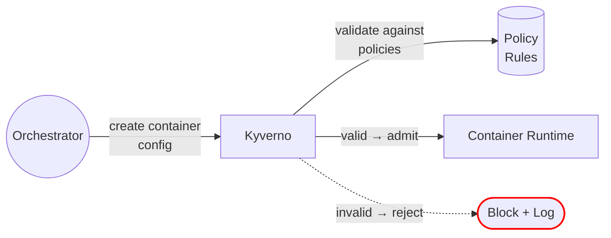

| Function | Detail |
|---|---|
| **Resource limits required** | Reject any container config missing CPU/memory/disk limits |
| **No host mounts** | Block any config that attempts to mount host filesystem |
| **Approved images only** | Reject configs referencing images not in the approved registry |
| **No privileged containers** | Block privileged mode, host networking, host PID namespace |
| **When disabled** | Orchestrator's built-in config validation only (less strict) |

---

## Environment Profiles

The mandatory baseline applies everywhere. Optional tools are flagged per environment.

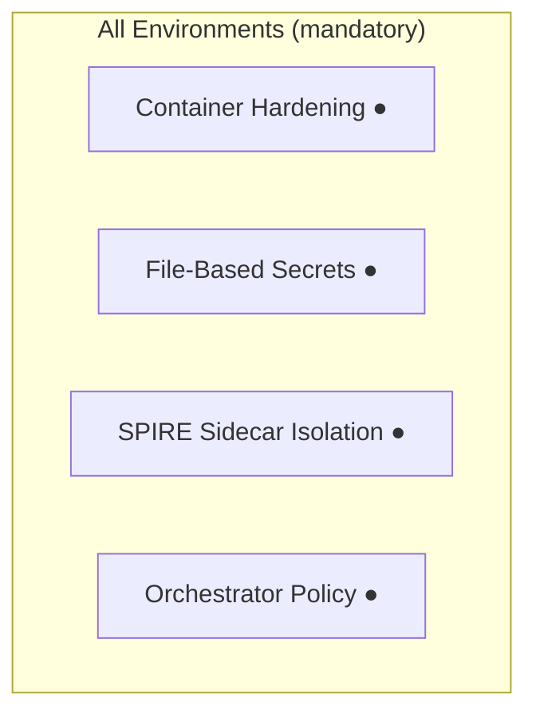

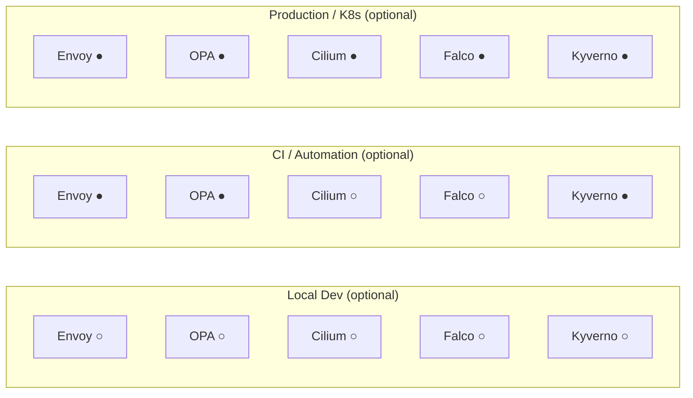

| Layer | Local Dev | CI / Automation | Production / K8s |
|---|---|---|---|
| **Container hardening** | **On** | **On** | **On** |
| **File-based secrets** | **On** | **On** | **On** |
| **SPIRE sidecar isolation** | **On** | **On** | **On** |
| **Orchestrator policy** | **On** | **On** | **On** |
| Envoy | Off | On | On |
| OPA | Off | On | On |
| Cilium | Off | Off | On |
| Kyverno | Off | On | On |
| Falco | Off | Off | On |

### Graceful Degradation

When an **optional** tool is disabled or crashes, the mandatory baseline still holds.

| Tool Disabled | What Still Protects You |
|---|---|
| **Envoy off** | Orchestrator validates identity and rate-limits. Container hardening prevents exploitation. |
| **OPA off** | Orchestrator's built-in policy engine handles authorization. Container caps limit blast radius. |
| **Cilium off** | Standard Docker/K8s network policies. Container has no CAP_NET_RAW, no shell tools for exfil. |
| **Falco off** | Container hardening (seccomp, capabilities, AppArmor) PREVENTS what Falco would detect. Lifecycle TTLs bound exposure. |
| **Kyverno off** | Orchestrator validates configs. Hardening is applied by the provisioner, not Kyverno. |

### Health Monitoring

Every optional tool must be health-checked. Undetected tool failure is a security gap.

| Requirement | Detail |
|---|---|
| **Health check** | Each tool exposes a health endpoint or is monitored via process supervision |
| **Failure alerting** | Tool crash or unreachability triggers immediate alert to operator |
| **Flag audit trail** | All feature flag changes are version-controlled and logged to audit trail |
| **Production immutability** | Production flags cannot be toggled without emergency procedure + audit entry |
| **Fail-closed option** | Configurable per tool: if Falco or Cilium crashes in production, halt new agent provisioning |

---

## Threat Coverage

Maps each tool to the threats it addresses from the [[arch-threat-model|Threat Model]].

| Threat | Envoy | OPA | Cilium | Falco | Kyverno |
|---|---|---|---|---|---|
| **Compromised LLM Agent** | Identity check | Action authorization | Egress enforcement | Anomaly detection | — |
| **Supply Chain Poisoning** | — | — | — | — | Image policy |
| **Secret Exfiltration** | — | Access scoping | Egress enforcement | Secret access monitoring | — |
| **Container Escape** | — | — | Kernel enforcement | Escape detection | No privileged containers |
| **External API Probe** | mTLS rejection | — | — | — | — |
| **Traffic Interception** | mTLS encryption | — | — | — | — |
| **DNS Exfiltration** | — | — | DNS filtering | — | — |
| **Orchestrator DoS** | Rate limiting | — | — | — | — |
| **Insider Acct Takeover** | — | Policy enforcement | — | — | — |
| **Log Injection** | — | — | — | Process monitoring | — |
