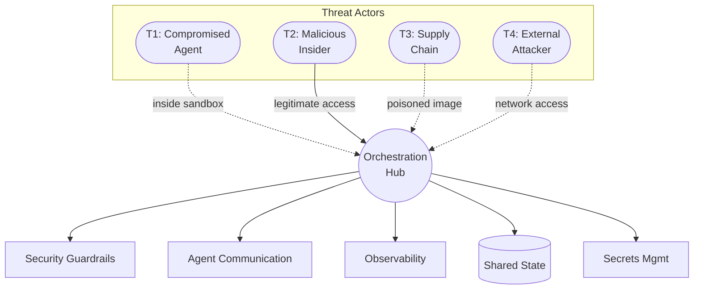
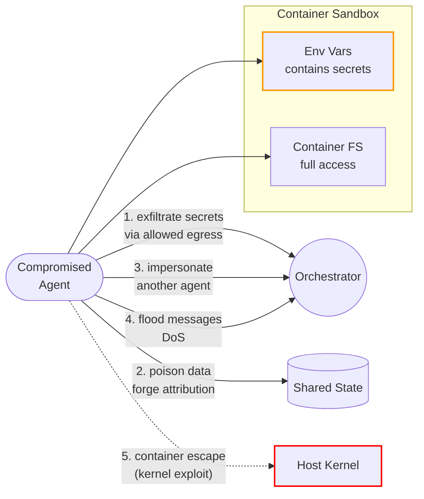
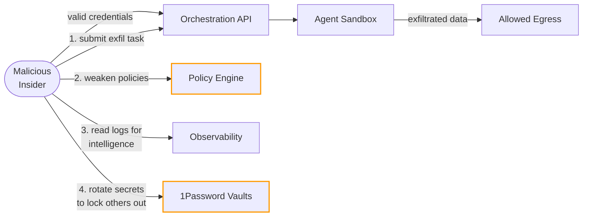
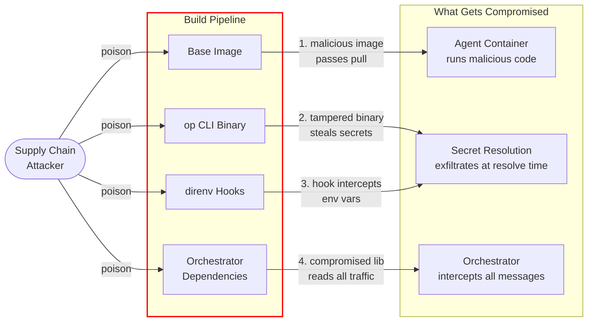
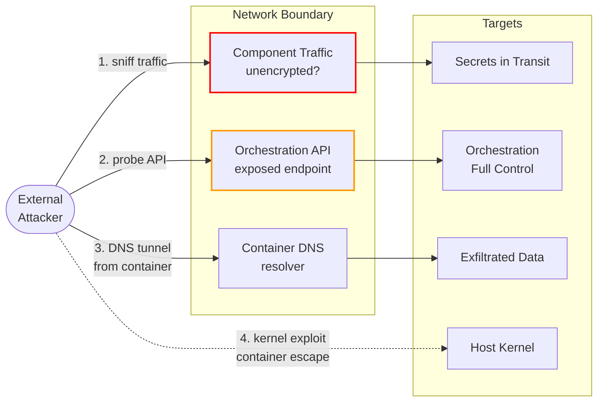
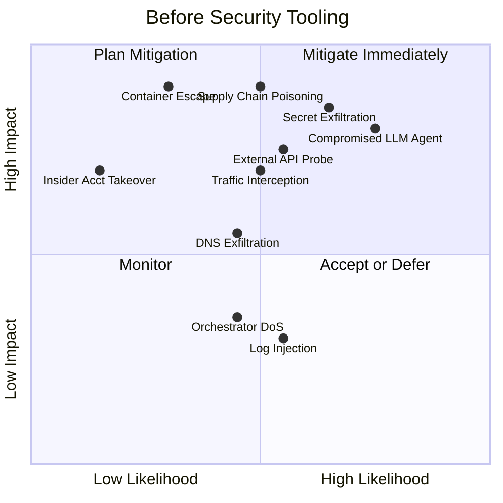
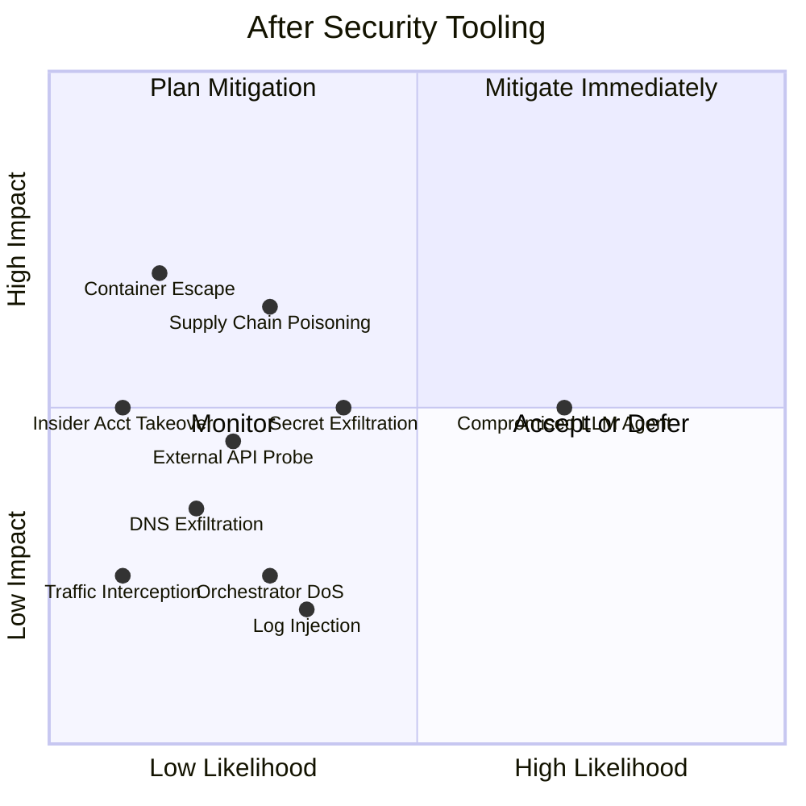

# Threat Model

Defines what we are defending against, what assumptions we make, and where the known risks live.

## Threat Actors Overview

Each threat actor has a different entry point and attack path through the architecture. Detailed paths below.

## Assumptions

Things we assume to be true. If any of these break, the security model degrades.

| Assumption | If violated |
|---|---|
| **Container runtime is sound** | Container escape → full host compromise |
| **Host OS is hardened** | Process inspection leaks secrets from `/proc/*/environ` |
| **1Password is not compromised** | All secrets are exposed — single point of failure |
| **Network between components is trusted (or encrypted)** | Eavesdropping on secrets, messages, logs in transit |
| **Agent images come from a trusted registry** | Poisoned images execute arbitrary code inside the sandbox |
| **The orchestrator is not compromised** | Attacker controls all task routing, policy, and identity issuance |
| **op CLI binary is authentic** | Tampered CLI could exfiltrate secrets at resolution time |

## Threat Catalog

### T1: Compromised Agent

An agent container runs malicious code — either through a supply chain attack or a prompt injection that causes the agent to act adversarially.

**Entry point**: Inside the sandbox — the agent is already running.

| # | Attack Path | Impact | Mitigation |
|---|---|---|---|
| 1 | Read env vars → exfiltrate over allowed egress | Credential theft | Scoped secrets per agent, short-lived tokens, egress DPI |
| 2 | Write poisoned data to shared state | Downstream agents consume bad data | Artifact signing, attribution verification |
| 3 | Forge identity on orchestrator | Actions attributed to wrong agent | Cryptographic agent identity (see Identity & Trust) |
| 4 | Flood the orchestrator | DoS on agent communication | Rate limiting, per-agent quotas |
| 5 | Exploit kernel to escape container | Full host compromise | Seccomp, AppArmor/SELinux, minimal capabilities, patched kernels |

---

### T2: Malicious Insider

An authorized user with legitimate access acts with bad intent.

**Entry point**: The orchestration layer — they have valid credentials.

| # | Attack Path | Impact | Mitigation |
|---|---|---|---|
| 1 | Submit task → agent exfiltrates data over allowed egress | Data loss | Policy engine review, dual-approval for sensitive tasks, audit trail |
| 2 | Modify policies → grant excessive agent capabilities | Privilege escalation | Policy changes require MFA + peer approval, change audit log |
| 3 | Query observability stack → infer operations, extract PII | Information leakage | RBAC on logs/traces/metrics, data masking |
| 4 | Rotate secrets in 1Password → deny access to others | Availability impact | Vault access controls, break-glass procedures, rotation alerts |

---

### T3: Supply Chain Compromise

A dependency, base image, or tool in the build pipeline is compromised.

**Entry point**: Before the sandbox — the attack is baked into artifacts the platform trusts.

| # | Attack Path | Impact | Mitigation |
|---|---|---|---|
| 1 | Poisoned base image → arbitrary code in sandbox | Full agent compromise | Image signing (cosign), vulnerability scanning, approved base image list |
| 2 | Tampered op CLI → exfiltrate secrets at resolution | All secrets for that runner exposed | Checksum verification, pinned versions, signed releases |
| 3 | Malicious `.envrc` hook → intercept env vars pre-container | Secrets stolen before reaching sandbox | `.envrc` review in PR, restricted direnv allowed list |
| 4 | Compromised orchestrator dependency → read/modify all messages | Full communication interception | Dependency pinning, SBOM generation, regular audits |

---

### T4: External Attacker

Network-level access to the platform, but no legitimate credentials.

**Entry point**: The network boundary — they can see traffic and probe exposed services.

| # | Attack Path | Impact | Mitigation |
|---|---|---|---|
| 1 | Sniff unencrypted traffic between components | Eavesdrop on secrets, messages, logs | mTLS between all platform components |
| 2 | Probe orchestration API → brute force or exploit | Full system control | Authentication required, rate limiting, network segmentation |
| 3 | DNS exfiltration from inside container | Data leak bypassing egress rules | DNS filtering/logging, restricted resolvers, egress DNS inspection |
| 4 | Exploit host kernel from network | Container escape, host compromise | Kernel patching cadence, minimal host surface, VM isolation for high-risk |

## Risk Matrix

Context: solo operator, mix of LLM-driven and static agents, multi-environment (local dev + cloud CI + self-hosted K8s).

### Pre-Mitigation (architecture only)

### Post-Mitigation (with [[arch-security-tooling|Security Tooling]])

### Tuning Rationale

| Threat | Before | After | Tooling That Moved It |
|---|---|---|---|
| **Compromised LLM Agent** | 0.75 / 0.80 | 0.70 / 0.50 | Likelihood stays high (prompt injection still works). Impact halved — Cilium blocks exfiltration, Falco detects anomalies, OPA limits actions, Envoy validates identity. |
| **Supply Chain Poisoning** | 0.50 / 0.90 | 0.30 / 0.65 | Kyverno blocks unapproved images at admission. cosign rejects unsigned images. Falco catches anomalous behavior if one slips through. |
| **Secret Exfiltration** | 0.65 / 0.85 | 0.40 / 0.50 | Cilium kernel-level egress blocks unauthorized destinations. Falco detects /proc/*/environ reads. OPA scopes secret access. Multiple layers to punch through. |
| **Container Escape** | 0.30 / 0.90 | 0.15 / 0.70 | Kyverno prevents privileged containers at admission. Falco detects escape syscalls and auto-recycles. Dwell time near zero. |
| **External API Probe** | 0.55 / 0.75 | 0.25 / 0.45 | Envoy mTLS rejects unauthenticated connections at TLS handshake. Probes never reach the orchestrator. |
| **Traffic Interception** | 0.50 / 0.70 | 0.10 / 0.25 | Envoy + SPIRE mTLS encrypts all traffic. Effectively solved — residual only if mTLS misconfigured. |
| **DNS Exfiltration** | 0.45 / 0.55 | 0.20 / 0.35 | Cilium intercepts all DNS at kernel level, enforces resolver allowlists, detects tunneling patterns. |
| **Orchestrator DoS** | 0.45 / 0.35 | 0.30 / 0.25 | Envoy rate limiting at proxy layer before traffic hits orchestrator. |
| **Insider Acct Takeover** | 0.15 / 0.70 | 0.10 / 0.50 | OPA enforces granular policy. Stolen credentials are constrained by declarative rules. |
| **Log Injection** | 0.55 / 0.30 | 0.35 / 0.20 | Falco process monitoring + SVID attribution flags unsigned entries. |

### Quadrant Shift Summary

| Quadrant | Before | After |
|---|---|---|
| **Mitigate Immediately** | Compromised LLM Agent, Secret Exfiltration, Supply Chain | — empty — |
| **Plan Mitigation** | Container Escape, External API Probe, Traffic Interception | Compromised LLM Agent (only remaining high-area threat) |
| **Monitor** | DNS Exfiltration, Orchestrator DoS | Supply Chain, Secret Exfiltration, Container Escape, External API Probe, Insider Acct Takeover |
| **Accept or Defer** | Log Injection, Insider Acct Takeover | Traffic Interception, DNS Exfiltration, Orchestrator DoS, Log Injection |

## Addressed Gaps

| Gap | Addressed By | Page |
|---|---|---|
| ~~Encryption in transit (mTLS)~~ | Envoy + SPIRE x509 SVIDs | [[arch-security-tooling]], [[arch-identity-and-trust]] |
| ~~Container runtime hardening~~ | Falco syscall monitoring + Kyverno admission (no privileged containers) | [[arch-security-tooling]] |
| ~~Network segmentation~~ | Cilium identity-aware eBPF networking | [[arch-security-tooling]] |
| ~~Secret exfiltration prevention~~ | Cilium egress enforcement + Falco secret access monitoring | [[arch-security-tooling]] |
| ~~DNS exfiltration~~ | Cilium DNS filtering | [[arch-security-tooling]] |

## Outstanding Gaps (to be addressed)

| Gap | Related Page | Priority |
|---|---|---|
| Host hardening requirements | New page needed | High |
| Incident response procedures | New page needed | High |
| Shared state access control (RBAC) | [[arch-shared-state]] | Medium |
| Log integrity (signing, WORM) | [[arch-observability]] | Medium |
| Security control testing/validation | New page needed | Low |
