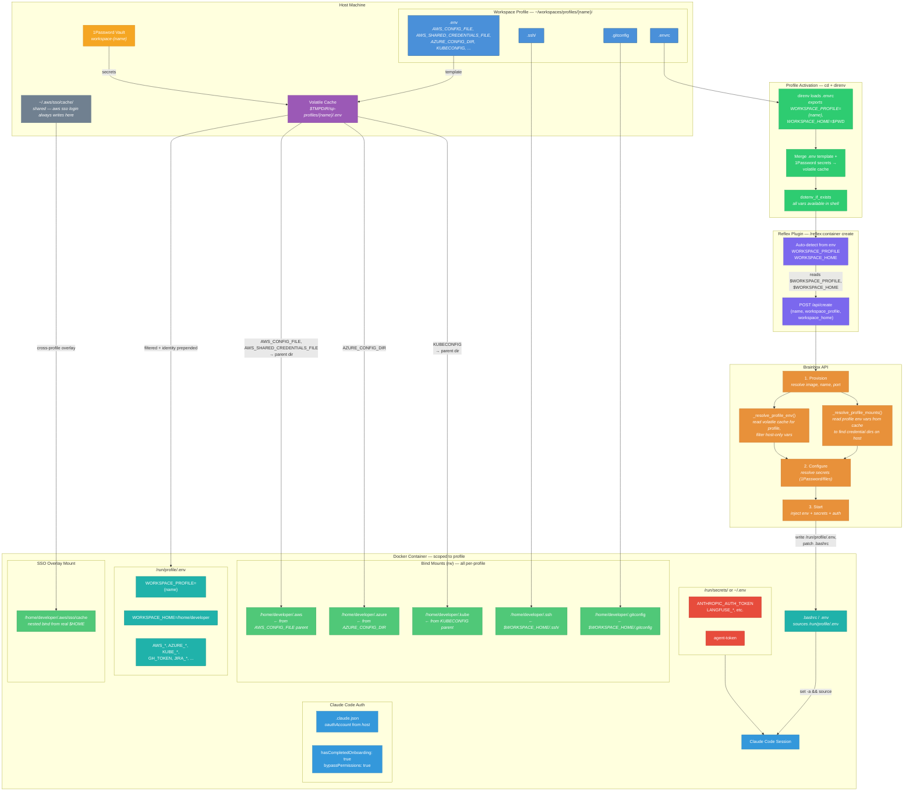
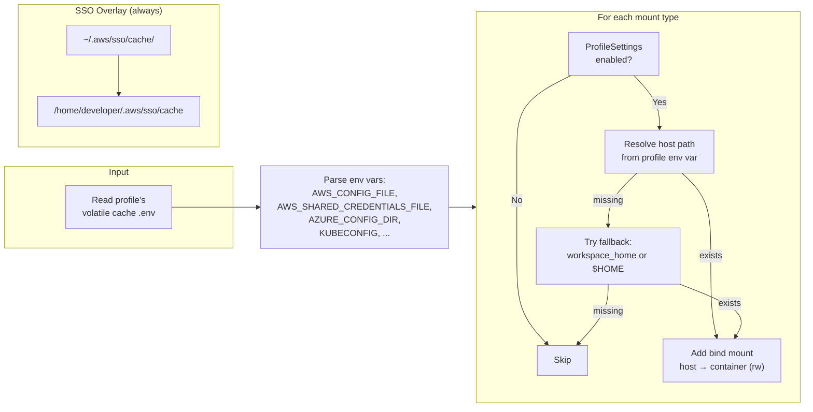
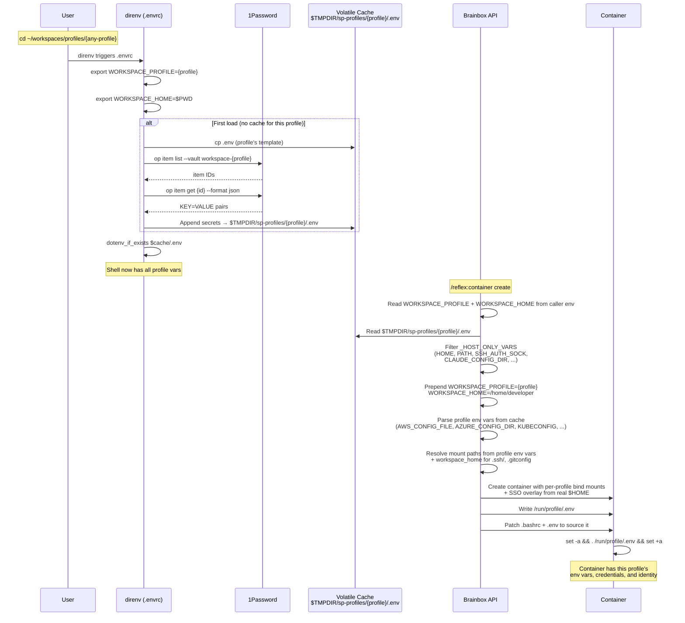

# Profile-Aware Container Creation

How workspace profiles, environment variables, and volume mounts flow from the host into sandboxed containers.

## End-to-End Flow

Each workspace profile is a self-contained directory with its own `.envrc`, `.env` template, `.ssh/`, `.gitconfig`, and a dedicated 1Password vault. The flow is identical for every profile — `cd` into it, direnv activates, and `/reflex:container create` provisions a container scoped to that profile.

## Profile Mount Resolution

All credential directories are resolved from the **active profile's environment variables** (read from the volatile cache). The API never uses its own process env vars or `$HOME` fallbacks for another profile's credentials. Only the SSO token cache is shared across profiles (it lives under the real `$HOME`).

## Mount Matrix

All env vars are read from the profile's volatile cache, not the API host's own environment.

| Mount | Setting | Profile Env Var | Resolve | Fallback | Container Target | Default |
|-------|---------|----------------|---------|----------|-----------------|---------|
| AWS | `mount_aws` | `AWS_CONFIG_FILE` `AWS_SHARED_CREDENTIALS_FILE` | parent dir | `$WORKSPACE_HOME/.aws/` | `/home/developer/.aws` | on |
| Azure | `mount_azure` | `AZURE_CONFIG_DIR` | direct | `$WORKSPACE_HOME/.azure/` | `/home/developer/.azure` | on |
| Kube | `mount_kube` | `KUBECONFIG` | parent dir | `$WORKSPACE_HOME/.kube/` | `/home/developer/.kube` | on |
| SSH | `mount_ssh` | — | — | `$WORKSPACE_HOME/.ssh/` | `/home/developer/.ssh` | on |
| Git | `mount_gitconfig` | `GIT_CONFIG_GLOBAL` | direct (file) | `$WORKSPACE_HOME/.gitconfig` | `/home/developer/.gitconfig` | on |
| GCloud | `mount_gcloud` | `CLOUDSDK_CONFIG` | direct | `$WORKSPACE_HOME/.gcloud/` | `/home/developer/.gcloud` | off |
| Terraform | `mount_terraform` | `TF_CLI_CONFIG_FILE` | parent dir | `$WORKSPACE_HOME/.terraform.d/` | `/home/developer/.terraform.d` | off |

**SSO overlay**: `~/.aws/sso/cache/` from the real `$HOME` is always overlaid at `/home/developer/.aws/sso/cache/` when AWS is mounted. This is the only cross-profile shared mount — `aws sso login` always writes tokens to the real home regardless of which profile is active.

## Environment Variable Flow

## Host-Only Variables (Filtered Out)

These variables are stripped when forwarding the profile env into containers because they are host-specific or would conflict with the container's own configuration:

| Variable | Reason |
|----------|--------|
| `HOME`, `USER`, `LOGNAME` | Container has its own user (`developer`) |
| `PATH`, `PWD`, `OLDPWD`, `SHLVL` | Container has its own filesystem |
| `SSH_AUTH_SOCK`, `GIT_SSH_COMMAND` | Host socket paths don't exist in container |
| `TMPDIR`, `SHELL`, `TERM_PROGRAM` | Host-specific runtime |
| `CLAUDE_CONFIG_DIR`, `GEMINI_CONFIG_DIR` | Container has build-time defaults |
| `XDG_CONFIG_HOME` | Would override container config paths |
